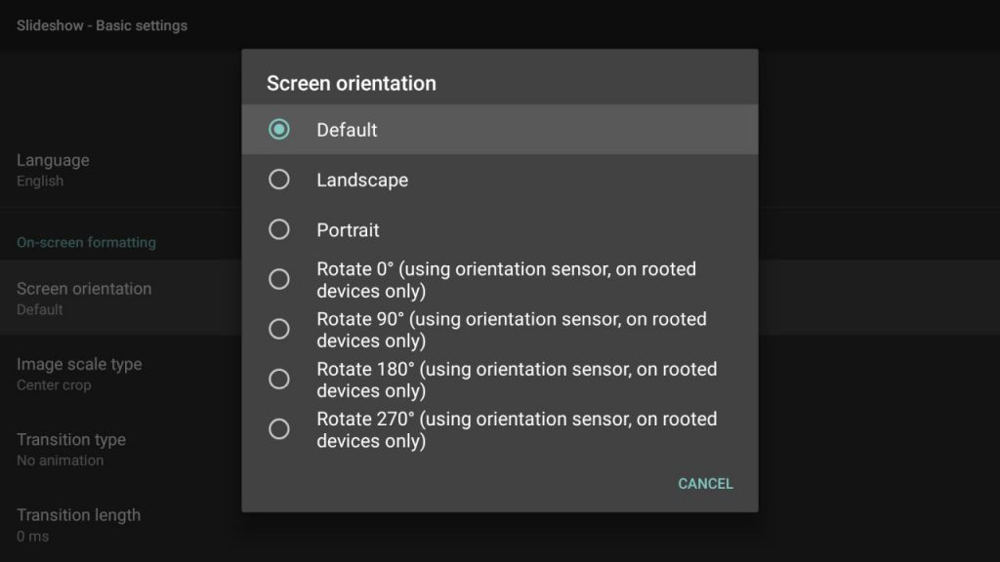

# Screen rotation

In case you want to display content on your TV in portrait mode or rotate the content by any other way, Slideshow offers two options how to achieve it:

## Screen layout rotation

Screen layout rotation can be set through the web interface → menu `Screen layout` → `Edit screen layout` → `Rotation`. The layout can be rotated by 90°, 180° or 270°. Only the layout is rotated, the on-screen menu stays as it was.

Rotation screen layout is supported universally on every device (the support doesn’t depend on the hardware). For video playback on rotated layouts we suggest using the player type `ExoPlayer + TextureView` or `ExoPlayer + SurfaceView` (see [Device settings](settings/#Screen layout)).

## Android screen orientation

Screen orientation of the entire Android system can be set through the web interface → menu `Settings` → `Device settings` → `Screen orientation`, or through on-screen menu → `Basic settings` → `Screen orientation in on-screen menu`.

There are two sets of options:

- Default, Portrait or Landscape
- Simulating change of orientation sensor, for rooted devices only (might affect other apps as well)

Support of these options depends on the particular hardware model, not every manufacturer supports all of them on their devices. If changing Screen orientation and restarting Slideshow app produces no change on your device, we suggest falling back to Screen layout rotation described above.

/// caption
Setting screen orientation through Basic settings
///
