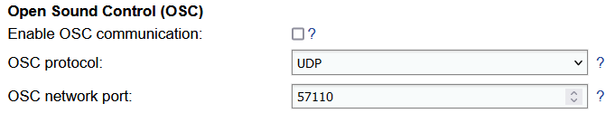
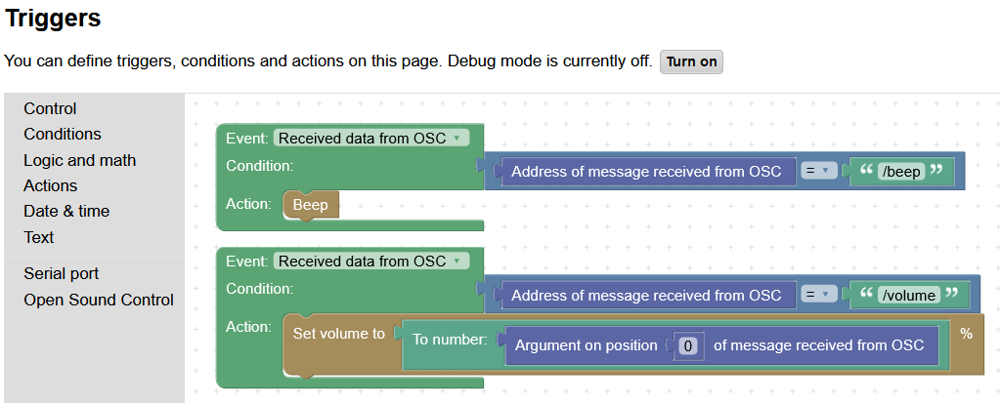
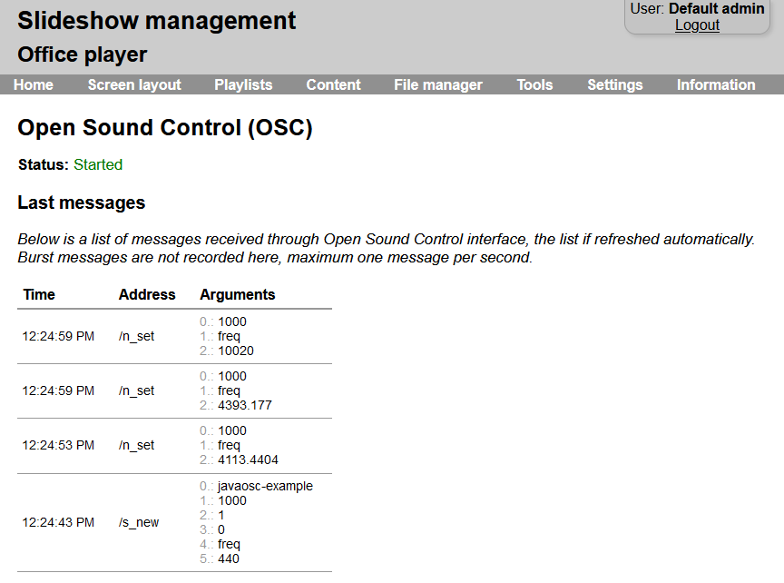

# Open Sound Control

Slideshow supports receiving commands through [Open Sound Control](https://en.wikipedia.org/wiki/Open_Sound_Control) (OSC) network protocol, which can be used for connecting Slideshow to various music and video systems.

The set up can be performed via the web interface – menu `Settings` – `Device settings` – `Open Sound Control (OSC)`. Reload is required for applying any change in the settings. In OSC controller (e.g. music synthesizer) Slideshow device should be added using its IP address and the same network port which is entered in Slideshow settings.

Commands received from Open Sound Control can be used in Triggers (web interface – menu `Settings` – `Triggers`) to set up actions when a particular OSC command is received.

Recording the received messages is possible through the web interface – menu Information – Open Sound Control. This page is available mainly for debugging purposes, to see what messages and arguments Slideshow received.

