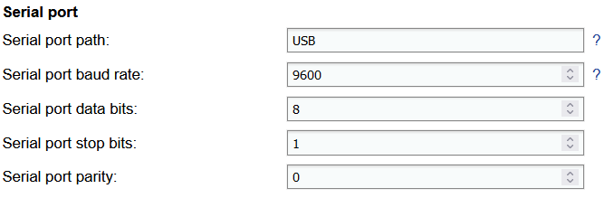
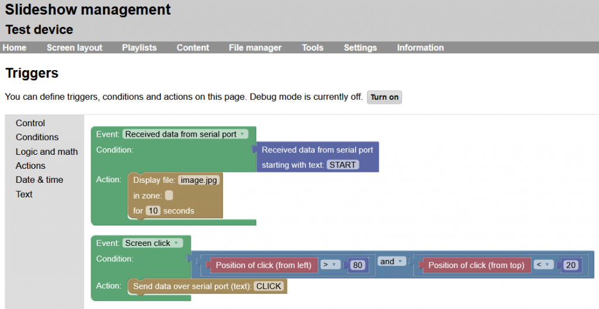

# Serial port

Slideshow app supports communication with other devices using hardware serial port (RS-232), either using direct RS-232 port (if your Android device has it) or using USB-to-serial converter.

This feature can be also used for communication with Arduino and similar devices.

## Supported hardware

If your device has a native RS-232 port, it is possible to use it directly, but rooted access might be required on some devices.

For USB-to-serial adapter to work it is necessary that the Android device has a free USB port and supports USB host (almost all Android boxes do). USB-to-serial adapters based on the following chips are supported:

* FTDI FT232R, FT232H, FT2232H, FT4232H, FT230X, FT231X, FT234XD
* Prolific PL2303
* Silabs CP2102 and all other CP210x
* Qinheng CH340, CH341A, CH9102
* Arduino using ATmega32U4
* Digispark using V-USB software USB
* BBC micro:bit using ARM mbed DAPLink firmware

Permission to access a USB device has to be granted manually on the screen of the Android device the first time a USB-to-serial adapter is connected. Prompt will be displayed automatically after the supported adapter is plugged in.

## Serial port setup

Configuration of the serial port can be done through Slideshow’s web interface – menu `Setting` – `Device settings` – section `Serial port`. Baud rate, data bits, stop bits and parity have to be set in Slideshow settings exactly the same as on the second device. Selected baud rate has to be supported by the serial port on the Android device.

> 

List of currently detected serial ports on the particular Android device can be found through menu `Information` – `About device` – `Available serial ports`.

## Using serial port

If text read from serial port is in JSON format and starts with `{"operation"`, it is processed as an API command (see MQTT API for the list of supported commands). The result is then written back to the serial port. Data from and to the serial port are processed in ASCII encoding, not UTF-8.

It is also possible to read from serial port and write to serial port through Triggers. ASCII and HEX formats are supported for detecting input and writing output.
> 
