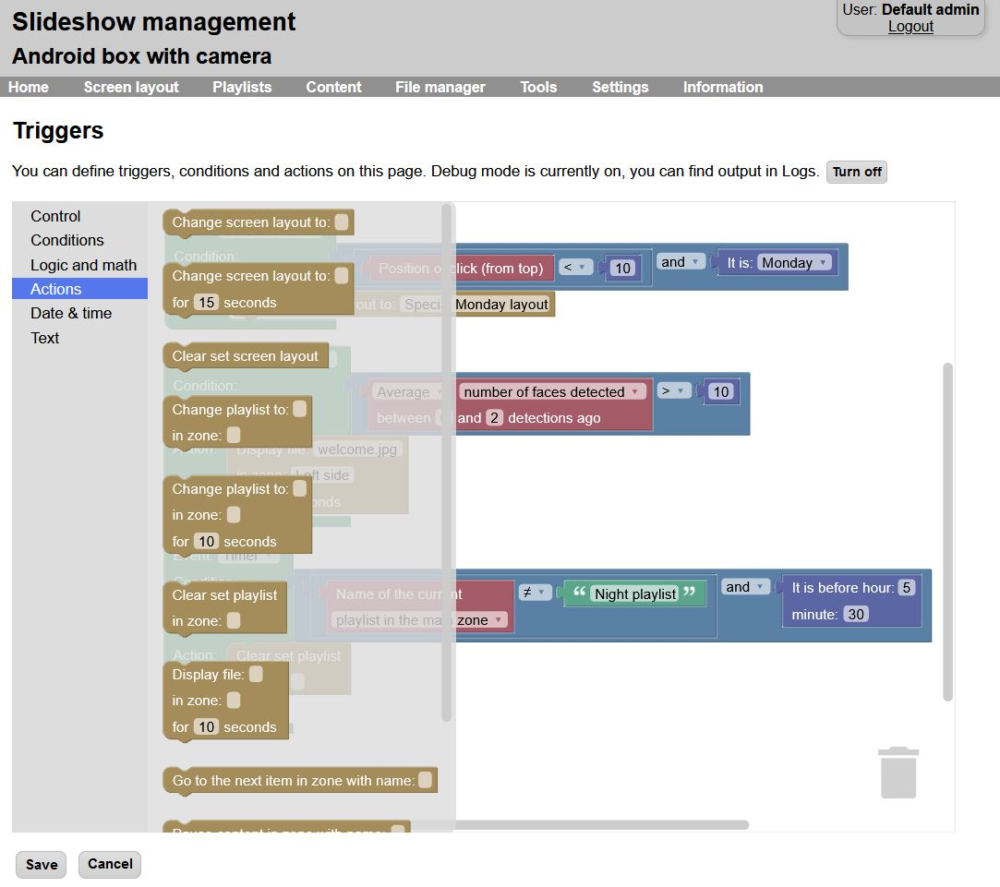
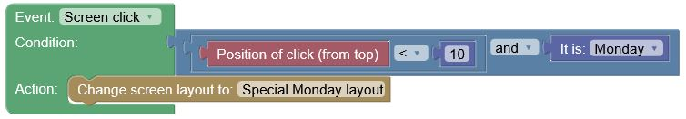
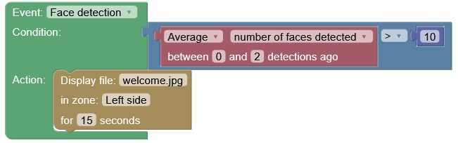
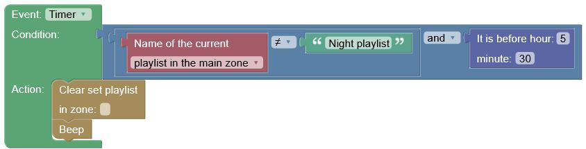

# Triggers

Using triggers, you can setup advanced conditions and actions for your digital signage playback.

Trigger setup is possible through the web interface, menu `Settings` → `Triggers`. It is possible to backup and restore triggers using XML configuration backup. 

## Setting up a trigger

The basic building block of each trigger is the control element. There can be multiple control elements defined, each one is evaluated separately. Each control element defines:

- Which **event** starts this trigger – whether screen was clicked, face detection was run, key was pressed or minute timer was run.
- What are the **conditions** for this trigger – for example position of the screen click, how many faces were detected, what time it is and more. Conditions can be combined using logic predicates `and`, `or` and `not`.
- What **action** should be executed if the conditions are satisfied – for example change playlist or screen layout, display particular media file, pause or resume playback, start audio file etc.

You can add building blocks from the left menu to the workspace using drag&drop. Make sure that the building block is not whited out after placing it in the workspace, as it might indicate the output type of the block doesn’t fit the input type of the other block.

!!! success "Executing triggers"
    After the triggers are saved, the **actions** will be automatically executed always when the **event** occurs and the **conditions** are satisfied.

/// caption
Triggers setup in the web interface
///

## Examples

/// caption
If screen was clicked in the top 10% and it is Monday, change the current screen layout to “Special Monday layout”
///

/// caption
If more than 10 faces were detected on average in the last 3 frames, display file “welcome.jpg” in zone “Left side” for 15 seconds”
///

/// caption
Every minute check if the current playlist in the main zone is not “Night playlist” and it is before 5:30 AM, if true, clear the manually set playlist in the main zone and beep
///
