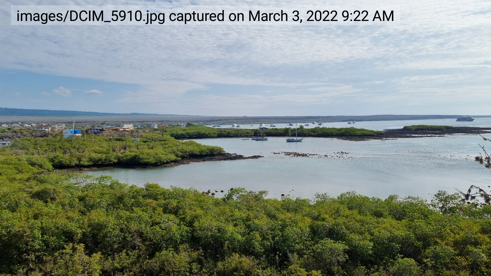
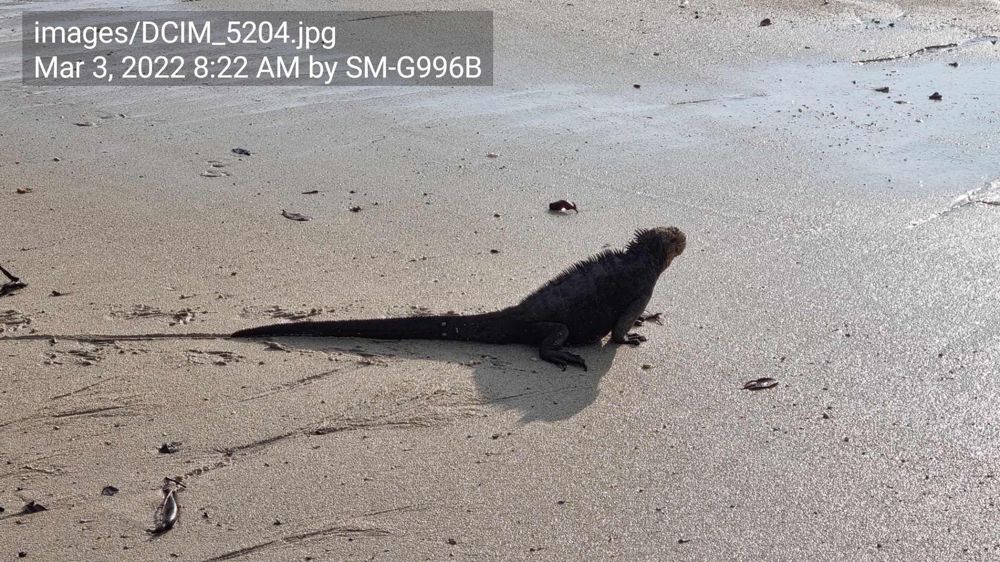
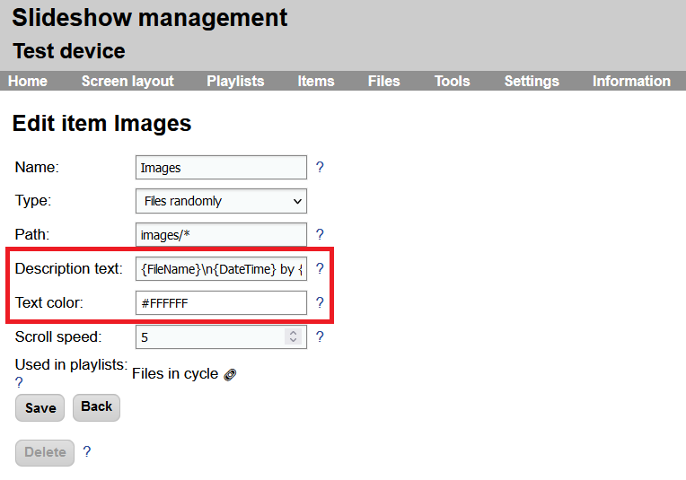

# Description text

While displaying images, videos or web pages, it is possible to automatically display additional dynamic description text in the top left corner of the zone.

{ width="350" style="display: inline" } { width="350" style="display: inline" }
/// caption
Examples of the description text
///

The setup can be done via the web interface → menu `Content` → `Edit` by filling out `Description text` and `Text colo`r. It is available for content types Single file, Files alphabetically, Files randomly, Audio/video stream and Video input.

- **Description text** – template text which will be displayed on the screen. Can contain several placeholders, which will be replaced dynamically:
    - `{FileName}` – full name and path of the currently displayed file
    - `{FileNameShort}` – name of the file without folder and file extension
    - `{ItemName}` – name of the content which is displayed
    - `{DateTime}` – date and time when the picture was captured, from EXIF tag of the image (available only for JPEG images)
    - `{...}` – additional data from EXIF tags of the image
- **Text color** – color of the text on the screen. The background color will be calculated automatically as a semi-transparent complementary color. To turn off the background color, set the text color to semi-transparent.

/// caption
Setup of the content with description text
///