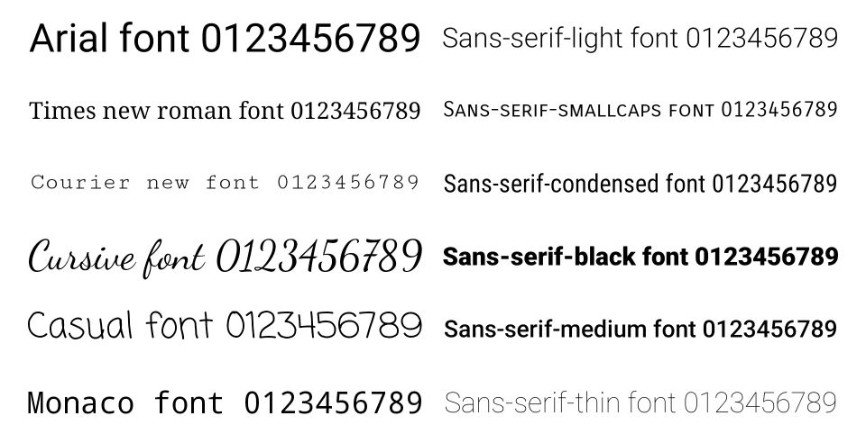
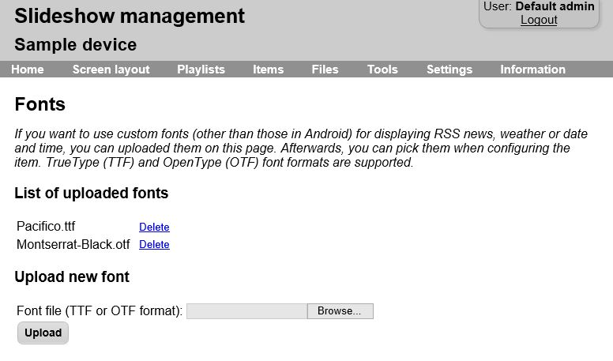

# Fonts

You can select a custom font for displaying plain text, date and time, weather, RSS news or name days via web interface → menu `Content` → `Edit`.

All fonts installed in Android are available in Slideshow. The exact list depends on the particular Android image, but usually contains 15+ fonts preinstalled. On most devices, the same font might be installed under two or more different names.

/// caption
Some of the fonts available on Android 9
///

## Own fonts

If you would like to use a font that isn’t bundled in your Android image, you can upload it via web interface → menu `Settings` → `Fonts`. Supported font formats are TrueType (TTF) and OpenType (OTF). You can then pick any of the uploaded fonts in the Edit content form, they are marked with an asterisk before their name.

/// caption
Form for uploading custom fonts
///
