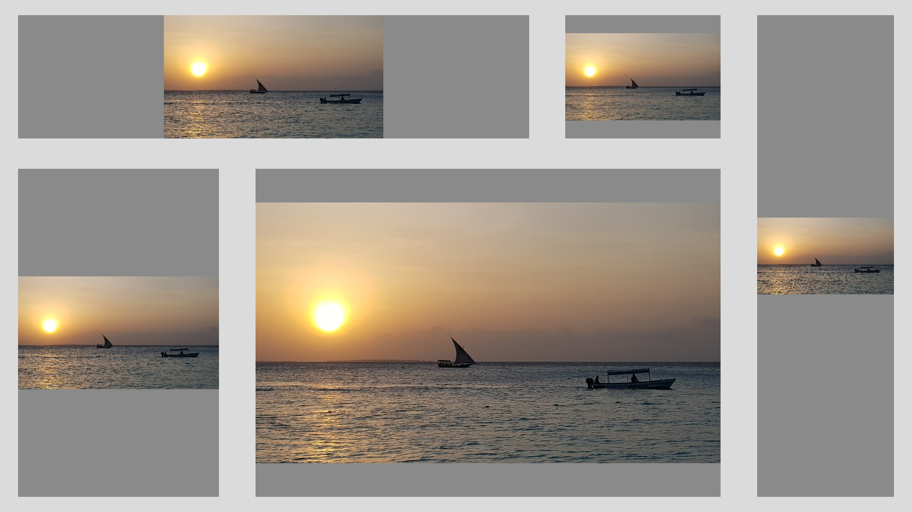
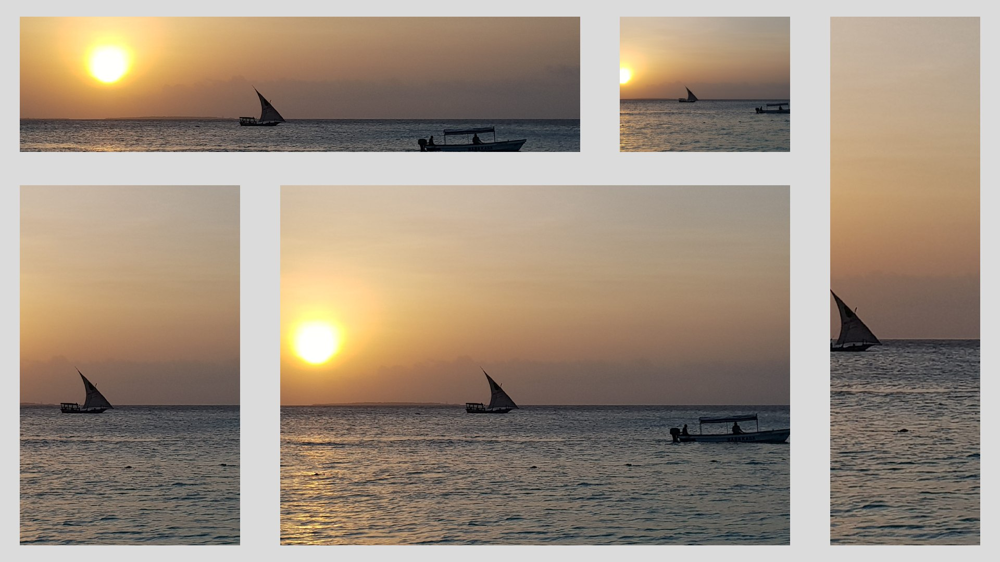
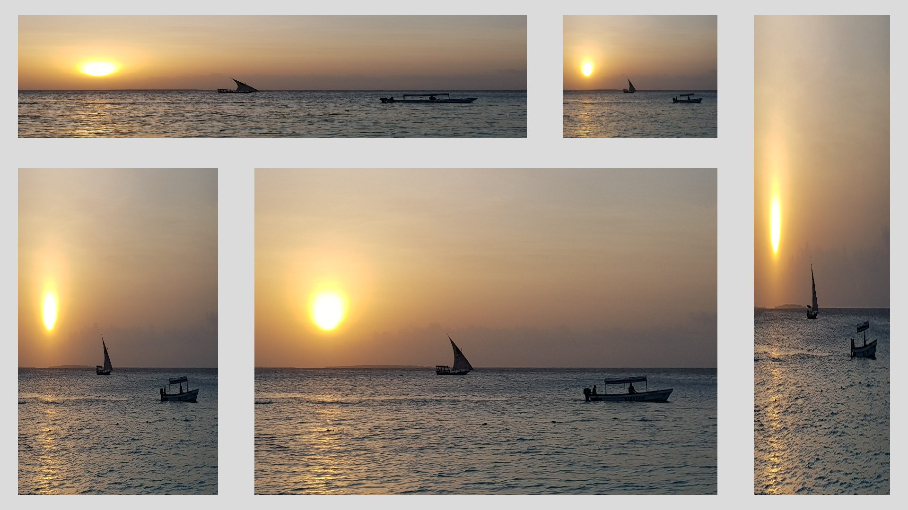
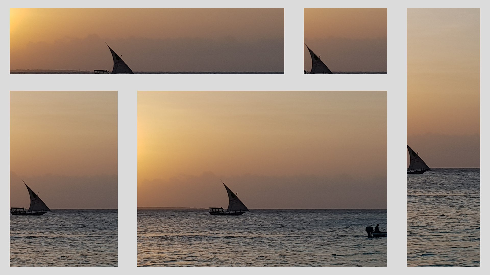
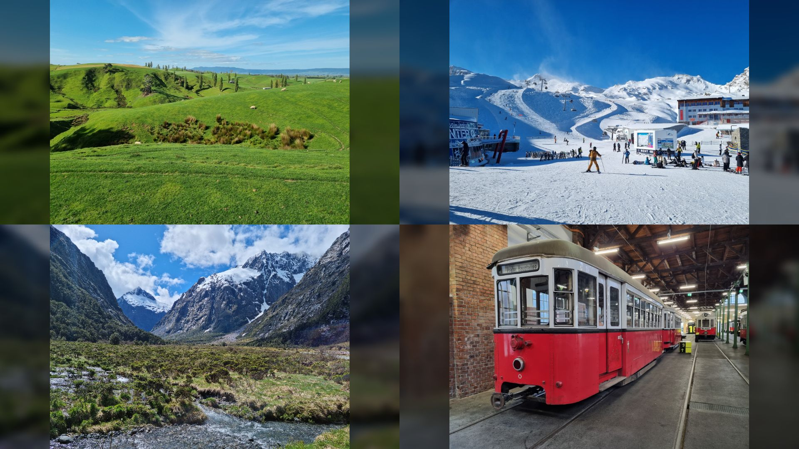
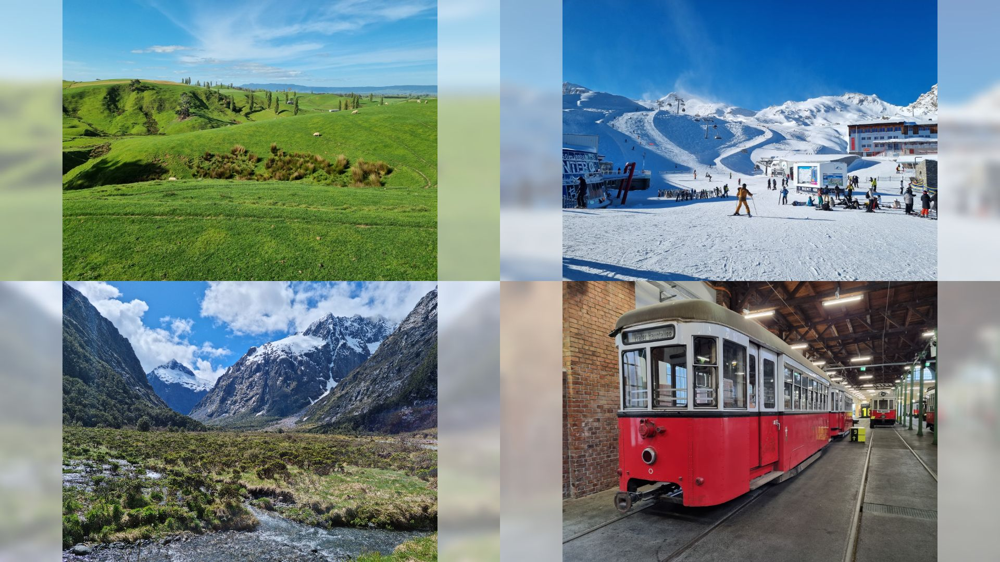

# Scaling images and videos

If resolution of image or video doesn’t match the resolution of the zone where it should be displayed, Slideshow can scale the picture using various methods, which differ in how much is the picture scaled up or down and whether the aspect ratio is preserved.

The method for scaling can be set globally via web interface → menu `Settings` → `Device settings` → item `Image scale type` or on-screen menu → `Basic settings` → item `Image scale type`. Scaling videos works only if you are using Enhanced video player.

You can find examples of various scaling types below for the reference. They each display the same image in several different zones, each zone has dark grey background.

## Fit center

Maintains the original aspect ratio. Scales the image so both width and height are the same or smaller as the zone. Might display some of the background of the zone.

## Center crop

Maintains the original aspect ratio. Scales the image so both width and height are at the same or larger as the zone. Might crop some parts of the image. Never displays any of the background of the zone.

## Fit to screen

Doesn’t maintain the original aspect ratio (image can become distorted). Scales the image so both width and height are the same as the zone. Never displays any of the background of the zone.

## Center (no scaling)

Maintains the original aspect ratio. Doesn’t scale, uses the original width and height of the image – be careful with extra large images, they will occupy a lot of RAM.

## Blurred image background

In addition to scaling described above, it is possible to achieve blurry background effect for images in zones that don’t match the image aspect ratio through option `Image background type` in Content configuration (web interface → menu `Content` → `Edit`). In case `Image background type` is set, Fit center scaling will be used automatically, overriding any global Image scale type setting. This setting is available for Content types Single file, Files randomly and Files alphabetically and it is applied only for images, not for videos.

/// caption
`Image background type` set to `Blurred & darkened`
///

/// caption
`Image background type` set to `Blurred & lightened`
///
    