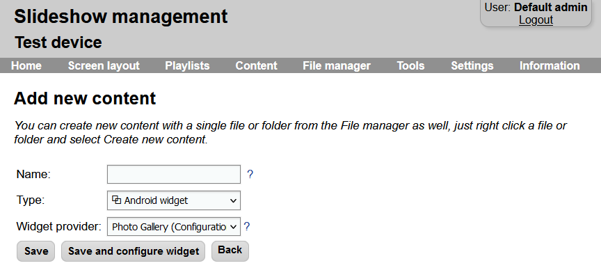

# Android widgets

It is possible to display an Android widget inside a zone of a screen layout using content with type `Android widget`. The list of widget providers contains all providers of the widgets installed on the particular Android device. Additional widget providers can be added by installing various widget apps to the Android system (either manually or through Google Play Store).

After adding new content with the type Android widget you might get a permission dialog on the screen of the Android device, which has to be confirmed.

Some of the widgets require configuration through the screen of the Android device. The configuration can be started using the `Start and configure widget` button when saving the content.

/// caption
Content edit page with type Android widget
///

Slideshow lists only actual system-registered widgets. It might differ from the list of widgets in your Launcher, as it usually lists app shortcuts as well as launcher built-it widgets.
