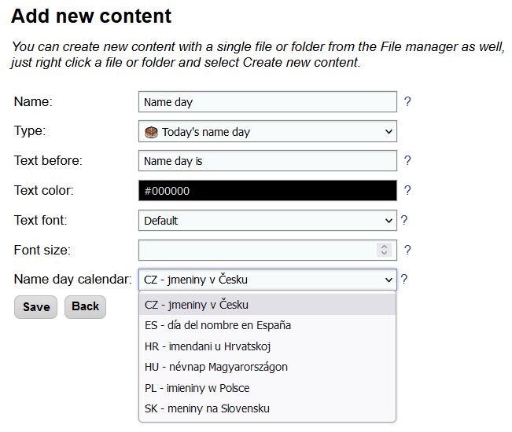

# Name days

Name day is a tradition in some countries (mostly in Central Europe), that people with a particular given name celebrate on a selected day of the year. The celebration is similar to a birthday celebration. You can find out more about this tradition on [https://en.wikipedia.org/wiki/Name_day](https://en.wikipedia.org/wiki/Name_day) or [https://www.behindthename.com/namedays/](https://www.behindthename.com/namedays/).

By creating content with type `Today’s name day`, Slideshow can display on the screen which name celebrates name day on the current day. Slideshow has an offline copy of the list of names for several countries, there is no need to be connected to the internet to display the name.

Source of the names for particular days is this open-source repository: [https://github.com/milan-fabian/name-day-list](https://github.com/milan-fabian/name-day-list).

/// caption
Edit content page with Today’s name day
///

/// caption
Name day displayed on the screen
///

