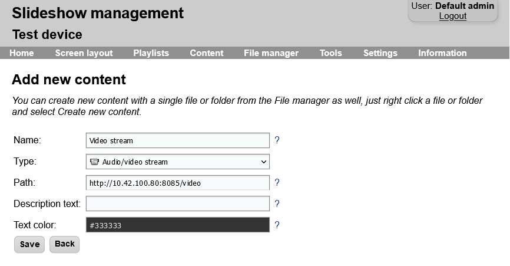

# Video streams

Slideshow supports playing HTTP and RTSP video streams on the screen using content with type `Audio/video stream`.

HTTP or RTSP video stream can be produced for example using VLC media player on Windows or Linux, from a IP security camera or other sources.

If you would like to display YouTube video or YouTube live stream, use content type `YouTube video` instead of `Audio/video stream`.

If you would like to display live image from a different device with HDMI output, you can use content type `Video input` on supported devices.

We recommend setting video player type to ExoPlayer for displaying video streams, as it has much better support for live streams than the native Android video player. However, support of stream containers and codecs is still highly dependent on the device, in reality not every device has good support for live streams. On some devices, there are even differences between the native video player and ExoPlayer. We recommend thorough testing before you start using video streams for your customers.

/// caption
Creating new content with type Audio/video stream
///

## Video tutorial

<iframe style="width: 100%; aspect-ratio: 16 / 9;" src="https://www.youtube.com/embed/Zg0awHOr7Dg?feature=oembed&start&end&wmode=opaque&loop=0&controls=1&mute=0&rel=0&modestbranding=0" frameborder="0" allowfullscreen></iframe>
