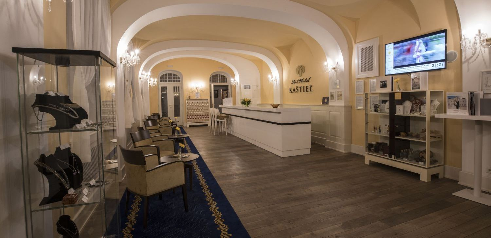
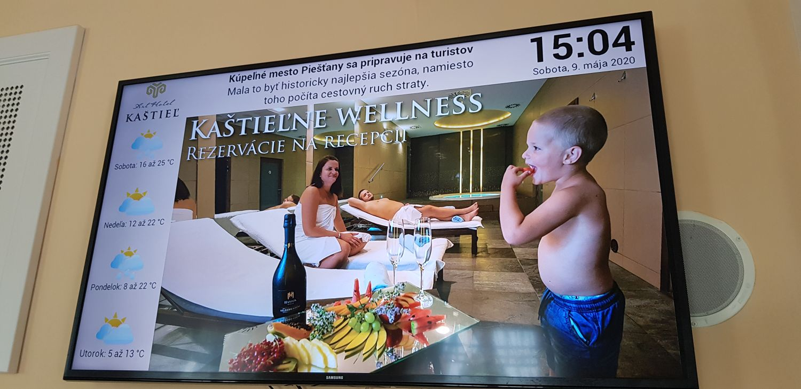
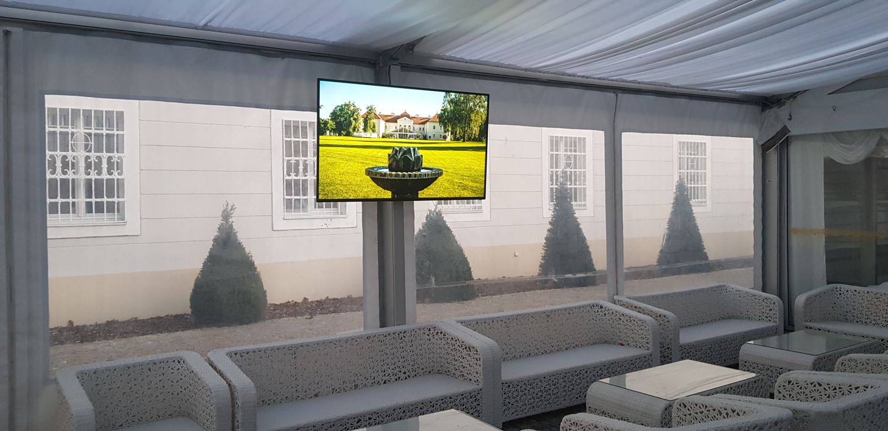
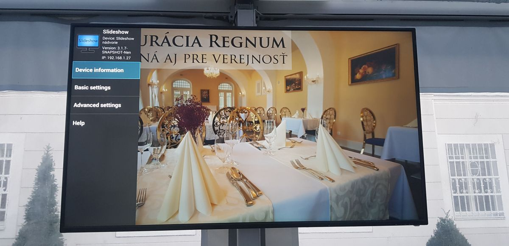

# Art Hotel Kaštieľ

## Introduction

[Art Hotel Kaštieľ](https://www.hotelkastiel.sk/) is a small luxury hotel in Slovakia. Management of the hotel were thinking about displaying advertisement for their services in the reception area and in the courtyard, but were missing simple digital signage solution. They already had regular 50″ Samsung TV near the reception for playing TV channels (mostly news channels), but setting it up for displaying banners and videos with advertisement was time consuming and not at all user friendly.

They asked us for our help with this project and we were happy to offer them solution based on the Slideshow software.

## Solution

- Reception area: Android box with Slideshow installed, connected to regular TV, displaying date & time, news, weather, banners and videos 
- Courtyard area: BenQ display including Android with Slideshow installed, displaying just banners and videos 
- Content management via local network using web browser

### Reception area

For the reception area, we decided to use the existing Samsung TV. It has multiple HDMI inputs, so we kept the existing set-top box for watching TV channels, connected new Android box to different HDMI input and installed Slideshow on the box. There was no free LAN port available anywhere near the TV, so the box is connected to internal network via secured WiFi.

As the reception area is the entry point for all hotel guests, the customer wanted to display also current date and time, news in the text form and weather forecast for next 4 days on the screen – all in the local language. This was easily setup in Slideshow via date & time panel, RSS panel (with two local news sources) and weather panel (from OpenWeatherMap). We used the sample screen layout with side panels as a base for the setup.

### Courtyard area

There was no TV in the courtyard and as it is mostly outdoor area with TV mount prepared under the tent, we had to pick more durable display. We decided to go with BenQ Smart Signage display ST650K with 65″ 4K screen, which is certified for 16/7 usage. Thanks to Android installed directly on the display, there was no need to add additional Android box. We installed Slideshow on Android (you can find more information about the installation here) and connected the display to internal network via LAN cable.

On this display, the customer decided to go with more simplified setup, without time, RSS and weather panels. There is only one panel across the whole screen, displaying uploaded banners and videos in random order.

The display in the courtyard had been scheduled to automatically turn off at 22:00 every evening and turn on at 10:00 every morning via Benq’s MDA management application, in order to conserve the electricity.

### Content management

The customer didn’t want to display exactly the same banners and videos on the both screens, some banners were meant only for the reception area. Because of this, we decided not to implement any centralized management for this two screens, but to leave the content management separated. As both devices are connected to the local network, customer’s manager can access the Slideshow’s web interface from browser on their work computer and update the content easily.

## Result

The installation has been done during summer 2019. Since then, the TV on the reception was been displaying banners and videos almost 24/7. The display in the courtyard has been stored inside for the winter, but is scheduled to be installed again next week, when we will also perform regular software update.

Customer’s manager is regularly updating the content for both screens and they particularly like scheduled deletion functionality, thanks to which they don’t have to remember to manually delete the banner after the particular promo period is over – they just schedule the deletion ahead, immediately after uploading.

The main benefits for the hotel are higher sales of secondary services and activities and higher brand awareness for customers visiting the premises. Significant benefit for the owner is also no recurring costs for Slideshow and no dependency on any provider.

{ width="370" }
{ width="370" }
{ width="370" }
{ width="370" }
