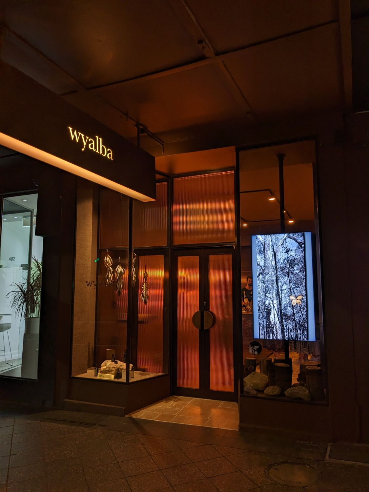
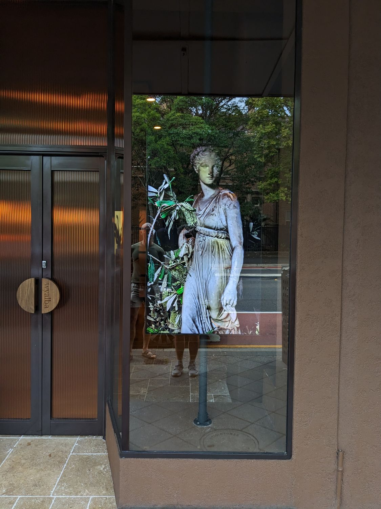

# Artwork display

!!! quote "James McGrath, Artist & Digital creator"
    Thanks again for your flawless, reliable software, that allows my artwork to be delivered to these unique spaces.

James McGrath is an Australian architect, artist and digital creator with a diverse range of experience in historical imagery, digital media, and traditional art. With over 20 solo exhibitions worldwide, James creates works that combine art, theater, and digital media, for public as well as private spaces.

James first contacted us in February 2022, looking for software to use for displaying digital art. We offered Slideshow as an easy-to-setup solution, working on almost any Android device. Since then, we have worked with him on several projects, including synchronized playback across multiple screens. He provided us valuable feedback and we were able to expand the solution to cover his requirements.

For art installations, James is using a branded version of Slideshow called Art.Base.Digital. This allows him to offer the art installations entirely under his own brand.

One of James’s newest exhibits is a video of an iconic ancient Greek statue of a dancing Daphne into a swirl of Australian native Banksia flowers. You can see it live in wyalba store at Oxford street in Sydney, Australia, on a twin portrait display powered by nVidia Shield TV Pro Android box with Slideshow app. The screens have been on 24/7 for 6 months already, with no issues so far. Thanks to using Slideshow and a more common type of screens, the overall cost of this installation was less than half of the originally quoted solution with a different cloud-based software, which also required more expensive hardware.

{ width="370" }
{ width="370" }
{ width="370" } <video controls width="370">
<source src="../artwork_james_mcgrath.mp4" type="video/mp4">
</video>

You can find more information about the work of James McGrath on [https://taplink.cc/jamesmcgrath](https://taplink.cc/jamesmcgrath) and [https://www.artbase.digital](https://www.artbase.digital).