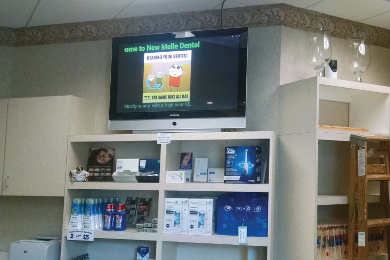
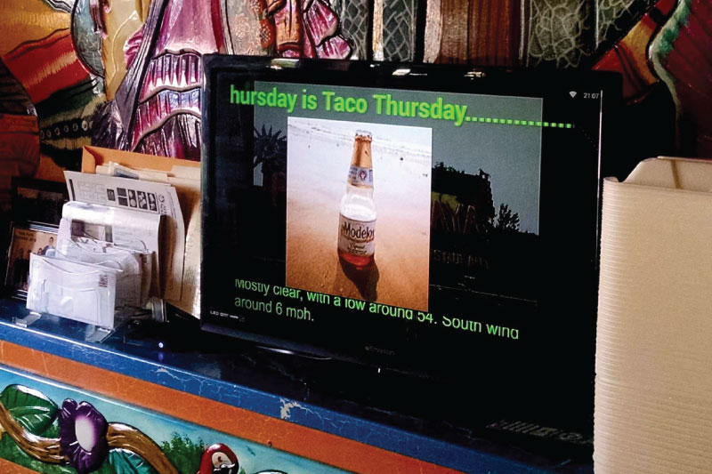
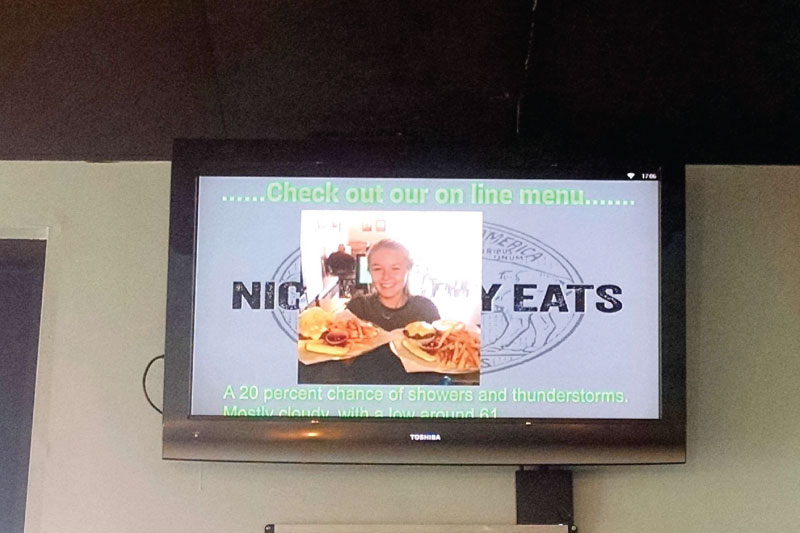

# Local Business Patriots

!!! quote "Mr. Paul Wheeler, founder and owner of Local Business Patriots"
    We have Slideshow running in 22 locations and are very pleased.

## Introduction

[Local Business Patriots](https://www.localbusinesspatriots.org/) is a digital signage provider based in Augusta, Missouri, USA. They are aiming at non-technical small business owners who don’t have the time or money to set up and operate complicated systems, but want a simple solution for displaying some images and messages, preferable using the already present TV  or screen with an HDMI input. As of 2020, they have been providing their services for more than 140 different stores, restaurants and service providers across the region of Central Missouri.

They have been using different digital signage software for some time, but due to its poor service and problematic Dropbox synchronization, they have started to look for a replacement and got in touch with us.

## Solution

After the initial feature comparison, we found out that Slideshow has some useful features that the previous software didn’t offer, but also lacked a couple of features, which were necessary for Local Business Patriots in order to smoothly transition between the solutions, such as switching screen layouts more often than once an hour. We offered adding the missing features, quickly agreed on a time frame and budget and within 2 weeks, they were already testing a beta version of Slideshow with all required features added. It took a week to stress test Slideshow, prepare configurations and finalize the details and afterwards Slideshow was ready to replace the previous software.

In order to make the on-boarding process as easy as possible for the small business owners, all clients of Local Business Patriots start with the same basic screen layout: scroll bar with customizable RSS messages on the top, customer’s images in the center, weather fetched as RSS news at the bottom and optional background image.

All images as well as Slideshow’s configuration are synchronized from their business Dropbox account via the Periodic download feature. Each location has a separate folder for files on the Dropbox and it is shared with the customer, who can upload new images there from anywhere in the world and Slideshow will start displaying them within 10 minutes. It acts as a true cloud-based digital signage solution and the only recurring cost for Local Business Patriots is a single business Dropbox account.

For updating the messages on the top of the screen, Local Business Patriots developed a script which enabled their customers to update the messages just by sending a simple text message or email and thanks to Slideshow’s RSS messages functionality, the new message is displayed on the screen within a minute after the email is sent.

If any change in the screen layout is requested by any customer, Local Business Patriots can prepare the new configuration, upload the XML file in the correct folder on Dropbox and Slideshow will synchronize it quickly. If the change is simple, for example slowing down the moving RSS messages, they directly edit the configuration XML file, if the change is more complicated, they prepare the required layout on their test device in the office and export the configuration as a backup.

## Result

In words of Mr. Paul Wheeler, founder and owner of Local Business Patriots, after a month from starting the deployment: “We have Slideshow running in 22 locations and are very pleased. It was a pleasure to work with you over the last few weeks.” The number quickly rose to 103 locations after two more weeks and more locations are currently pending, the goal is to reach 800 deployments by the end of 2021.

Based on the feedback from customers, we continue to work together on adding more features, which will be available for customers of Local Business Patriots as well as every user of Slideshow app.

{ width="370" }
{ width="370" }
{ width="370" }
