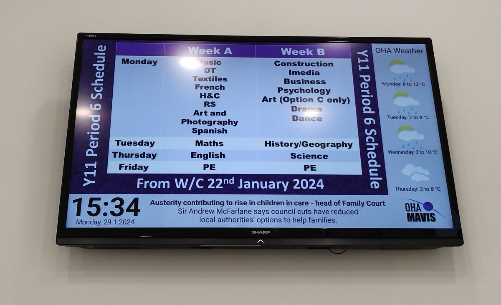
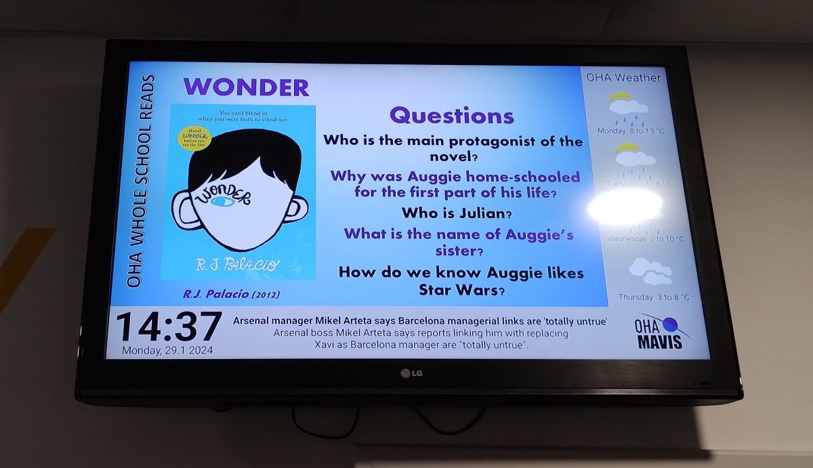
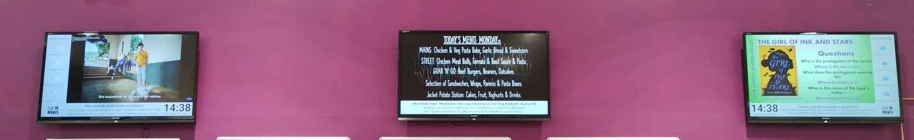

# Ormiston Horizon Academy

*Provided by Mr. Leigh Preece, Senior Science Technician at Ormiston Horizon Academy*

The [Ormiston Horizon Academy](https://ormistonhorizonacademy.co.uk/) in Stoke on Trent, United Kingdom, was built in 2012 and equipped with information screens and two video walls to pass on information to students and staff throughout the day.

An original system, over time, failed due to heat build-up due to fans inside small PCs becoming full of dust. The Academy’s Science Technician, Leigh Preece, with both a background in Science and Audio-Visual systems, researched a few potential replacements in 2020 and initially settled on a Raspberry Pi based system.

The Pi’s were connected to a cloud-based display system from Denmark, but sadly the plug was pulled on the servers in Summer 2023, leaving the Academy, once again, with blank screens.

Leigh spotted ‘Slideshow’ while he was looking at a mix of both low budget and some very high budget replacements for Raspberry Pi’s and PC-based solutions and, with some knowledge of Android, it was time to test the Slideshow for a few weeks while exploring the admin interface too.

An Android based ‘box’ was ordered online and the software trialled. Issues with connectivity arose and some units tested would not allow Slideshow to run on boot. A variety of other TV Boxes were trialled and eventually the ‘HK1 RBox’, running Android 12, proved to be reliable and would allow Slideshow to run 24 hours a day from boot up.

Content is generated by staff in PowerPoint and converted to JPEG and uploaded to Google Drive and regular synchronisation ensures that displays are always up to the date and the admin interface is proving useful, allowing remote administration of each screen.

The Academy daily lunch menu features alongside math puzzles, photo collages of student artwork, sports results, reading book information and advertisements for the Drama students upcoming production are just a sample of what is currently on screen.

Layouts have been adopted that show various RSS news feeds, time, local weather and the academy logo and, after watching the Slideshow YouTube tutorial videos; Leigh took on the challenge of showing ‘live content’ with the YouTube live stream of ‘Euronews’ to give students some real time news content into their academy day.

Slideshow is proving to be a reliable replacement, provides constant and up to date information to students and staff at the Academy and has proved very easy to establish, use and maintain.

/// caption
Screen with timetable
///

/// caption
Screen with books
///

/// caption
Three displays with Slideshow at OHA Restaurant
///
