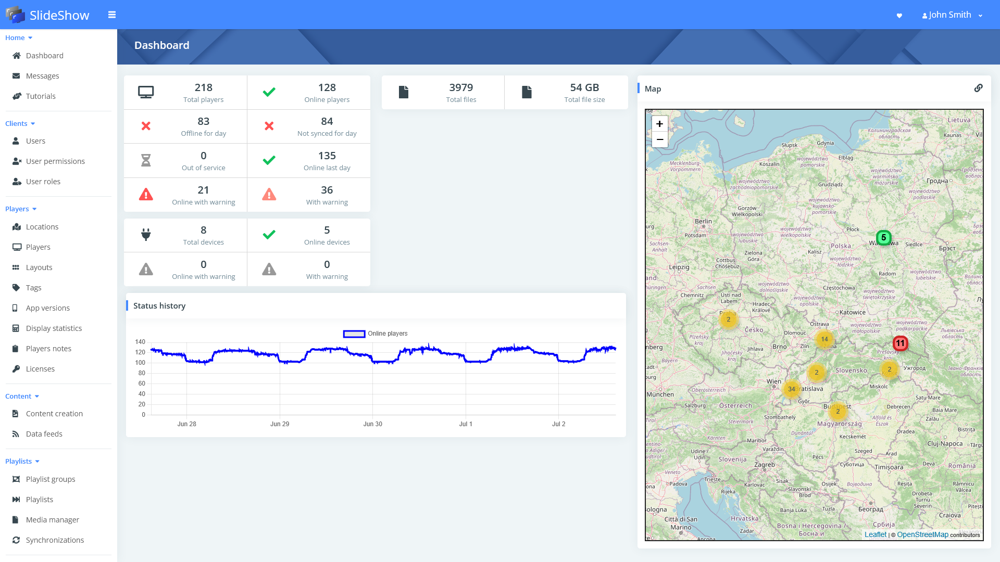
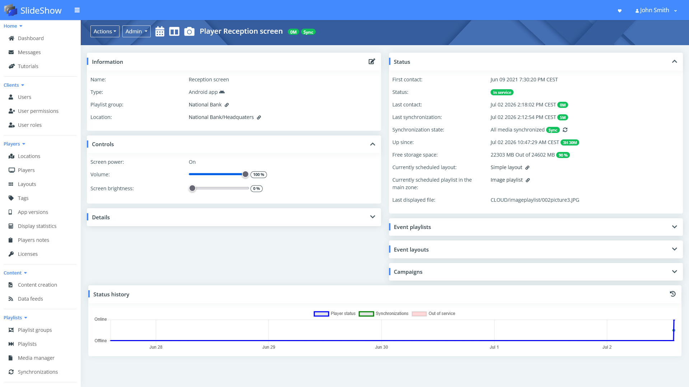
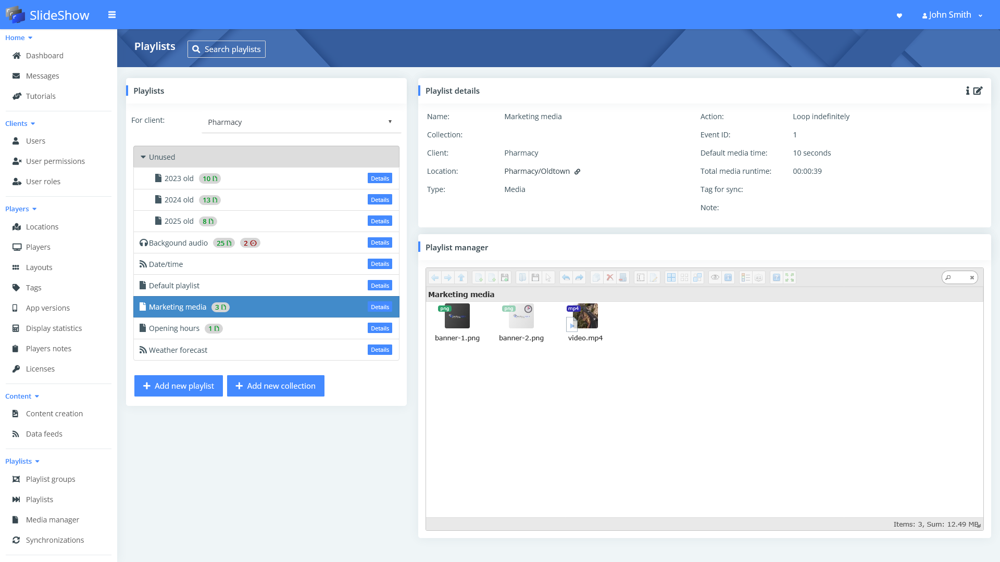

# Slideshow Cloud Management

SlideShow Cloud Management provides a centralized platform for remote management of multiple players running the SlideShow app. Users can manage content, schedules, and devices from anywhere in the world through a web browser.

SlideShow Cloud Management is offered as a commercial product for Digital Signage Providers.

## Features

- **Automatic player provisioning**  
  Install a customized APK on an Android device and the SlideShow app initializes automatically based on the device’s MAC address.
- **Player grouping**  
  Organize players by location and/or playlists.
- **Content scheduling**  
  Define which content is displayed on specific players or groups, including exact days of the week and times of day.
- **Event-driven playlists and layouts**  
  Trigger special playlists and layouts manually when needed.
- **Monitoring and analytics**  
  View player status, statistics, and graphical insights across all players, per client, or for individual devices.
- **Detailed reporting**  
  Access display statistics for players and media, with export to Excel for further analysis.
- **Notes management**  
  Add and manage notes for individual players and locations.
- **Media management**  
  Upload and organize content such as images, videos, documents and web pages.
- **Device configuration**  
  Configure settings for individual players or entire locations.
- **Automatic synchronization**  
  Changes to content, schedules, or settings are automatically synchronized from the cloud to the players.
- **Remote updates**  
  Upgrade the SlideShow app on devices remotely.
- **Remote device control**  
  Reboot devices remotely when necessary.
- **User management**  
  Create and manage user accounts with role-based permissions and automatic password recovery.
- **Client-based access control**  
  Group players by client. Users can be assigned to one or more clients and will only have access to their respective players.

## Deployment options

We offer two deployment models:

- **Managed service (SaaS)**  
  We provide SlideShow Cloud Management as a fully managed service. You don't need to handle any technical setup or maintenance.

- **Customer-hosted deployment**  
  You provide a Linux server (on-premises or via a preferred cloud provider). We install and configure all required components. You are responsible for system monitoring, operating system updates, and backups.

Both deployment options can be customized with your branding and deployed under your domain (e.g., cloud.customer-domain.com).

## Screenshots

/// caption
Dashboard with player statistics
///

/// caption
Player detail
///

/// caption
Playlist mangement
///

## Get Started

If you are interested in SlideShow Cloud Management, contact us at :material-email: [info@slideshow.digital](mailto:info@slideshow.digital?subject=SlideShow Cloud Management) and we will prepare a fully customized quote for you.
