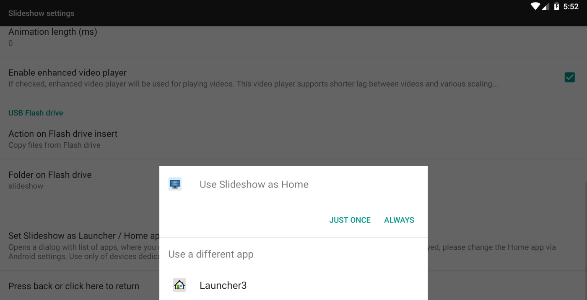
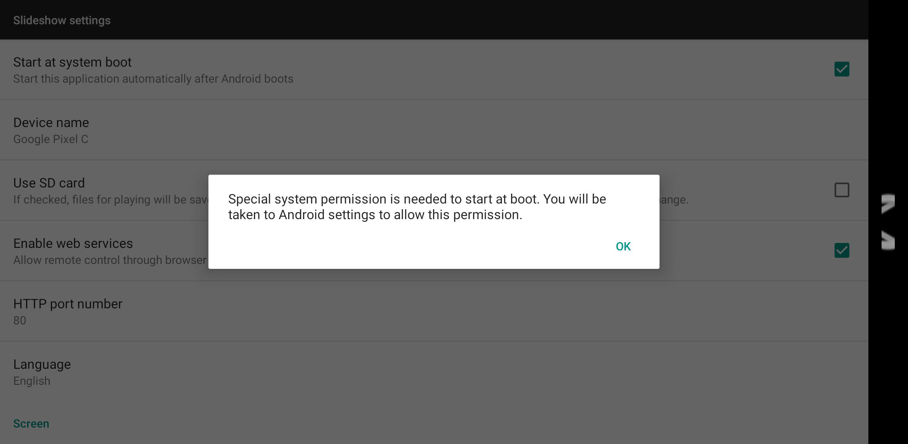
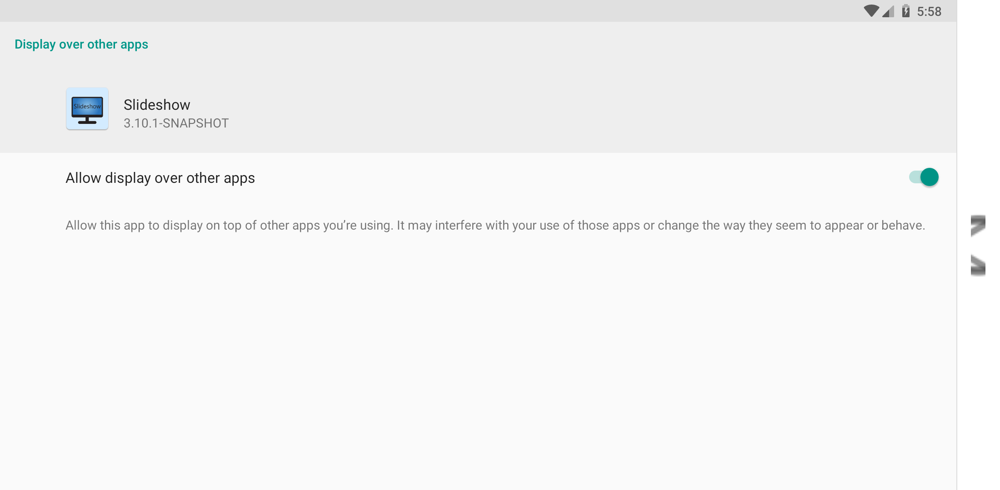

# Automatic startup

If you are using Slideshow for digital signage, it is important to set up automatic startup of Slideshow after the device boots, in case the whole device is restarted (e.g. due to power outage).

Several ways how to do it are described below. We suggest using only one method at a time, combining multiple methods is not recommended.

## Setting Slideshow as Android Launcher / Home app

Android Launcher app is an app providing the home screen, displaying widgets and other app’s icons on your Android device. It is the first app that is started when Android is booting up.

If you use an Android device only for Slideshow, this is the preferred way for Slideshow’s automatic start-up, as it’s faster (can save up to 15 seconds) and looks much more elegant for the end users.

You can set Slideshow as your Launcher app:

1. Via on-screen menu – `Basic settings`, scroll down and click on “Set Slideshow as Launcher / Home application”
2. You will get a pop-up, where you can choose Slideshow as your Launcher / Home app, select it. If there is a possibility to check “Always”, check it.
3. Depending on your device, you might need to redo steps 1., 2. and 3. one more time and click on the Always button.
4. Reboot the entire device. Slideshow should load immediately after the booting finishes.

Note that if you set Slideshow as your Launcher app, the Home button on your device (or remote control) will be mapped to Slideshow app. If you want to exit Slideshow or open another app, click on `Exit` in on-screen menu. You can unset Slideshow as Launcher app via `Basic settings`.

/// caption
Pop-up for choosing Android Launcher app
///

## Setting Slideshow to start at system boot

If you can't or don’t want to change Launcher / Home app on your device, you can still set Slideshow to start automatically by setting `Start at system boot` via on-screen menu – `Basic settings`. After Android boots up, it will start your regular Launcher app at first and then after a few seconds, Slideshow will start.

Depending on your Android version, you might need to allow "Appear on top" permission in Android (the name of the permission might differ in various Android versions). In case this permission is necessary for automatic startup, Slideshow will try to automatically navigate you to the relevant Android settings. If you receive the “You will be taken to Android settings to allow this permission” message, but Slideshow fails to navigate you there, try opening `Android Settings` – `Apps` – `Slideshow` – `Permissions` and allow `Appear on top`, `Display over other apps` or similar permission.

/// caption
Dialog on devices where "Appear on top" permission is needed
///

/// caption
Allowing "Appear on top" permission
///

## Using the possibilities of modified Android system

On some devices, users can simply set the application to start automatically after boot by long clicking Slideshow icon in the list of installed apps and choosing `Launch on startup` or similar option.

This option is available only on some devices, it depends on whether the device manufacturer added this possibility to the Android image for the particular model.

## Other useful features

You can combine automatic startup with two useful features of Slideshow:

- Setting Android’s wallpaper to Slideshow’s "Loading" screen
- Setting Android’s bootanimation to Slideshow’s "Loading" screen (available only on [rooted devices](../hardware/root_on_android.md))

You can set both of them via web interface – menu `Settings` – `Device settings` – scroll down and press button `Set wallpaper` or `Set bootanimation`.

## Video tutorial

<iframe style="width: 100%; aspect-ratio: 16 / 9;" src="https://www.youtube.com/embed/sUcgVIvLQuk?feature=oembed&start&end&wmode=opaque&loop=0&controls=1&mute=0&rel=0&modestbranding=0" frameborder="0" allowfullscreen></iframe>
