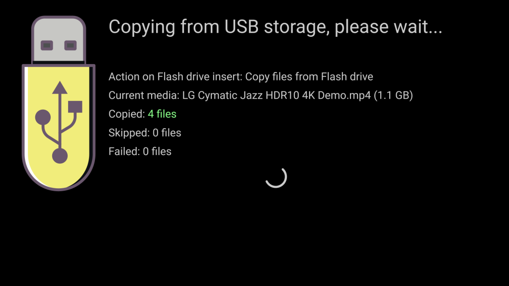

# File storage (internal, USB drive, SD card)

By default, Slideshow saves all files uploaded for playing into device’s internal storage, in the folder `/slideshow/slideshow`.

## SD card or USB Flash Drive as a permanent storage

If the size of your device’s internal storage is not sufficient and the device has an SD card or MicroSD card slot, or a USB port, you can use it as a file storage for Slideshow, by changing the setting Storage for media either via web interface → menu `Settings` → `Device settings` or on-screen menu → `Basic settings`. You can check whether Slideshow can detect the SD card or USB drive in `Device information`, under `External storages`.

The exact folder on SD card / USB drive, where Slideshow keeps the files can be either `/slideshow` or `/android/data/sk.mimac.slideshow/files/slideshow`, depending on the Android version (due to security policy of Android, which is out of our hands). We suggest formatting the storage to either EXT4 or FAT32, support of other file systems depends on your Android device.

Only the files for playing will be saved on SD card / USB drive. Configuration and logs will always stay in the device’s internal storage. After changing the `Storage for media` setting, you will have to re-upload all files for playing, they are not copied automatically between internal and external storage.

## USB Flash Drive as a source for copying or temporary playback

Slideshow can detect when you plug-in USB Flash Drive into your Android device (into USB host port) and depending on setting Action on Flash drive insert one of the following things can happen:

- **Do nothing** – Slideshow will "ignore" the flash drive and continue playing media files from internal memory.
- **Copy files from Flash drive** – Slideshow will pause the current playlist and copy all files from the flash drive into internal memory, overwriting files with the same name.
- **Delete files from device and copy from Flash drive** – same as a previous option, but deletes all already uploaded files first (irreversibly!).
- **Play files from Flash drive** – Slideshow will pause the current playlist in the main zone and play files from the flash drive in alphabetical order until the flash drive is unplugged. If there are any other zones in the layout, their content won’t be affected.

You can choose which folder to use on the flash drive in setting `Folder on Flash drive`. This can be used as a simple security feature, as Slideshow will ignore any flash drive not containing a folder with this name. Leaving this setting empty will cause Slideshow to copy or play files from the root folder of the flash drive, including hidden files and folders. At least one file should be present in the folder, in order for Slideshow to detect it correctly.

Flash drives formatted to either EXT4 or FAT32 should be supported by all versions of Android. Support of other file systems depends on your Android device.

If you add setup.csv file to USB flash drive, it will be recognized and processed before copying files.

/// caption
Screen while copying files from USB flash drive
///

## Video tutorial

<iframe style="width: 100%; aspect-ratio: 16 / 9;" src="https://www.youtube.com/embed/JnlM-xXn8wg?feature=oembed&start&end&wmode=opaque&loop=0&controls=1&mute=0&rel=0&modestbranding=0" frameborder="0" allowfullscreen></iframe>
