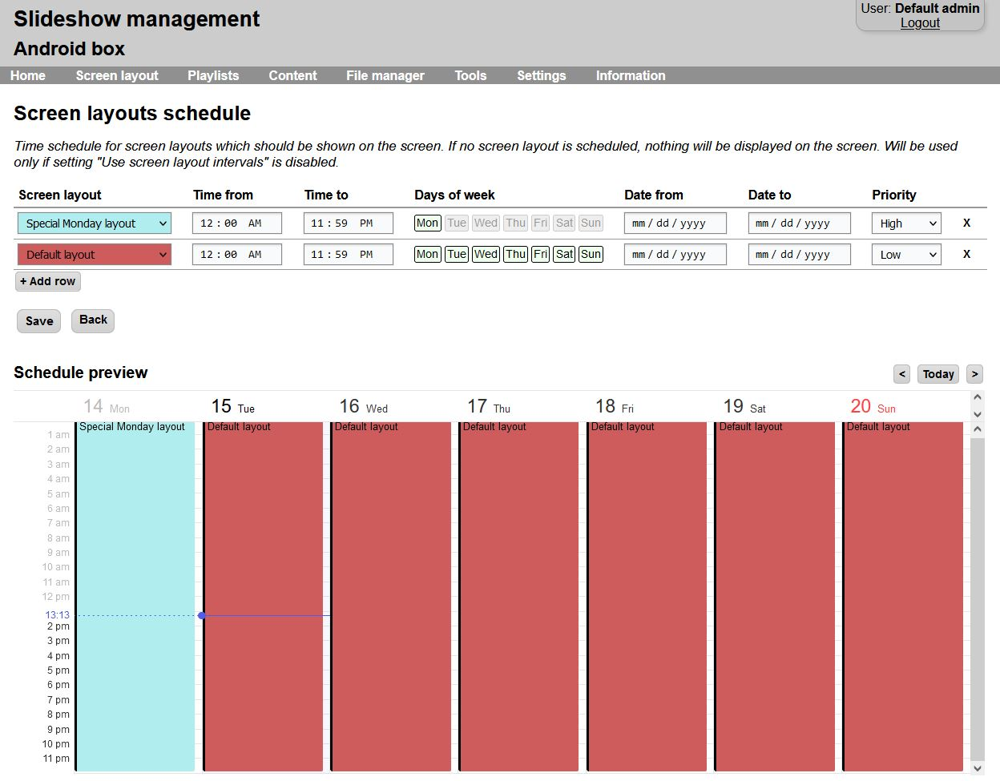
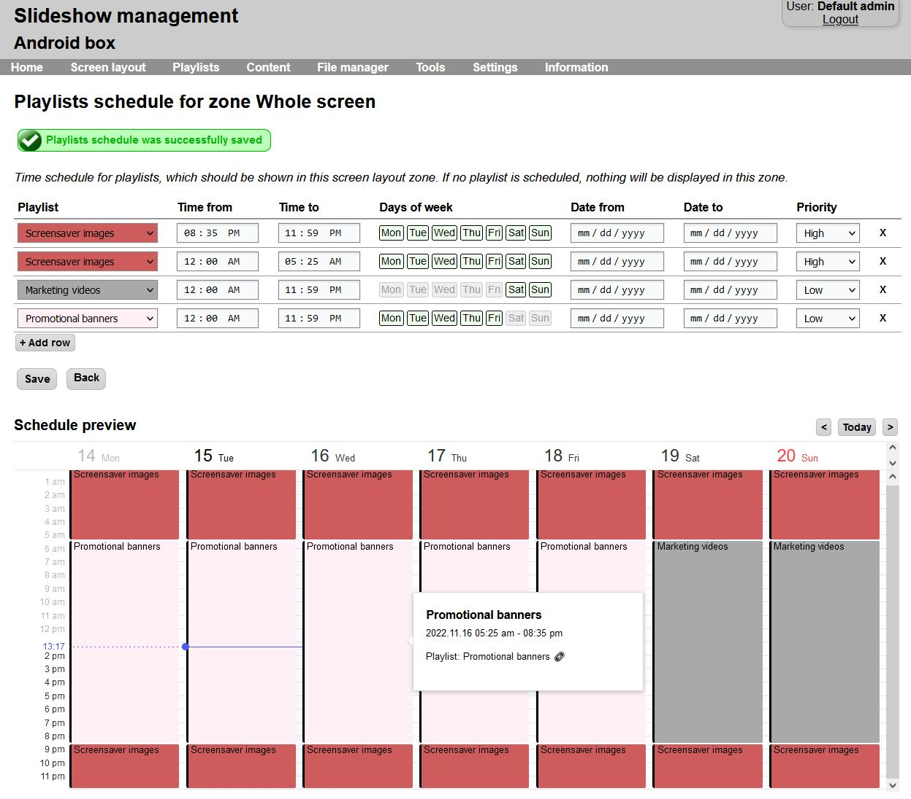
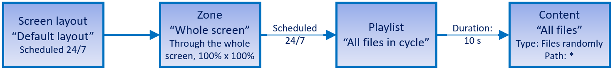
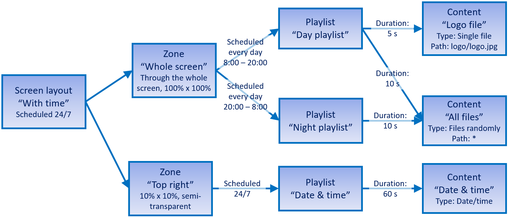

# Layout and playlist scheduling

Scheduling is used in two places in Slideshow app: for screen layouts schedule (which screen layout should be displayed when) and for playlists schedule (which playlist should be displayed when and in which screen layout zone).

You can manage all these settings from Slideshow’s [web interface](../../network-access/web-interface.md).

## Screen layouts schedule

You can setup schedule for screen layouts in order to display different screen layouts on different parts of the day or different days of week. Slideshow will automatically check the screen layout schedule each minute, so after changing the schedule, it might take up to a minute to see the change on the screen of the Android device.

You can manage the schedules via menu `Screen layout` → button `Screen layouts schedule`.

/// caption
Page for editing screen layouts schedule
///

## Screen layouts intervals

If you enable `Use screen layout intervals` through menu `Settings` → `Device settings`, Slideshow will use screen layout intervals to determine which screen layout should be displayed, instead of screen layout schedule. Intervals in minutes can be then set via menu `Screen layout` → `Edit screen layout` → `Interval`. The check whether to change a layout on the screen is performed automatically on the background every 10 seconds.

Settings `Wait with screen layout change` and `Reset order on playlist change` are often used with these intervals. Enabling `Wait with screen layout change` can be used for letting videos (or other content) play until the end before changing the layout. Disabling `Reset order on playlist change` is beneficial if the layout changes often and it is not required to start the playlist from the beginning of each change.

## Playlists schedule

Each screen layout zone has a schedule for playlists, that means that the zone can display different playlists on different parts of the day or different days of week. Slideshow will automatically switch the playlist when the next content from the playlist should be displayed.

You can assign playlists to a zone via menu `Screen layout` – `Edit screen layout` – double click a zone – `Playlists schedule for zone`.

/// caption
Page for editing playlists schedule
///

## Audio playlists schedule

There is a special scheduling for audio playlists, they are not connected to any screen layout zone, as this kind of playlists acts as [background audio](../../playback/background-audio.md). You can set up the schedule via the web interface → menu `Playlists` → button `Audio playlists schedule`. Only playlists with type `Audio playlist` can be assigned to background audio.

## Diagrams for better clarification

Below are diagrams for two sample configurations:

/// caption
Visualization of the default configuration - this is how content, playlists, zones and screen layouts are setup when you install Slideshow	
///

/// caption
Visualization of little bit more complex setup: two zones on the screen, one zone has different playlist during day and night, the day playlists switches between two different contents
///

## Video tutorial

<iframe style="width: 100%; aspect-ratio: 16 / 9;" src="https://www.youtube.com/embed/dC285mcUcbY?feature=oembed&start&end&wmode=opaque&loop=0&controls=1&mute=0&rel=0&modestbranding=0" frameborder="0" allowfullscreen></iframe>
