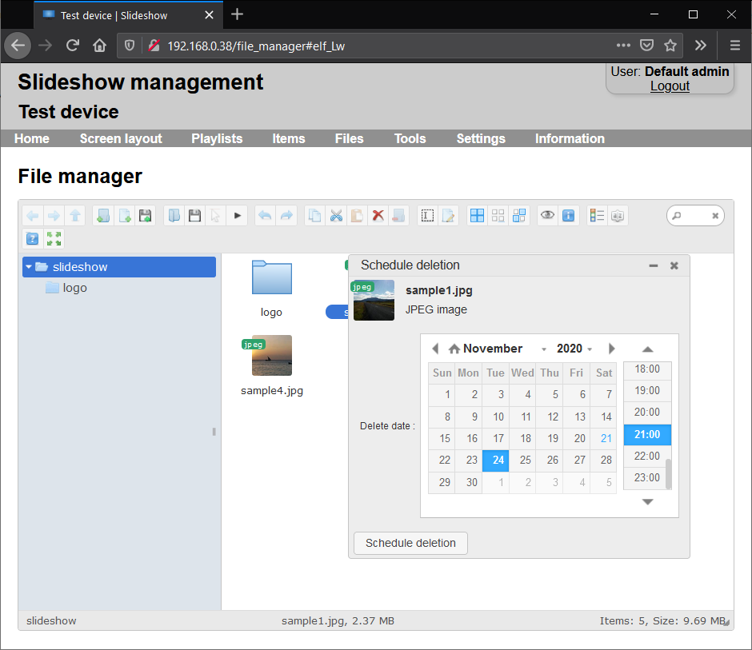

# Scheduled file deletion

Slideshow allows you to schedule the date and time when a file should be automatically deleted. This date and time is then checked periodically, and once the current date and time is past scheduled deletion, Slideshow will automatically delete the file from its internal storage. Interval how often are the dates checked can be configured via web interface → menu `Settings` → `Device settings`, item `How often to check files`.

Slideshow uses the system time for checking whether a file should be deleted. Please make sure that the device has the correct date, time and time zone set.

Bellow are three methods how you can set scheduled deletion of a file.

## Scheduled deletion via File Manager

You can set or change the deletion date for file via web interface →  menu `Files` →  `File manager`, right-click the file and pick `Schedule deletion`. In the dialog, you can pick date and time when you would like to automatically delete this file.

You can check the deletion date by either right-clicking the file and choosing `Get info`, or switching the File manager into List view. In both cases, the date is listed under "Delete date".

/// caption
Scheduled deletion in the File manager
///

## Scheduled deletion via setup.csv file

Deletion date can be configured in the setup.csv file included in ZIP archive, USB flash drive, Google Drive or Dropbox.

## Scheduled deletion via file name

If you upload a file with special file name to Slideshow through any channel (web interface, FTP, WebDav, USB, Google Drive, Dropbox, etc.), Slideshow will recognize the format and save the scheduled deletion date.

Supported format of file name is as follows: `{any name}_DEL_{date}.{extension}`

Supported date formats are:

- `yyyy-MM-dd` (e.g. 2019-12-07)
- `yyyy-MM-dd HH:mm` (e.g. 2019-12-07 13:20)
- `dd.MM.yyyy` (e.g. 07.12.2019)
- `dd.MM.yyyy HH:mm` (e.g. 07.12.2019 13:20)
- `xxD` (e.g. 20D, meaning deletion in 20 days after upload)
- `xxH` (e.g. 5H, meaning deletion in 5 hours after upload)

Examples:

- `image_DEL_2020-11-22.jpg`
- `video_DEL_2020-11-22 21:00.mp4`
- `sample-banner_DEL_22.11.2020.jpg`
- `temporary document_DEL_7D.pdf`

File name is checked only at the moment file is first uploaded to Slideshow. If you want to change the scheduled deletion date afterward, you can do so via File manager (see the first method). Renaming the file after it was uploaded has no effect on scheduled deletion.
