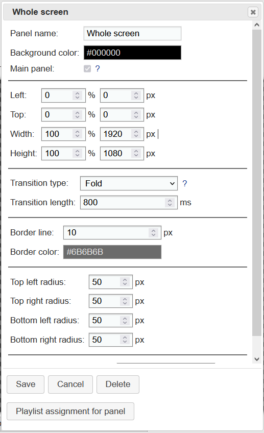
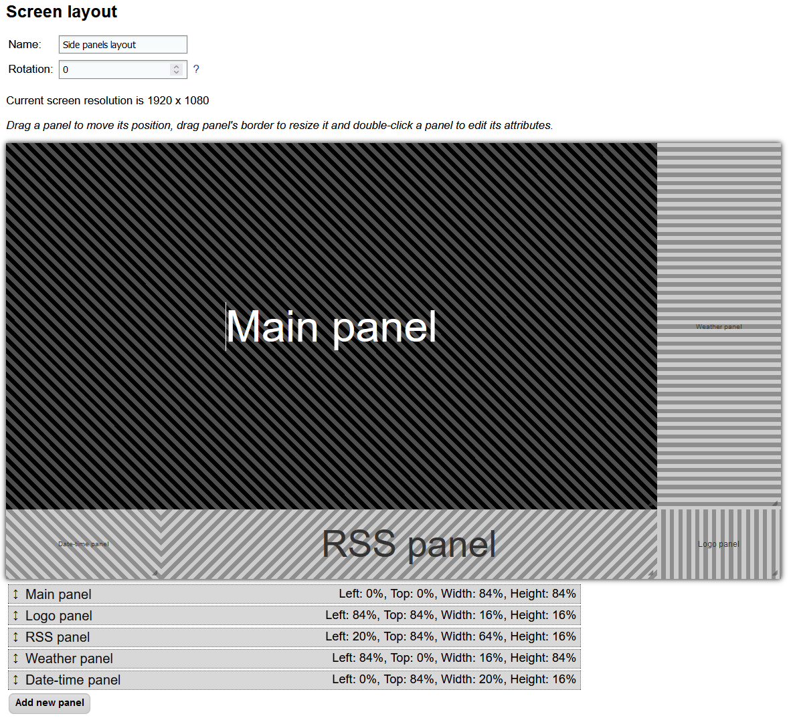

# Screen layouts and zones

Using screen layouts and zones, you can set up what content you would like to display on the screen. They can be created and edited through Slideshow's [web interface](https://slideshow.digital/documentation/network-access/) → menu `Screen layout`.

## Zone

Zone is a rectangular area on the screen. It has a defined position on the screen, in percentage of width and height. You can set up the following parameters for each zone:

- Position and size, either in percentage or in pixels (automatically recalculated)
- Background color, which can be semi-transparent, or linear / radial color gradient consisting of two colors
- Border lines, their width and color
- [Transition](https://slideshow.digital/documentation/animations/) between two consecutive images
- Rounded corners

Each zone has one or more [playlists](https://slideshow.digital/documentation/items-playlists/) assigned through [schedules](https://slideshow.digital/documentation/time-slots-and-intervals/), that means that the zone can display different playlists on different hours of the day or different days of week.

Zone can be configured through the `Edit screen layout` page, by double-clicking a particular zone.

/// caption
Configuration of a single zone
///

## Screen layout

Screen layout describes what the entire screen looks like. It consists of one or [several zones](https://slideshow.digital/2019/08/inspiration-for-layouts/), which can also overlap. You can use transparent or semi-transparent background color for overlapping zones. The zones are rendered in the exact order as they are displayed on the Edit screen layout page, the last zone in the list is displayed at the top of the screen. You can reorder the zones by dragging them in the list below the screen layout builder

You can schedule different screen layouts on different parts of the day or different days of week.

Through menu `Screen layout` → button `Sample screen layouts` you can quickly choose from a few predefined screen layouts and use them on your device.

/// caption
Configuration page of a screen layout
///

## Video tutorial

<iframe style="width: 100%; aspect-ratio: 16 / 9;" src="https://www.youtube.com/embed/f-2ikw_3riw?feature=oembed&start&end&wmode=opaque&loop=0&controls=1&mute=0&rel=0&modestbranding=0" frameborder="0" allowfullscreen></iframe>
