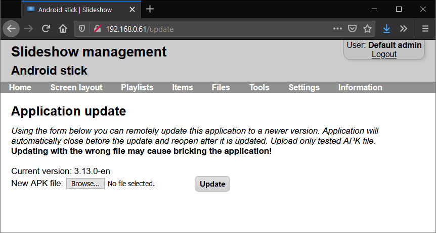
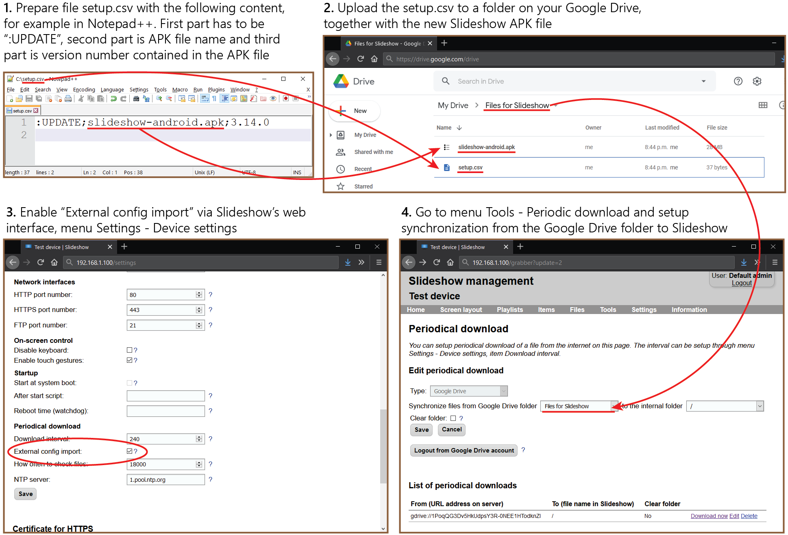

# Remote update

Slideshow can be updated remotely to a newer version using an APK file, which you can download from here. With the help of the remote update functionality, you don’t need physical access to the device in order to update the whole app and get new functionality.

Slideshow will start updating only if the update APK file differs from the one already installed on the device, otherwise it won’t do anything. You can check the current version of Slideshow on the top of the on-screen menu, or through the web interface → menu `Information` → `About software`.

Use remote update only on devices, on which you originally installed Slideshow manually through the APK file, not through Google Play Store or other app stores. Always review the changes in the new version before updating.

Remote update works only on [rooted devices](../hardware/root_on_android.md) or on devices on which Slideshow app is set as the device owner. Special handling is available for the following non-rooted Android devices:

- Zidoo Z9X
- Philips Smart TV. 

For other non-rooted devices, you can use only the automatic update option from Google Play Store.

## Remote update through web interface

If you can access Slideshow’s web interface, you can upload a new APK file through menu Settings – Application update. Update process will start several seconds after the file upload is finished and it may take up to one minute. Slideshow app will automatically reload after the update process is finished.

/// caption
Page for remote update
///

## Remote update through File synchronization

Slideshow can be updated via File synchronization from Google Drive, Dropbox, HTTP/FTP server or from USB flash drive using command `:UPDATE;APK file name;version` in the setup.csv file. Use the last part of the command ("version") to prevent Slideshow from unnecessary processing the file if the same version is already installed. `External config import` has to be enabled in Device settings in order for this functionality to work (this setting acts a security check).

Update is always performed as a last step of the synchronization process, after all other files have been downloaded. It may take up to one minute and Slideshow will automatically reload afterward.

/// caption
Diagram of remote application update through Google Drive
///