# Intel Compute Stick (Android-x86)

While testing Slideshow on various devices, I recently remembered that I have an older Intel Compute Stick and thought "Why shouldn't it run Slideshow?". So I prepared a tutorial for those of you wanting to try it as well, or simply wanting to try:

- Android on your PC or laptop *(steps 1-5 except the boot menu shortcut are the same)
- Slideshow on your PC or laptop *(all steps except the boot menu shortcut are the same)

## What is Intel Compute Stick?

Couple of years ago Intel released new product with their processor -- Intel Compute Stick. It is very similar to Android "sticks", except it contains regular Intel 64-bit processor. That means it fully supports Windows operating system (among others). On the other side, Android sticks usually use ARM processor.

For this test, I am using an older model from 2015, but the process is similar for newer models as well. Most of this tutorial can be used even for a general PC, laptop or box with 64bit Intel or AMD processor.

**Intel Compute Stick STCK1A32WFC - hardware parameters:**

- Intel Atom Z3735F processor, 4 cores, 1.33 to 1.83 GHz
- 2 GB DDR3L RAM
- 32 GB flash storage
- HDMI 1.4a output
- 1x USB 2.0 port *(only one, so you will need USB hub for connecting keyboard, mouse and USB flash drive at the same time)*
- MicroSD card slot
- WiFi 802.11b/g/n with integrated antenna
- Power through micro USB *(power adapter is rated for 5V/2A, so the power consumption is on the level of Raspberry Pi!)*

[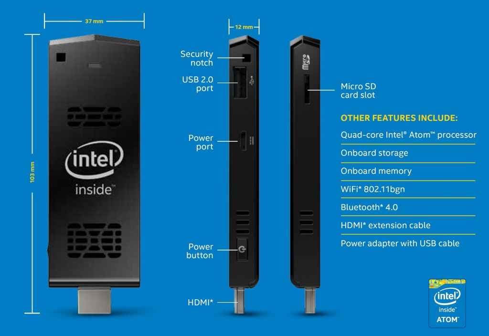](intel-compute-stick-marketing.jpg)

## What is Android-x86?

Android-x86 is a community and open-source project to port Android operating system to x86 platform (also known as "The PC"). Thanks to this project, you can run Android on your computer or laptop. Homepage of the project is <https://www.android-x86.org/>.

This tutorial has been done with version Android-x86_64-9.0-r1 -- most recent at the time.

## How to set it up - step by step

**1.** Download Android-x86 image from <https://www.fosshub.com/Android-x86.html> and flash it to the USB Flash drive (for example with [Rufus](https://rufus.ie/)).

[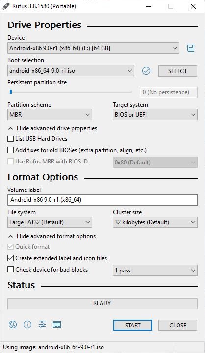](rufus-android.jpg)

**2.** Insert USB Flash drive into Intel Compute Stick, power it on and keep pressing F10 on the keyboard until you see Boot Menu (the key shortcut might be different on other devices). Select the USB Flash drive and press Enter.

[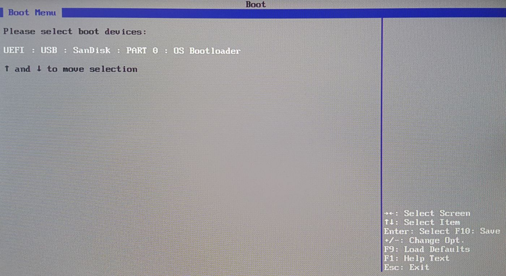](intel-compute-stick-1.jpg)

**3.** Installation screen of Android-x86 will be displayed after few seconds. Select Android-x86 Installation and continue with the steps on the screen (see <https://www.android-x86.org/installhowto.html> for more details). Be careful when selecting the partition for installation, it will overwrite all files! After finishing the installation, choose to reboot the device.

Alternatively, you can select Android-x86 Live, which would start temporary Android on your device, without touching data on your hard drive. Just note that everything you do in this setup will be lost after the reboot, so I suggest using this only for quick testing.

[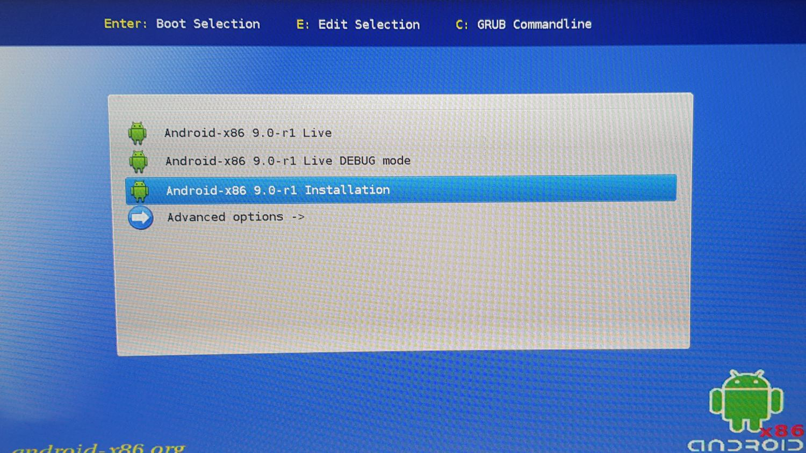](intel-compute-stick-2.jpg)

**4.** Android will boot into first-run setup. Select your language, setup WiFi connection (I highly suggest this), connect your Google account (not necessary at all).

If by any chance you get "A bootable device has not been detected" error message, try reinstalling Android-x86 with the "Auto Installation" option. As a last resort, install Ubuntu (or different Linux) first and then reinstall it to Android-x86.

[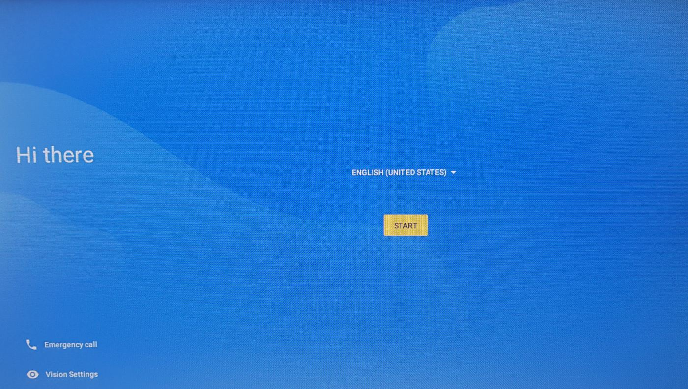](intel-compute-stick-3.jpg)

**5.** Congratulation! You are now running full Android operating system directly on the PC platform, without any emulator.

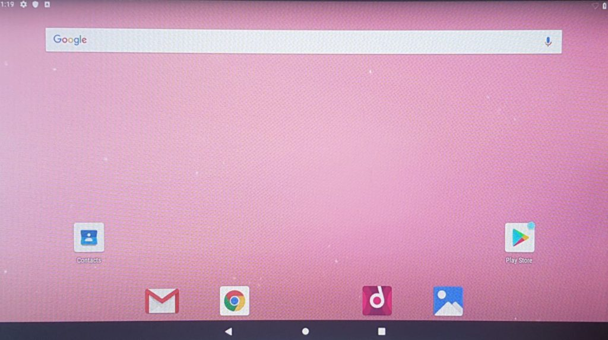

**6.** Open Chrome on Android and download the newest Slideshow APK from <https://slideshow.digital/how-to-get-it/>. Run the APK file to install Slideshow. Android will ask you for confirmation whether you want to allow installing apps from Chrome -- select Allow.

[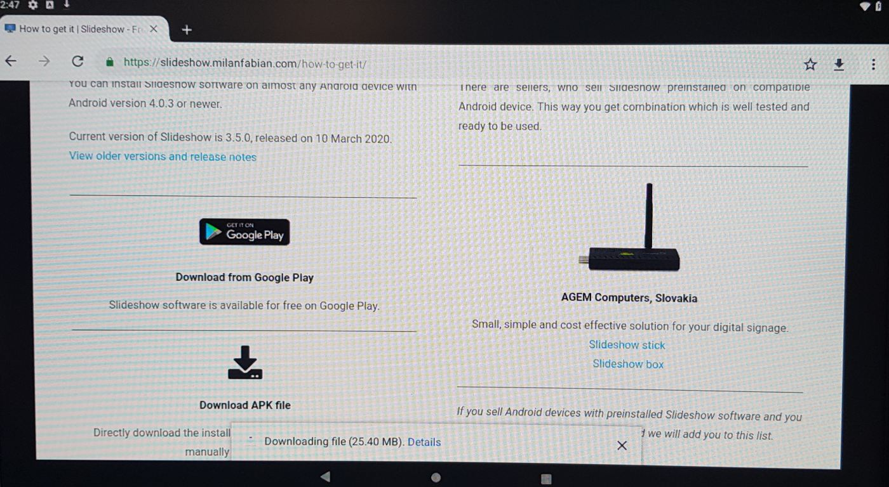](intel-compute-stick-4.jpg)

**7.** Run Slideshow after installation, allow access to images & files (necessary), allow superuser access (highly recommended) and go through the settings.

If you want to use this installation for real digital signage, most important settings are "Start at system boot" (check) and Device name (use something more descriptive than the original name).

Afterwards, scroll down and click on the "Press back to return".

[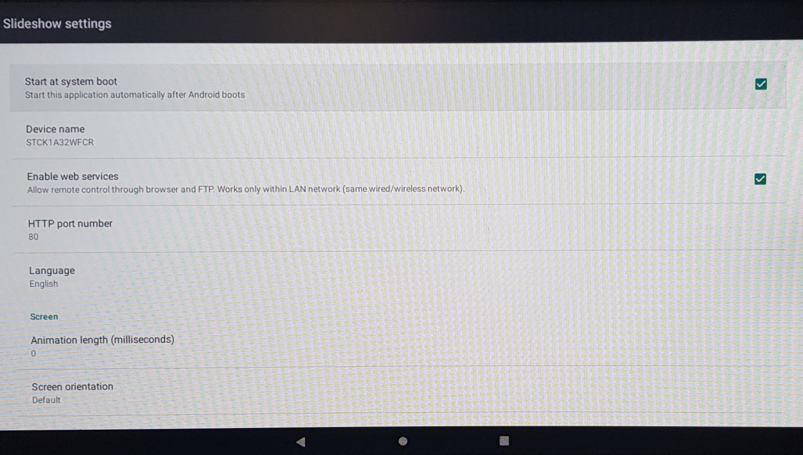](intel-compute-stick-5.jpg)

**8\.** Slideshow is ready -- you can now start using it. For example, open the address displayed on the screen in browser on your (other) computer and upload files.

[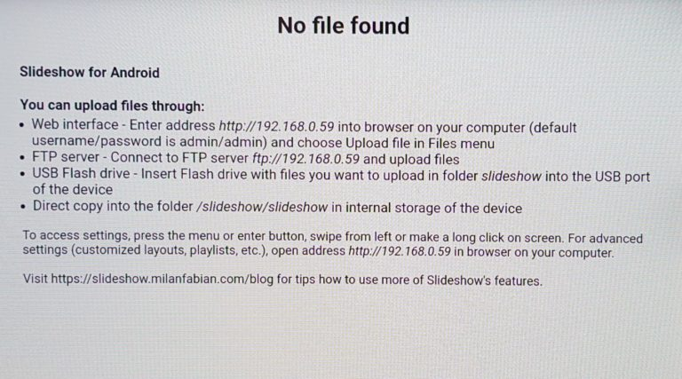](intel-compute-stick-6.jpg)

## Performance observations

- At the beginning, Android displayed "Application not responding" notification a couple of times. After the reboot everything was running much smoother (almost no lags).
- The performance of Intel Compute Stick with Slideshow is fairly standard -- in 720p and 1080p it doesn't have any problems displaying video and moving text at the same time. It also supports [Enhanced video player](../../playback/video-playback/index.md), so you can experiment with [rotating the screen](../../configuration/screen-rotation.md) as well.
- In higher load (even playing standard 720p x264 video, hard to say if hardware decoding is active), the CPU temperature goes over 55 °C and that triggers tiny cooling fan inside the device (how did they even fit a fan there?), which has little bit tiresome sound. Be aware of this if you are planning on running it in a quiet place.
- While working with the user interface (settings, benchmarks), WiFi was disconnecting after approximately 10 minutes, requiring manual reconnect through settings. However, with Slideshow running the WiFi kept connected during the whole 5 hour test, probably because of Slideshow's WiFi lock.
- Switching between low power and performance mode in BIOS had no measurable effect on the performance.
- I tried running AnTuTu and Passmark benchmarks to get a hint of comparison to other devices, but both failed (AnTuTu got stuck on the GPU test, Passmark crashed immediately after launching the app). I finally used Geekbench 4.4, which run without any problems. The performance is around 2014's OnePlus One, which is not bad for a device which cost around 110 EUR in 2015. You can find graphs with the complete results bellow and compare Intel Compute Stick with Rockchip RK3288, which is still a popular System-on-chip in Android boxes.

[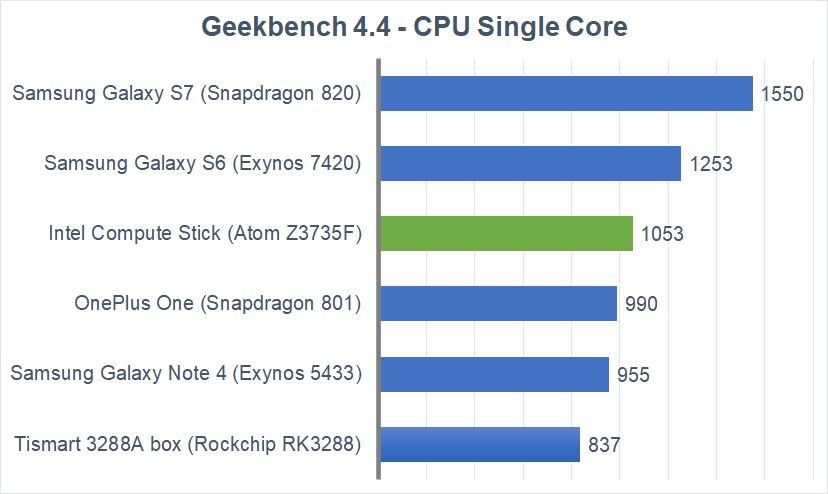](geekbench-benchmark1.jpg)

[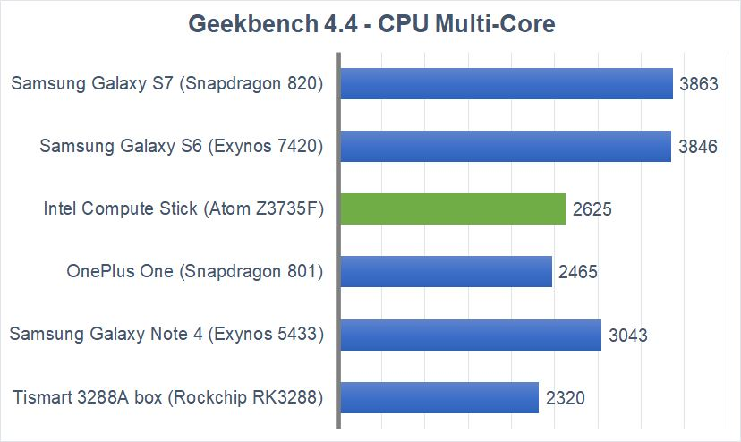](geekbench-benchmark2.jpg)

[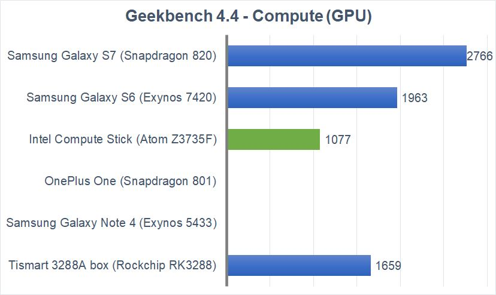](geekbench-benchmark3.jpg)
/// caption
Results for Intel Compute Stick and Tismart 3288A box were measured as a average of two runs. Other results are a courtesy of Geekbench results database.
///

## Conclusion

In general, Intel Compute Stick and Android-x86 seems combination worth a try for an IT enthusiast. If you are looking for a problem-free plug-and-play system, native Android box or stick with ARM processor is still probably a little bit better idea.

It is important to note that we are talking about a credit card sized device with release price around 110 EUR in 2015, which is running on just a couple of watts of electricity. From this point of view, I am pleasantly surprised how it performed and that I successfully managed to run Slideshow on it without any restrictions.
