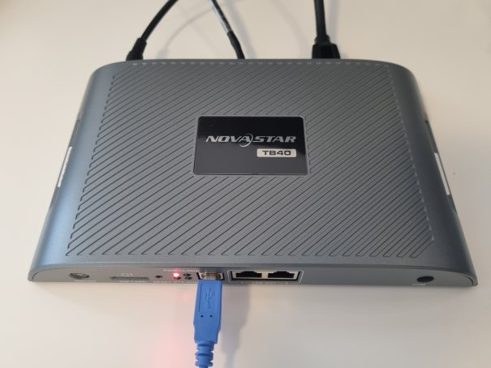
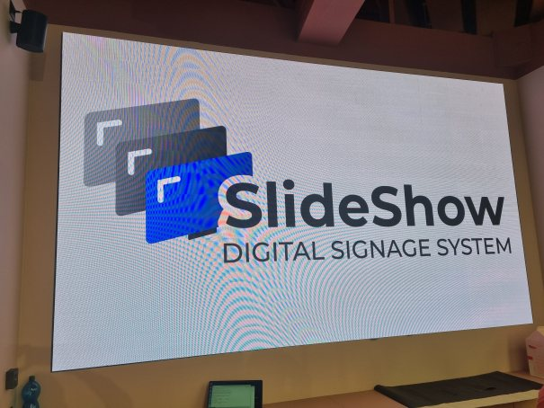

# NovaStar TB40 LED controller

The NovaStar TB40 is a mid-range multimedia controller from the [Taurus Series](https://www.novastar.tech/product/detail.html?catid=4&id=46), which combines Android-based media player and LED controller into a single intergrated device.

While it is possible to use a separate Android box with Slideshow and connect it to the LED controller via HDMI cable, NovaStar TB40 can be also used with Slideshow directly, without any need for a separate box.

## Installation of Slideshow 

1. Install [ViPlex Express](https://novastar.shop/en/downloads/) software and [ADB tool](https://www.xda-developers.com/install-adb-windows-macos-linux/) on your computer
2. Connect NovaStar TB40 to the computer via USB A-B cable
3. Open ViPlex Express software on your computer
4. Type `novasoft` anywhere in the app
5. Open the newly shown `User Software` tab
6. Connect to the device using username `admin`, password `SN2008@+` (if you changed the password, enter the changed one)
7. Enable ADB and disable PlayService
8. Pick the [installation APK](../../../get-started/index.md), check `Auto launch on startup` and install app
9. Open command line on your computer and run command `adb shell`. If you get `adb.exe: device offline` error, unplug the USB B cable from the LED controller, re-plug it and try the command again. If you get any error with the later commands, try running `adb root` command before `adb shell`.
10. While in `adb shell` command, enter the following commands, in order to allow permissions for SlideShow:

    ``` 
    pm grant sk.mimac.slideshow android.permission.READ_EXTERNAL_STORAGE;
    pm grant sk.mimac.slideshow android.permission.WRITE_EXTERNAL_STORAGE;
    appops set sk.mimac.slideshow MANAGE_EXTERNAL_STORAGE allow;
    ```
   
11. Optionally, set other options while in `adb shell` command as well:

    ```
    pm grant sk.mimac.slideshow android.permission.CAMERA;
    pm grant sk.mimac.slideshow android.permission.SYSTEM_ALERT_WINDOW;
    pm grant sk.mimac.slideshow android.permission.READ_LOGS;
    dpm set-device-owner sk.mimac.slideshow/.AppAdminReceiver;
    setprop persist.sys.timezone "Europe/Bratislava";
    settings put global ntp_server pool.ntp.org;
    settings put global auto_time 1;
    settings put global package_verifier_user_consent -1;
    ```

12. You can exit the `adb shell` command by typing `exit`.
13. Run the app, for example using command `adb shell am start -n sk.mimac.slideshow/sk.mimac.slideshow.StartupActivity` from the computer.

Slideshow can't be set as a launcher app, otherwise NovaStar's configuration won't work properly

Based on the feedback from the community, SlideShow can be installed on other Taurus series controllers from NovaStart, such as TB60 and TB20 Plus, with the same steps.


/// caption
NovaStar TB40 LED controller
///


/// caption
LED wall driven by SlideShow and TB40
///
