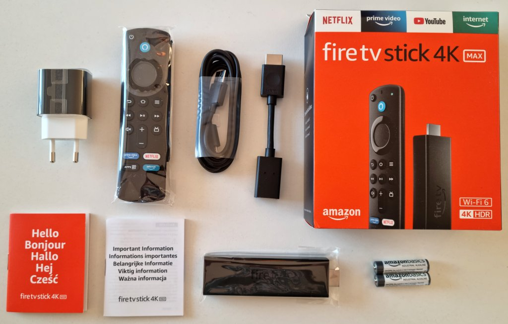
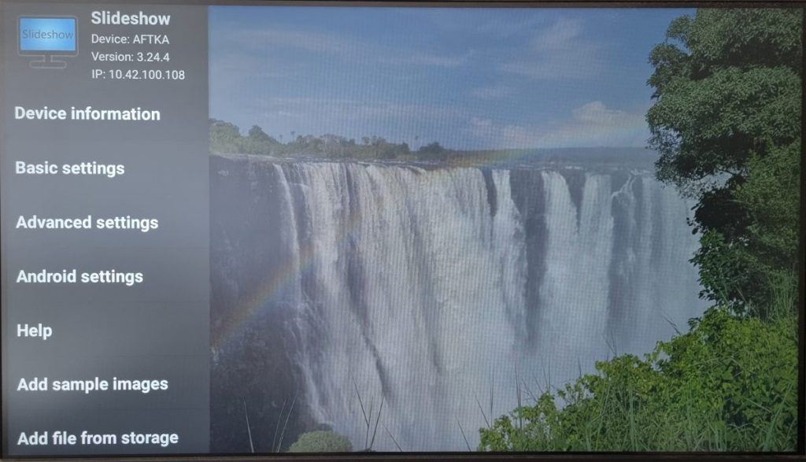

# Amazon Fire TV Stick 4K Max

Over the past years, we have received multiple questions regarding the compatibility of Slideshow with various Amazon Fire TV products. We knew it worked together, as Slideshow app was approved on [Amazon Appstore](https://www.amazon.com/Milan-Fabian-Slideshow-Digital-Signage/dp/B089J4ZTQY). However, we were curious how good the compatibility is, whether there are any features that could be enhanced and whether we should recommend the Fire TV series to users of Slideshow.

We decided to get the newest stick from Amazon called [Fire TV Stick 4K Max](https://amzn.to/3waofRq), which was released in October 2021. We ordered it directly from [Amazon.de](https://amzn.to/3waofRq) for a total of 61.47 EUR (including delivery), and we received it 9 days after placing the order (it was right before Christmas, so the longer delivery time was expected).

## Specification

- **CPU:** MediaTek MT8696 SoC, four ARM Cortex-A53 cores (64 bit), 1.8 GHz
- **GPU:** PowerVR IMG GE9215
- **RAM:** 2 GB DDR4
- **Internal storage:** 8 GB (about 4.2 GB is accessible for data)
- **HDMI output:** HDMI
- **Network connectivity:** WiFi 802.11b/g/n/ac/ax
- **Power supply:** 5.25V/1A DC adapter
- **Operating system:** Fire OS 7.2.5.5 (based on Android 9, modified by Amazon)

By default, there is no expansion option, the stick is without a microSD card slot and there is only one USB-C connector, which has to be used for power supply. If you want to expand the connectivity, you can buy a [special adapter](https://www.amazon.com/Amazon-Ethernet-Adapter-Fire-Devices/dp/B074TC662N) for wired LAN connection or a USB splitter for connecting a USB Flash drive, mouse or keyboard.

## Unpacking

Content of the package:

- Amazon Fire TV Stick 4K Max
- Remote control
- Power adapter (5.25V / 1A) with USB A port
- 1.5 m USB A – Micro USB cable
- 10 cm HDMI extender (female – male)
- 2x AAA battery for the remote control
- Manuals

We was quite disappointed to see Micro USB cable (instead of USB-C) and only 1A power adapter. 5W of power is apparently enough for the Fire TV Stick, but it would be nice to be able to reuse the power adapter for more power-hungry devices as well.

We initially used a different power adapter, but after getting a "Insufficient USB power detected" message, we switched to the bundled power supply.

/// caption
Content of the box
///

## First start

After plugging the Fire TV Stick in for the first time, we were greeted with the first-time setup consisting of several steps:

1. Remote control pairing – just press a button on the remote control 
2. Choose language from 12 available languages (with multiple regional variants)
3. Connect to WiFi network
4. Check for new firmware (our Fire TV Stick automatically upgraded to the newest firmware available, it took just a couple of minutes)
5. Sign in with your Amazon account, without any option to skip this step – sign-in is mandatory. Even if you deregister this device from your account later, you are immediately forced to register it on another account. You don’t have to enter the entire username and password using the remote control, just login to the Amazon account from your computer or smartphone and enter the code displayed by Fire TV Stick. 
6. Option to activate the parental control 
7. Enter the TV brand for remote control setup (for example, for controlling the volume). There is a huge number of brands available, but scrolling takes a lot of time. We didn’t find a way to skip this dialog in case you are using a screen without IR remote control (e.g., regular PC monitor). 
8. Offer for Prime free trial for 30 days 
9. Choose a profile (who is currently watching)

## Software

Operating system of Fire TV Stick is Fire OS 7, which is heavily modified Android 9. From the first moment you can see that this device is focused on movie playback, you are greeted with a home screen containing ads for the newest movie on Prime Video.

Only a few apps are preinstalled on the stick:

- **Prime Video** – app for watching movies and series from your Amazon Prime Video subscription.
- **Amazon Music** – app for streaming music, very similar to Spotify. Works also in background, while using another app.
- **Silk browser** – regular web browser based on Chromium. Entering URLs through the on-screen keyboard is really slow, using voice recognition is much faster, but it’s problematic for non-English website names.

You can install additional apps through Amazon Appstore, which acts as a replacement for Google Play store. The number of apps available is nowhere near the number of apps on Google Play and the quality is often quite disappointing. If you would like to play a little bit with the stick and try various apps, you will probably need to install two apps first:

- **[Downloader](https://www.amazon.com/AFTVnews-com-Downloader/dp/B01N0BP507/)** app, which lets you sideload APK files for apps which are not available in Amazon Appstore
- **[Mouse Toggle for Fire TV](http://android.fluxii.com/mousetoggle/)** app to simulate a mouse on the screen, which is usable for apps that require mouse or touch for control

There is no preinstalled app for playing videos or music from your local storage, you can install them from Amazon Appstore or download through Downloader.
The stick is not rooted by default. Developer options can be activated, but they contain only two settings: ADB debugging and Install of unknown apps, so the room to adjust various settings is pretty limited (not necessarily a bad thing, given the focus of the device). According to [a thread on XDA developers forum](https://forum.xda-developers.com/t/unlock-root-twrp-unbrick-fire-tv-stick-4k-mantis.3978459/) the stick can be rooted, but the process includes disassembling the device and shorting some pins, so it’s definitely not something you will do on a regular basis.

Home screen
Home screen

Amazon Appstore
Amazon Appstore

Silk Browser
Silk Browser

## Performance

While navigating the user interface of Fire TV Stick, it was always responsive and fast.

To get some objective performance comparison with previously tested devices, we wanted to run Geekbench 4.4 and AnTuTu 8.5.3 benchmarks on the stick. While We managed to get results from Geekbench with the help of Mouse Toggle app (no way to navigate through the app without mouse), we were unable to run AnTuTu benchmark as it was always asking for permission to access the phone (no such thing on Amazon Fire TV Stick).

The results in Geekbench are slightly above Rockchip RK3288, we consider it as-expected for a tiny, fanless and quite inexpensive stick. It has enough performance for all the expected tasks – media playback and light web browsing.

Despite having only an integrated WiFi antenna, the network connection was stable all the time. Average transfer speed to AX3600 access point across 5 meters and a single wall was around 150 Mbps, which is more than enough even for 4K streaming. After moving the stick closer to the access point (approximately 1 meter) the speed rose to an impressive 300 Mbps.

## Media playback

There are Prime Video and Amazon Music apps preinstalled on the Fire TV Stick, with quite a big offer of movies, series and music. Of course, a monthly subscription is needed for playback and even the trial requires entering a credit/debit card number, with automatic billing in case you forget to cancel your subscription within a trial period.

Both Prime Video and Amazon Music offer an automatic trial after you subscribe and enter your card details. Amazon Music worked without any problem, we entered the card details on our computer while signed in on the same Amazon account as on the stick, and afterward we could immediately start listening to the music. There were more problems with Prime Video, at first it accepted the same card as Amazon Music, but then displayed an error “We were unable to process your payment”. Reentering the card didn’t help and without an accepted card, we were unable to activate the Prime Video account in any way. We suspect the problem might be with 3-D secure payment verification, which is required by all local banks, but probably not completely supported by Amazon.

There is no other video player preinstalled, so if you would like to watch offline content, you will have to download another player from Appstore. We can highly recommend [VLC for Fire](https://www.amazon.com/dp/B00U65KQMQ), which lets play content from the local storage, or easily mount a network storage. Playback of 4K videos in both H.264 and H.265 format was smooth, hardware decoding was working without any problem.

You can also install Netflix and Apple TV apps from Appstore, if you have a subscription to these services.

## Installation of Slideshow

Slideshow can be installed on the Fire TV Stick in three ways:

- From Amazon Appstore on your computer, open [https://www.amazon.com/Milan-Fabian-Slideshow-Digital-Signage/dp/B089J4ZTQY](https://www.amazon.com/Milan-Fabian-Slideshow-Digital-Signage/dp/B089J4ZTQY), click on the Deliver button on the right side (you have to be logged in with the same Amazon account as on your stick). The app will be delivered to the device in about a minute and you can launch it afterwards
- From Amazon Appstore on the stick, open Appstore application and search for "Slideshow Digital Signage". Select the blue logo of Slideshow app and click on Download.
- Using Downloader app ([https://www.amazon.com/AFTVnews-com-Downloader/dp/B01N0BP507](https://www.amazon.com/AFTVnews-com-Downloader/dp/B01N0BP507)), navigate to [https://slideshow.digital](https://slideshow.digital), click on `How to get it` in the menu and `Download APK file`. Downloader will start the installation automatically.

The easier (and preferred) method is through Appstore. We suggest using Downloader app only if you want the upgrade immediately to the newest version of Slideshow (as the approval process in Appstore might sometimes take a week) or if you are installing a branded version of Slideshow.

Installing Slideshow through browser on a computer
Installing Slideshow through browser on a computer

Installing Slideshow through Appstore on the device
Installing Slideshow through Appstore on the device

Installing Slideshow through Downloader app
Installing Slideshow through Downloader app

### First start

After starting Slideshow on Fire TV Stick for the first time, the app will ask you for permission to access the media and files on your device. Without granting this permission, Slideshow can’t work, as it needs access to the files it should be displaying.

After Slideshow app loads, you can start adding files. As there is no free USB port left on the stick, we suggest uploading the files from the web browser on your computer through Slideshow’s web interface; you can find its address on the screen after startup.

If you would like to open the on-screen menu, you can do so by pressing the menu button on Fire TV remote control. Using option “Add file from storage” from the on-screen menu unfortunately doesn’t work properly on Amazon devices, as there is no way to navigate in the following system dialog (reported to Amazon without reply, sadly).

/// caption
Slideshow on Amazon Fire TV Stick 4K Max
///

### Usage

**Video decoding** is without any problems, even combination of 4K videos and video preloading (for minimal lag between videos) works fine. We tested various high-bitrate H.264 and H.265 videos, it successfully played the highest bitrate we could find – 250Mbps H.264 4K video and 400Mbps H.265 4K 10bit video. We were honestly impressed, the hardware video decoding was really impressive, as the supported bitrate is over 10 times more than what you can possibly need in real life.

The only video we could find that wasn’t played lag-free was a 4K video encoded in AV1 codec. While FullHD AV1 was without problems, 4K AV1 was visibly laggy. As this codec is still quite new and not at all common in digital signage media, we don’t consider this a problem. Even support for FullHD AV1 decoding is much more than what you usually get in a 60 EUR device.

While the video decoding was a positive surprise, support for a **4K output** was a little bit of a negative surprise. Similar to the most Android devices claiming 4K support, it has only Full HD internal framebuffer and 4K support is valid only for video playback, meaning you can play 4K videos, the TV will display it as 4K, but images and graphics will be processed in lower resolution. Moreover, the 4K output is available only on devices that support HDCP 2.2. So if you have a special display with HDMI 2.0 4K input, but without HDCP 2.2, the stick will lock its output in Full HD. We understand why Amazon would lock it for their video content (HDCP is used for protecting the content from being copied), but we don’t know why they locked it for other apps as well.

Little bit surprising was the fact that it is not possible to directly control the **audio volume** output of the stick, it always plays on the maximum volume. Volume keys on the remote control are used for controlling your TV’s volume via HDMI-CEC, not stick’s volume. That means that if you have a screen without HDMI-CEC support, you will have to manage the volume directly on that screen. Changing the volume using the slider on the home page of Slideshow’s web interface doesn’t work at all on Fire TV Stick.

Although the raw **performance** of the CPU in the stick is much lower than what you get in high-end smartphones, it still has enough performance for all computing-intensive tasks, such as transitions between images and scrolling RSS news.

Fire TV Stick 4K Max is marketed as with 8 GB **internal storage**. Part of the storage is reserved for the system, the partition for user files has 5 GB, from which there was about 4 GB free after first startup of Slideshow (the rest was occupied by other apps and their data). That might be enough for many marketing slides and clips, but don’t expect to be able to upload high-quality hours-long video, it won’t fit there. As there are no easy ways to expand the internal storage, it is a pity that they didn’t put larger storage in the device.

As for the **automatic start** of Slideshow after the stick boots, you can set it up by checking “Start at system boot” in Basic settings in the on-screen menu. Slideshow will claim that a system permission is needed, but this permission is not present in Amazon’s version of Android, so in reality, it is not needed. With the “Start at system boot” option turned on, Slideshow will automatically start a few seconds after the device loads. Settings Slideshow as Launcher app is not possible, Amazon doesn’t allow changing the Launcher app on its devices at all.

As the stick is **not rooted**, some of Slideshow’s extra features, such as remote app update or remote reboot, can’t be used at all.

## Conclusion

Amazon Fire TV Stick 4K Max is heavily centered around the Amazon ecosystem. If you would like to watch movies from Amazon Prime video and listen to the music from Amazon Music without much setup, then this is the right device for you. If you are looking for a gadget to play with, you will find yourself quite limited with the software and expansion options of this stick.

Overall, digital signage playback on Amazon Fire TV Stick 4K Max using Slideshow app was smooth, the device was stable over multi-day testing. For 40-60 EUR (depending on the availability, country and shipping) you get a smart device which can be easily used with your TV or display.

Although there are a few negative points, in general we can recommend Amazon Fire TV Stick 4K Max as a stable long-term Digital Signage player for Slideshow app. It can be brought directly from [Amazon](https://amzn.to/3waofRq).

:material-plus-circle: Fast first setup 
:material-plus-circle: Small & inexpensive 
:material-plus-circle: Good integration with Amazon services 
:material-plus-circle: 4K video output 
:material-plus-circle: Impressive video decoding capabilities 
:material-plus-circle: Stable 

:material-minus-circle: No way to use without an Amazon account 
:material-minus-circle: Amazon Appstore is not as good as Google Play Store 
:material-minus-circle: Low expansibility (adapter needed even for an USB port) 
:material-minus-circle: Only 4 GB of storage available for files 
:material-minus-circle: Operating system has its specifics compared to clean Android OS 
:material-minus-circle: 4K support is limited to videos only and with HDCP 2.2 displays

