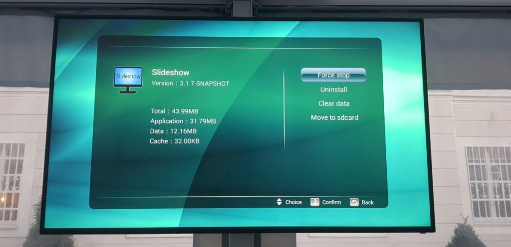
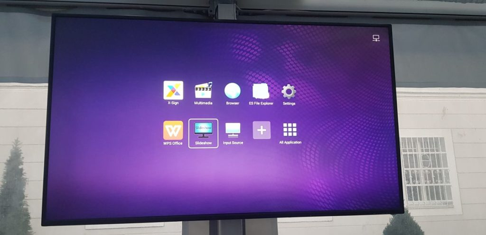
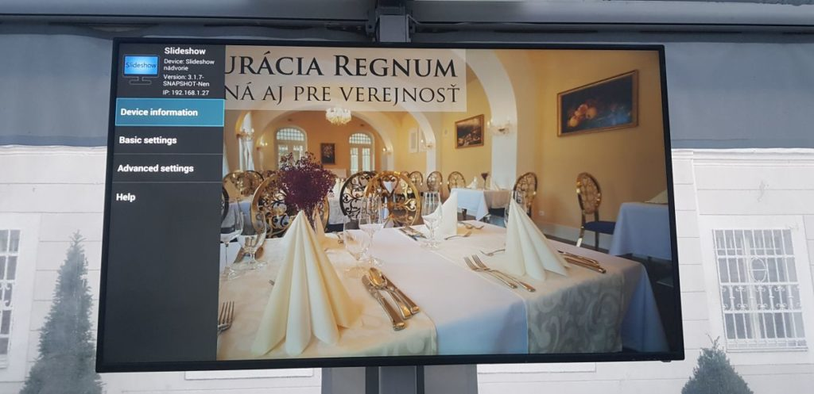

# Benq Smart Signage displays

Slideshow software can be used as a replacement for build-in X-Sign software used on BenQ [Smart Signage displays](https://www.benq.com/en-us/business/signage/smart-signage.html) ST550K / ST650K / ST750K.

X-Sign is cloud-based digital signage software by BenQ, which is preinstalled on these screens. However, if you prefer or need non-cloud software, or just feel like experimenting, you can run Slideshow app directly on these Android-based displays, without a need of any additional hardware.

## Setup

1. Ask your BenQ representative for instructions how to access "Factory mode" on the display. (We got the instructions from our BenQ representative, but they might be region-dependent, but if you are out of luck, [let us know](https://slideshow.digital/contact-us/))
2. (Optional but highly suggested) Connect the device to the internet / local network, either via LAN cable or Wi-Fi
3. Copy the APK file with Slideshow app on USB Flash drive
4. Insert the USB Flash drive into the USB port of the screen
5. Using remote control, open ES File Explorer (or any other file explorer), navigate to USB Flash drive and install the APK file. If you get message "For security, your TV is set to block installation of apps obtained from unknown sources", you are not in "Factory mode", see step 1.
6. Set up the Slideshow app and start enjoying it

## Notes

- Displays are running Android 4.3, which is quite old, and the most recent version of Slideshow you can use is [3.20.3](../../release_notes.md#version-3203). 
- You can count with approximately 1,8 GB of free space for your files.
- Android on these displays is not rooted, that means Slideshow's web interface will be available on port 8080 (http://...:8080) and you won't be able to reboot the device remotely
- If you would like to schedule power on and power off, you can set it up from your computer using [BenQ's MDA application](https://www.benq.eu/en-eu/business/support/products/projector/multiple-display-administrator/download.html). Just note that if you turn off the display with remote control or button, the scheduler won't/can't turn it back on. Turning on by the scheduler works only if the scheduler turned the display off previously.
- Display has 4K resolution (3840×2160), but Android's framebuffer is working with FullHD resolution (1920×1080). Video files might be upscaled internally (we didn't investigate this), but images are displayed just as FullHD. If you would like to display everything in 4K, you have to connect 4K-cappable player via HDMI.

