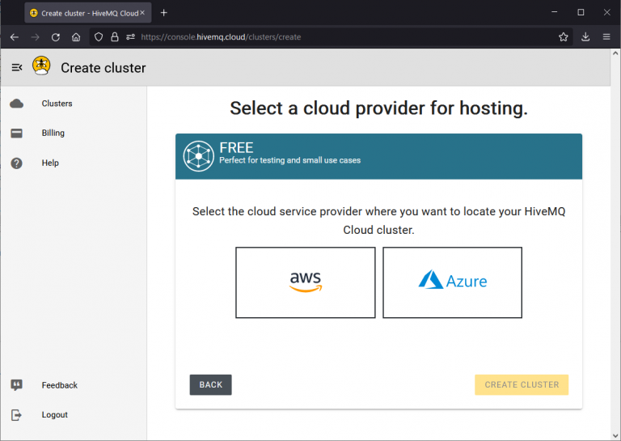
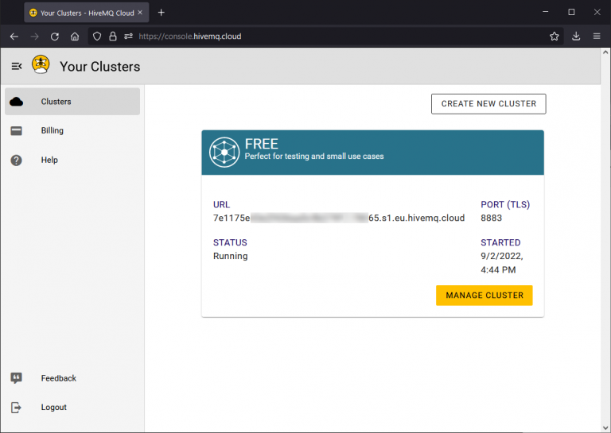
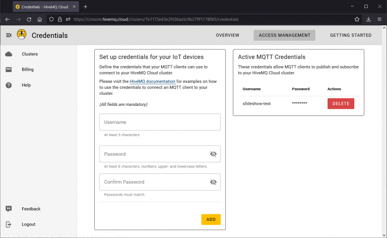
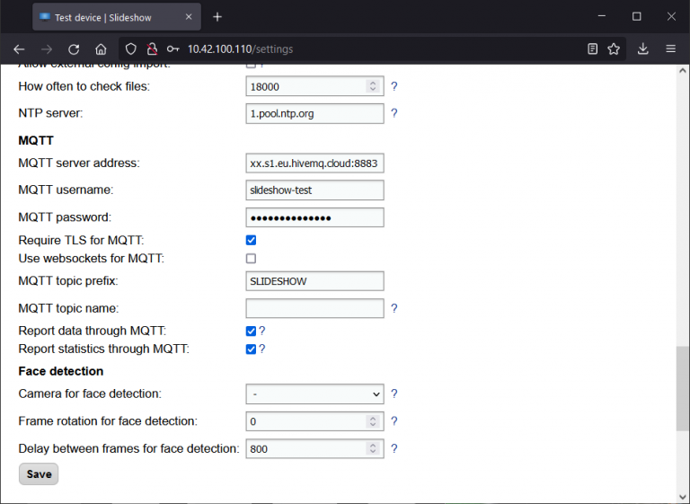
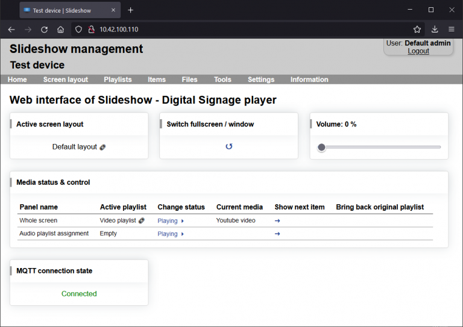
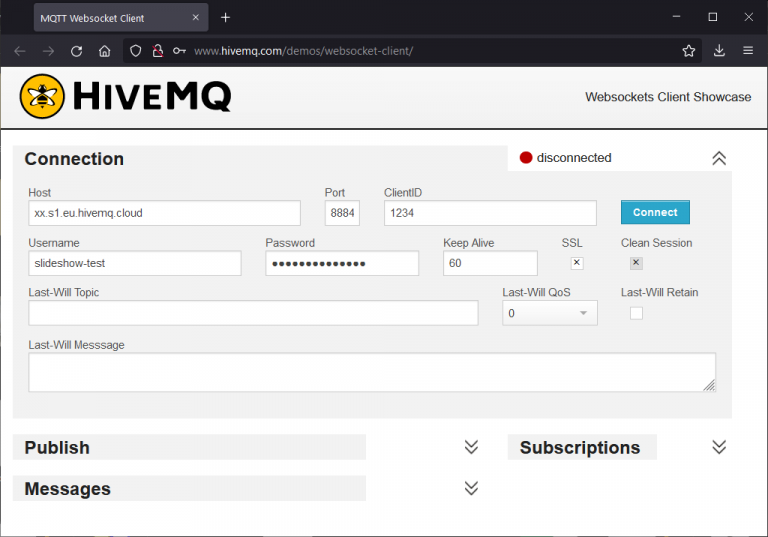
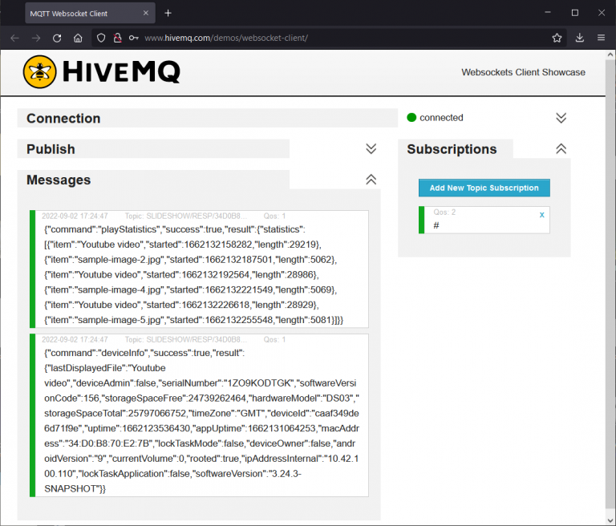
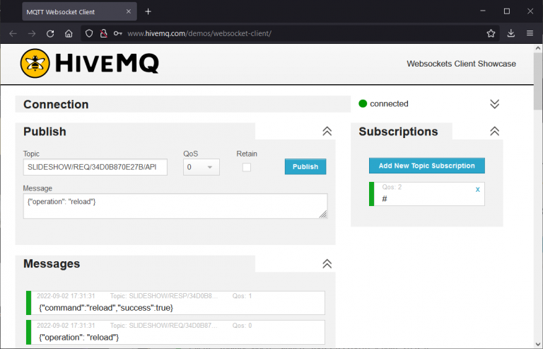

# MQTT

!!! tip "About MQTT "
    More information about MQTT protocol can be found on [https://mqtt.org](https://mqtt.org) and [Wikipedia](https://en.wikipedia.org/wiki/MQTT).

Slideshow contains an MQTT client, which can connect to a remote MQTT broker via internet connection and receive commands from external systems. Thanks to this, multiple instances of Slideshow can be controlled at the same time, even remotely across the world.

Setup of the connection to the broker can be done through the web interface – menu `Settings` – `Device settings` – section `MQTT`. Reload the app after changing the settings in order to apply them. Current connection status can be found via menu `Information` – `About device` – `MQTT connection state`, or on the bottom of the home page.

Supported MQTT version is 5, with optional TLS security or communication through HTTP WebSockets (both configurable in Device settings). Slideshow is tested with HiveMQ and Mosquitto MQTT brokers.

## Communication description

Communication via MQTT is asynchronous, Slideshow is listening for commands from an external system. Once the command arrives, Slideshow executes it and returns a response on another topic. If the request contains correlation data, Slideshow will add the same correlation data to the response.

Four MQTT topics are used for the communication with each device, the names are based on the MQTT topic prefix and MQTT topic name from the device settings.

- `{MQTT topic prefix}/REQ/{MQTT topic name}/SHELL` – request from server to the device to execute shell command
- `{MQTT topic prefix}/RESP/{MQTT topic name}/SHELL` – response from the device to the shell command
- `{MQTT topic prefix}/REQ/{MQTT topic name}/API` – request from server to the device to execute API call
- `{MQTT topic prefix}/RESP/{MQTT topic name}/API` – response from the device to the API call

If no topic name is set in the device settings, MAC address without colons will be used as a default (if available).

## Example communication

Topic prefix `SLIDESHOW` and device with MAC address `01:02:03:04:05:06` (as `MQTT topic name` setting) is used in all examples below.

### Execute shell command

- Request topic: `SLIDESHOW/REQ/010203040506/SHELL`
- Request message: `getprop ro.serialno`
- Response topic: `SLIDESHOW/RESP/010203040506/SHELL`
- Response message: `{"command": "echo test", "success": true, "result": { "result": 0, "stdout": "test\n", "stderr": "" }}`

### Move to the next file

- Request topic: `SLIDESHOW/REQ/010203040506/API`
- Request message: `{"operation": "next"}`
- Response topic: `SLIDESHOW/RESP/010203040506/API`
- Response message: `{"command": "next", "success": true}`

### Display file on screen

- Request topic: `SLIDESHOW/REQ/010203040506/API`
- Request message: `{"operation": "showFile", "parameters": {"zoneName": "Whole screen", "file": "sample1.jpg", "length": 5}}`
- Response topic: `SLIDESHOW/RESP/010203040506/API`
- Response message: `{"command": "showFile", "success": true}`

## Automatically reported data

If `Report data through MQTT` [setting](../configuration/settings.md#mqtt) is enabled, Slideshow will automatically report its current device status over MQTT every 2 minutes, without need to make any request. The data is sent to `{MQTT topic prefix}/RESP/{MQTT topic name}/API` topic. Similarly, enabling `Report statistics through MQTT` setting causes Slideshow to automatically send statistics about media files displayed in the main zone.

You can find examples of both reports below.

``` json title="Data report (device information)"
{
  "command": "deviceInfo",
  "success": true,
  "result": {
    "lastDisplayedFile": "Youtube video",
    "deviceAdmin": false,
    "serialNumber": "1ZO9KODTGK",
    "softwareVersionCode": 156,
    "storageSpaceFree": 24738324480,
    "hardwareModel": "DS03",
    "storageSpaceTotal": 25797066752,
    "timeZone": "GMT",
    "deviceId": "caaf349de6d71f9e",
    "uptime": 1662123536430,
    "appUptime": 1662132696156,
    "macAddress": "34:D0:B8:70:E2:7B",
    "lockTaskMode": false,
    "deviceOwner": false,
    "androidVersion": "9",
    "currentVolume": 0,
    "rooted": true,
    "ipAddressInternal": "10.42.100.110",
    "lockTaskApplication": false,
    "softwareVersion": "3.24.2"
  }
}
```

``` json title="Statistics report (playback statistics)"
{
   command: "playStatistics",
   success: true,
   result: {
      statistics: [
         {
            item: "Youtube video",
            started: 1662133551420,
            length: 29106
         },
         {
            item: "sample-image-5.jpg",
            started: 1662133580527,
            length: 5078
         },
         {
            item: "Youtube video",
            started: 1662133585604,
            length: 29137
         }
      ]
   }
}
```

## Supported commands

``` json title="Move to the next file:"
{
  "operation": "next", 
  "parameters": {"zoneName": "Whole screen"}
}
```

``` json title="Display file on the screen:"
{
  "operation": "showFile", 
  "parameters": {
    "zoneName": "Whole screen", 
    "file": "sample1.jpg", 
    "length": 5
  }
}
```

``` json title="Display custom HTML content on the screen:"
{
  "operation": "showSentHtml", 
  "parameters": {
    "zoneName": "Whole screen", 
    "length": 5, 
    "html": "<strong>Sample bold text</strong>"
  }
}
```

``` json title="Switch to different playlist:"
{
  "operation": "playlist/set", 
  "parameters": {"zoneName": "Whole screen", "playlist": 1}
}
```

``` json title="Clear set playlist:"
{
  "operation": "playlist/clear", 
  "parameters": {"zoneName": "Whole screen"}
}
```

``` json title="Set screen layout:"
{
  "operation": "layout/set",
  "parameters": {"layoutName": "Sample layout"}
}
```

``` json title="Clear set screen layout:"
{
  "operation": "layout/clear"
}
```

``` json title="Get device info:"
{
  "operation": "deviceInfo"
}
```

``` json title="Toggle fullscreen view for the main zone"
{
  "operation": "fullscreen/toggle"
}
```

``` json title="Get list of zones:"
{
  "operation": "zones"
}
```

``` json title="Set volume:"
{
  "operation": "volume/set", 
  "parameters": {"vol": 5}
}
```

``` json title="Reload app:"
{
  "operation": "reload"
}
```

``` json title="Reboot device:"
{
  "operation": "reboot"
}
```

``` json title="Synchronize files:"
{
  "operation": "synchronize", 
  "parameters": {
    "url": "https://example.com/data.zip", 
    "method": "GET", 
    "target": "file.zip", 
    "clearFolder": false
  }
}
```

Zone name in the parameters is optional, if no zone name is set, the operation will be performed in the main zone of the screen layout.

## Integration with HiveMQ

MQTT integration requires an external MQTT broker, to which Slideshow can connect. You can either install HiveMQ or Mosquitto brokers on your server or use a cloud service, for example, HiveMQ Cloud (<https://www.hivemq.com/mqtt-cloud-broker/>). HiveMQ Cloud is free for up to 100 client devices, meaning you can connect, for example, one management application and up to 99 devices with Slideshow app for free. It doesn't support separate permissions for each credential, so make sure you don't share your MQTT username and password with anybody.

Below, you can find a step-by-step tutorial of connecting Slideshow to HiveMQ Cloud and testing the connection by receiving status messages and issuing a command.

### Setting up HiveMQ cloud

1. Create new account on <https://console.hivemq.cloud>
2. Select which provider you would like to use (there is almost no difference for the free tier)

3. Note the connection details (URL and port) of the newly created cluster and click on Manage cluster

4. Click on Access management at the top and setup new credentials - username and password, which will be used by Slideshow to access the MQTT cluster.


### Setting up MQTT in Slideshow

1. Open the [web interface](../network_access/web_interface.md) of Slideshow app, navigate to menu `Settings` → `Device settings` and adjust the following settings and click on Save
    - MQTT server address: URL and port of the cluster, for example `xxxx.s1.eu.hivemq.cloud:8883`
    - MQTT username: from created credentials
    - MQTT password: from created credentials
    - Require TLS for MQTT: yes / checked
    - Report data through MQTT: yes / checked
    - Report statistics through MQTT: yes / checked

2.  Reload Slideshow via menu `Settings` → `Reboot / Reload` → `Reload application`. After logging in back, check whether the MQTT connection state is "Connected" on the home page. If there is any other state, you can check the reason in the logs accessible via menu `Information` → `Logs`.


### Testing the integration

1. For testing the integration, we will use an online MQTT client which runs directly in web browser. Open <http://www.hivemq.com/demos/websocket-client/>, enter the connection details to your MQTT cluster and click on Connect. Make sure to enter the websocket port (usually 8884), as this client doesn't support non-websocket communication.

2. Click on Add New Topic Subscription, enter topic name `#` and click on Subscribe. This covers all topics created in this cluster.
3. Wait for up to 2 minutes, and you will receive two messages from Slideshow app in the window, one with statistics about playback and one with information about the device and its status. Both are in JSON format and are computer-readable for subsequent processing.

4. To test a command, you can publish message `{"operation": "reload"}` to topic `SLIDESHOW/REQ/xyz/API`, where xyz is the MAC address of your Android device running Slideshow, all caps, without separators. You will get a success reply, and on the screen of the Android device you will see that Slideshow app was restarted.

