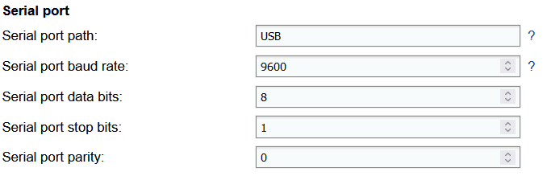
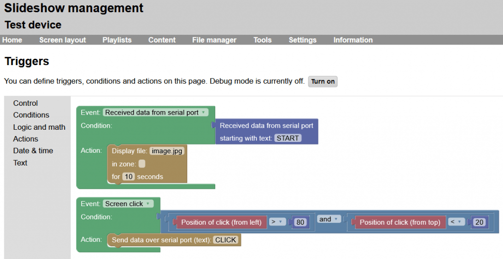
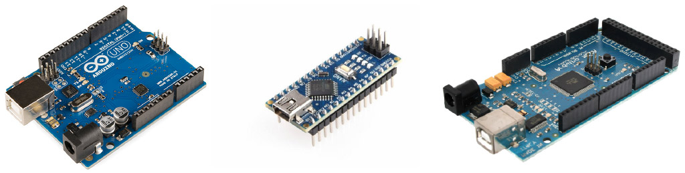
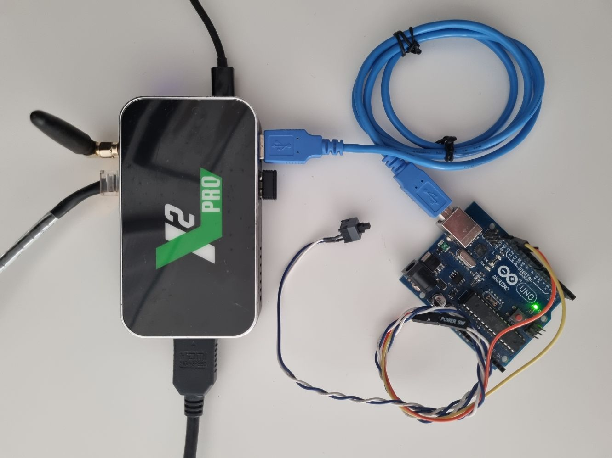

# Serial port

Slideshow app supports communication with other devices using hardware serial port (RS-232), either using direct RS-232 port (if your Android device has it) or using USB-to-serial converter.

This feature can be also used for communication with Arduino and similar devices.

## Supported hardware

If your device has a native RS-232 port, it is possible to use it directly, but rooted access might be required on some devices.

For USB-to-serial adapter to work it is necessary that the Android device has a free USB port and supports USB host (almost all Android boxes do). USB-to-serial adapters based on the following chips are supported:

* FTDI FT232R, FT232H, FT2232H, FT4232H, FT230X, FT231X, FT234XD
* Prolific PL2303
* Silabs CP2102 and all other CP210x
* Qinheng CH340, CH341A, CH9102
* Arduino using ATmega32U4
* Digispark using V-USB software USB
* BBC micro:bit using ARM mbed DAPLink firmware

Permission to access a USB device has to be granted manually on the screen of the Android device the first time a USB-to-serial adapter is connected. Prompt will be displayed automatically after the supported adapter is plugged in.

## Serial port setup

Configuration of the serial port can be done through Slideshow’s web interface → menu `Setting` → `Device settings` → section `Serial port`. Baud rate, data bits, stop bits and parity have to be set in Slideshow settings exactly the same as on the second device. Selected baud rate has to be supported by the serial port on the Android device.

/// caption
Configuration of serial port in Device settings
///

List of currently detected serial ports on the particular Android device can be found through menu `Information` → `About device` → `Available serial ports`.

## Using serial port

If text read from serial port is in JSON format and starts with `{"operation"`, it is processed as an API command (see MQTT API for the list of supported commands). The result is then written back to the serial port. Data from and to the serial port are processed in ASCII encoding, not UTF-8.

It is also possible to read from serial port and write to serial port through Triggers. ASCII and HEX formats are supported for detecting input and writing output.

/// caption
Sample serial port trigger
///

## Example with Arduino

### What is Arduino?

Arduino is a small hardware board with a microcontroller, essentially an entire small computer on a board. It has a processor, small memory and many low-level inputs and outputs, such as serial port, I2C and pins for LEDs and buttons.

There are many variants of the board with different models of microcontrollers and various expansions, as well as a wide range of add-on boards with displays, sensors and other peripherals. Most of the board can be connected to a computer with an USB cable, through which the board can be programmed. The USB connection acts as a USB-to-serial bridge as well, making the serial port communication between a host computer and Arduino possible.

Arduino boards and their clones are available for a very low price, the least expensive board can be bought for under 10 EUR / USD. Low price, as well as huge online community providing endless tutorials, guides and source code examples, makes them very popular in the hobby community for interacting with various low-level hardware. The boards are often used for learning programming as well.

You can find more resources regarding Arduino on [https://www.arduino.cc/](https://www.arduino.cc/). The boards can be bought for example on Amazon: Arduino Nano, Arduino Uno.

/// caption
Various Arduino boards. Source: Wikipedia
///

### Communication over serial port

Serial port (or RS-232) is a protocol for wired communication between two devices. It has much lower transmission speed than newer protocols (such as USB), but thanks to its simplicity and low hardware requirements, it is still used in industry in case a low-speed and short range connection is sufficient. Historically, mostly 9-pin DE-9 connectors have been used for serial port, but RJ45 is used as well (the same connector as for LAN cable, but with different signals). Serial port is present in many hobby development boards as well, including Raspberry Pi and Arduino, in the form of input/output pins.

Since version 4.2.0, Slideshow app supports communication over serial port. This can be used for communication with any device that has a serial port, including almost all Arduino boards as well. As the boards contain USB-to-serial bridge, they can be connected directly to the Android device running Slideshow app via USB cable. The communication can be used for various tasks, such as:

- Moving to the next file/media in Slideshow after pushing a button connected to Arduino
- Changing a playlist in Slideshow if Arduino detects a change in temperature using a thermometer add-on sensor
- Displaying a custom warning text in Slideshow if Arduino detects high concentration of Carbon Monoxide using a gas add-on sensor
- Flashing an LED connected to Arduino after clicking on the screen in Slideshow
- Showing a text on a small add-on display for Arduino after Slideshow detects a person using face detection
- …and many other combinations…

Arduino Uno board connected to an Android box via USB cable

/// caption
Arduino Uno board connected to an Android box via USB cable
///

### Tutorial

You can find the entire video tutorial for setting up communication between Slideshow app and Arduino board below, as well as the sample source code used for Arduino board. It will walk you through the initial configuration of the serial port in Slideshow and how you can interact with Arduino using Triggers and Slideshow API.

[:material-download: Sample source code for Arduino](slideshow_control.ino)

<iframe style="width: 100%; aspect-ratio: 16 / 9;" src="https://www.youtube.com/embed/oymH9wbh2L4?feature=oembed&start&end&wmode=opaque&loop=0&controls=1&mute=0&rel=0&modestbranding=0" frameborder="0" allowfullscreen></iframe>
