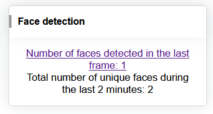
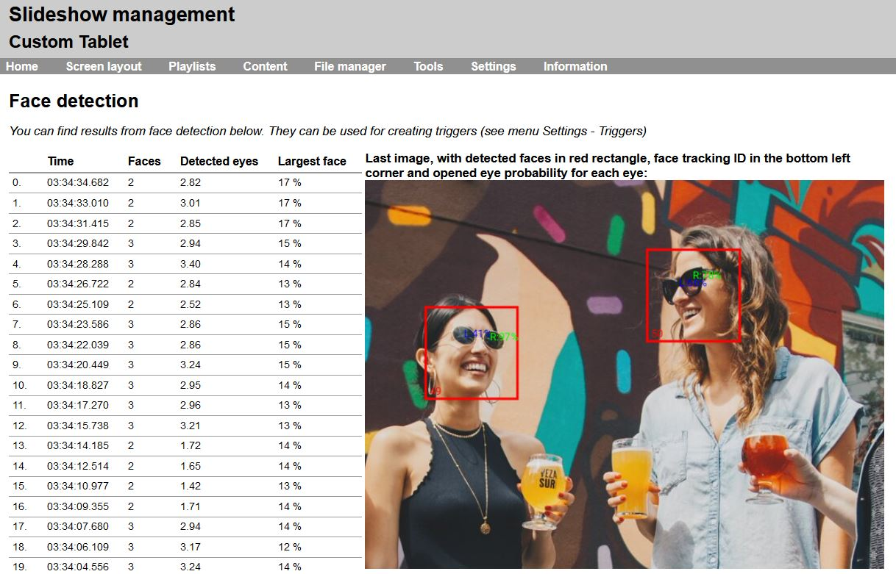

# Face detection

If the Android device running Slideshow app has a camera (either integrated, like a camera on a tablet, or USB camera), it can be used for detecting how many people are currently in the area in front of the camera. This number can be used for estimating how many people can see what is on the screen at the moment and for either interactively triggering a content on the screen or for further analytical and statistical purposes.

The face detection is done using a machine learning algorithm, which runs entirely on the Android device. No internet connection or special hardware is needed, the calculations are done entirely using CPU.

If you would like to further integrate the face detection feature with an external system, please contact us.

## Setup

Following steps are needed for enabling face detection:

1. On-screen menu → `Basic settings` → `Request camera permissions` → allow Slideshow to access the camera on the Android device. If this option is missing from the Basic settings, the permission has been already granted, and it is not necessary to grant it again.
2. Web interface → menu `Settings` → `Device settings` → select input camera under `Camera for face detection` and setup other options if needed. If you are using a USB camera and it is not listed in Device settings, please verify that it is correctly plugged in and supported by Android system (not all Android builds support all USB cameras).
3. Reload Slideshow app to apply the settings.
4. Wait 10 seconds after startup, navigate to web interface → menu `Information` → `Face detection` to check whether the camera image is correct. Refresh this page in order to get updated image and statistics.

## Usage

The quick overview of the face detection status can be seen on the Home page of the web interface. If the face detection is active, Face detection widget containing statistics will be displayed. By clicking on the `Number of faces link detected in the last frame` (alternatively through menu `Information` → `Face detection`) you can open a page with detailed statistics for the last 60 frames, as well as the last processed image from the camera. All detected faces together with their tracking IDs are marked in red, and the probability whether each eye is opened is marked with blue and green.

/// caption
Face detection widget on the home page
///

/// caption
Face detection statistics page
///

Results of face detection can be used in Triggers to trigger a change in playback. For example, detecting a person close to the camera can trigger a different playlist on the screen.

Face detection can’t be used at the same time as [video input](../playback/special-content/video-input.md) from the same camera, as two different processes can’t use the same camera at the same time.

## Video tutorial

<iframe style="width: 100%; aspect-ratio: 16 / 9;" src="https://www.youtube.com/embed/9uEm4xLTnlg?feature=oembed&start&end&wmode=opaque&loop=0&controls=1&mute=0&rel=0&modestbranding=0" frameborder="0" allowfullscreen></iframe>
