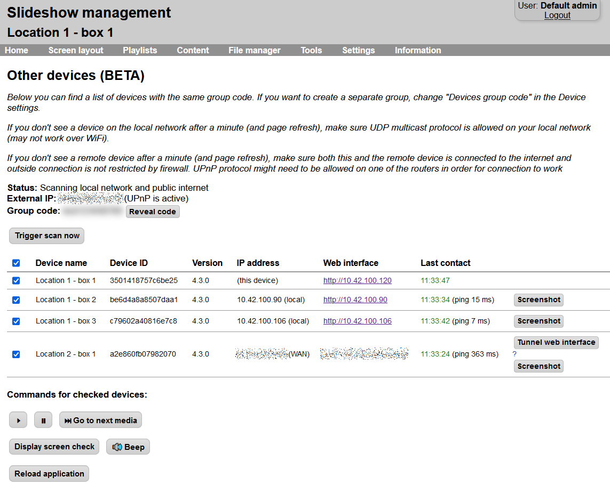
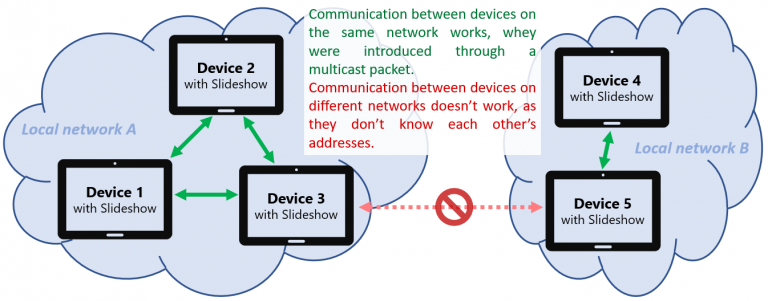
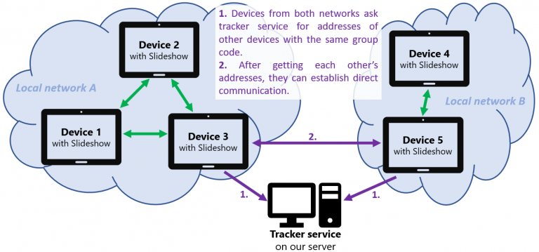
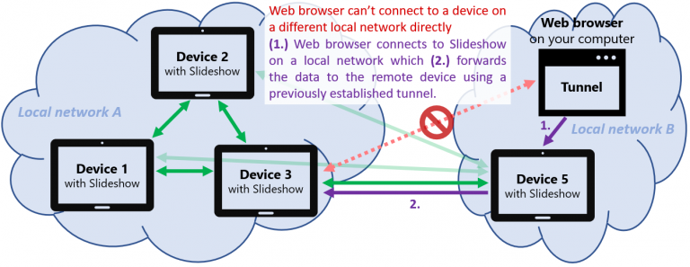

# Communication between devices

Multiple devices / players with Slideshow app installed can communicate directly between each other using a proprietary protocol, which can be used for light monitoring, management and synchronized playback between devices.

The group is defined by setting `Devices group code`, only devices with the same group code can communicate with each other.

- **LAN** – If the devices are on the same local network (LAN), they can discover each other automatically using UDP multicast. This might not work correctly over WiFi (prefer wired connection) or if the router blocks direct communication between devices.
- **WAN** – Direct peer-to-peer (P2P) communication between devices that are not on the same local network is sometimes possible, but usually requires support for UPnP (Universal Plug and Play) on the router. Communication might not work if more than one NAT is used, or if your internet provider uses Carrier-grade NAT. Enable setting `Enable device discovery` on the internet in order to allow discovery of devices not on the same local network.

!!! warning "Security notice"
    Make sure you don’t share your "Devices group code" with anybody, as it is used also as a security code for establishing the communication between devices.
	
!!! warning "Change the default web interface credentials"
    If you enable device discovery on the internet, we highly suggest changing the default username/password for the web interface as well.

Overview of discovered devices together with available commands can be viewed via Slideshow’s web interface → menu `Settings` → `Other devices`. For devices that are on a different local network there is a `Tunnel web interface` button as well, which opens a new browser window with the web interface of that device, even if your computer is on a different local network. Only a single tunnel can be opened at any time. The transfer speed through the tunnel is much lower than the usual network speed.

/// caption
Other devices page in Slideshow's web interface
///

## Remote communication explained

This section explains technical details of communication between two devices running Slideshow if they are not on the same local network, without a need for a cloud server.

### Peer-to-Peer explained

Peer-to-peer (or P2P) communication is a concept in computer networks where the devices (or "peers") talk directly to each other. It differs from client-server communication, where there is a publicly available server and all clients are talking to the server. In the client-server concept, the clients don't communicate with each other directly.

In peer-to-peer communication, each device can directly communicate with every other device. If one device goes offline (for example, it is powered off or there is some network problem), all other devices can still exchange messages with each other.

We have used the peer-to-peer concept in Slideshow app to allow exchange of information between multiple Android devices running Slideshow.

### Establishing communication

In order for two devices with Slideshow app to communicate with each other, they first have to discover each other, so they know where (to which IP address and network port) they should send messages. Slideshow automatically sends out an introduction message as a multicast packet, which is delivered to all devices on the same local network (unless it is blocked by router or Wi-Fi). Another device running Slideshow receives this multicast packet, checks if it was sent by a device with the same group code, and if yes, they establish a direct communication channel. This method with multicast packets is similar to [Bonjour](https://en.wikipedia.org/wiki/Bonjour_(software)) and [SSDP](https://en.wikipedia.org/wiki/Simple_Service_Discovery_Protocol) protocols.

However, if the devices are not on the same local network, they can't receive each other's introduction multicast packet and there is no way for them to directly find out each other's network address.

In order to solve this, we are hosting a small service on our public servers called **tracker**. It receives addresses and hashed group codes from individual devices with Slideshow, and if the tracker finds that two or more devices have the same group code, it lets them know each other's addresses. The devices can then establish direct communication using those addresses and they pass the data without using the tracker as a middle man. Thanks to this, the tracker service can be really tiny and requires few resources on the server, so we can offer it without asking for any kind of payment.

In 99% of the cases, the Android devices with Slideshow are behind a router with NAT ([Network Address Translation](https://en.wikipedia.org/wiki/Network_address_translation)). Establishing direct communication (after they discover each other's addresses thanks to the tracker) usually requires a special step to let the router (on at least one side) to pass the traffic without blocking. Slideshow tries to do this using two methods:

- **[Universal Plug and Play](https://en.wikipedia.org/wiki/Universal_Plug_and_Play)** (UPnP) - Slideshow contacts router to allow outside connection to its IP address and port.
- **[Hole punching](https://en.wikipedia.org/wiki/UDP_hole_punching)** - both devices try to contact each other multiple times, in order to establish entries in the router's translation table, until one of the routers lets the packet pass,

In case both devices are behind multiple routers or the router in both networks is set up to forbid the methods mentioned above, the communication unfortunately can't be established, the peer-to-peer concept won't work.

### Remote operations

After the communication between is established, Slideshow automatically informs the other device about its basic state every couple of minutes (this can be used as a light monitoring). There is also the possibility to send basic commands, for example, pause/resume content, go to the next media or reload the app.

If the devices are on different networks, we also enabled a special feature called **Tunnel web interface**. It creates a network tunnel between the two devices, using which a web browser on your computer can access the [web interface](web-interface.md) of Slideshow installed on the remote device. This tunnel uses UDP protocol (as required for the Hole punching method mentioned above), and its transfer speed is usually much lower than the regular network speed. As Slideshow's web interface is quite lightweight, the tunnel is still fast enough to provide access to all management features.

### Security

Allowing a remote connection to any local device is always security-sensitive, that's why we implemented several security measures:

- Introduction messages are always signed and Slideshow doesn't respond to any introduction message that was not signed correctly
- Any message from a device that hasn't introduced itself is ignored
- All data messages are encrypted using public-key cryptography

Thanks to these measures, only devices with the same group code can communicate with each other. You should always keep this group code secret. Additionally, messages to tracker, UPnP, and Hole punching are enabled only if you explicitly enable setting "Enable device discovery on the internet".

## Video tutorial

<iframe style="width: 100%; aspect-ratio: 16 / 9;" src="https://www.youtube.com/embed/Cb20UJjIEXI?feature=oembed&start&end&wmode=opaque&loop=0&controls=1&mute=0&rel=0&modestbranding=0" frameborder="0" allowfullscreen></iframe>
