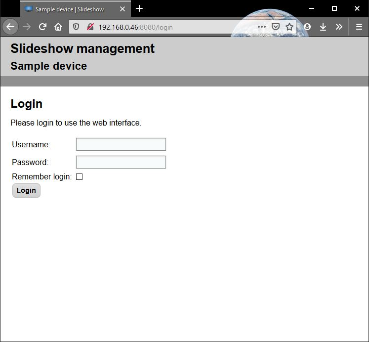
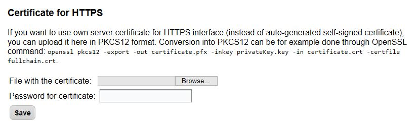

# Web Interface

If your Android device is connected to a local network, you can manage Slideshow from a computer, phone, or tablet within the same LAN. Note that the interfaces mentioned bellow work only from the same local network (LAN). If you want to manage Slideshow remotely, you can set up file synchronization from your HTTP/FTP server, Google Drive or Dropbox.

!!! tip "Web interface"
    Slideshow’s web interface is the main interface for managing all the Slideshow’s advanced features.
	
!!! Warning "Only local access"
    The web interface is accessible only within the same local network. It is not accessible remotely through the internet.

## Access

Web interface can be accessed from the web browser on your computer. You can find the address, on which the web interface is accessible, via on-screen menu → `Help`. It is usually `http://{device’s IP address}` for rooted devices and `http://{devices’s IP address}:8080` for non-rooted devices.

If the Android device has several networks (e.g., Wi-Fi + Wired, or Wi-Fi + 4G data), Slideshow will listen on all the networks, but will display only a single IP address on the screen. If you are on the same network as the Android device and can’t connect to the address displayed by Slideshow, please verify / disconnect other networks.

The port number for web interface can be changed via web interface → menu `Settings` → `Device settings` → `HTTP port number` or `HTTPS port number` or on-screen menu → `Basic settings` → `HTTP port number`. If you want to use port number bellow 1024, the device has to be rooted and port 8080 (for HTTP) / 8443 (for HTTPS) has to be free on the device (see this blog post for explanation).

## Credentials

**Default username / password is admin / admin.** It can be changed after logging in, either via menu `Settings` → `Users` or `Settings` → `Password change`. If you forgot the password, you can reset it on the login page within 10 minutes after the Android device is started. For security reasons, resetting the password requires direct access to the Android device.

/// caption
Web interface - login page
///

## Web interface via HTTPS

Slideshow also supports secured HTTPS protocol for web interface. The address is usually `https://{device’s IP address}` for rooted devices and `https://{devices’s IP address}:8443` for non-rooted devices. By default, Slideshow generates self-signed SSL certificate on the first start, so browsers will display security alert before accessing the page. You can upload your own SSL certificate for HTTPS in [PKCS12 format](https://en.wikipedia.org/wiki/PKCS_12) (includes both a private key and certificate) via web interface → menu `Settings` → `Device settings` → `Certificate for HTTPS`.

/// caption
Dialog for uploading certificate for HTTPS
///

## Note: Port numbers

On Linux-based operating system (such as Android), port numbers 0 to 1023 are called restricted. Under normal circumstances, only administrator (also called root) can start an application which will be listening to on any of these ports. The reason for this is that many of the port numbers in range 0 to 1023 are commonly used as default ports for various protocols. It would be insecure if a regular user (non-administrator) could start an application listening on port 80 (HTTP port) and block the actual HTTP server.

That's why on non-rooted devices, Slideshow starts web interface on port 8080 and FTP interface on port 8021. You can change these port numbers, but it is not possible to change them bellow 1024 due to security restrictions mentioned above.

On rooted devices, Slideshow can listen on ports bellow 1024 using root access, but only indirectly. That means that the web interface is still actually listening on port 8080 and using root access, Slideshow asks Android for local redirection from port 80 to port 8080. That means if your browser connects to port 80 on the device, Android will internally redirect it to port 8080 for Slideshow. Similar redirection is made for HTTPS (443 → 8443) and FTP (21 → 8021).

On application start, Slideshow automatically detects whether the device is rooted or not. If you open `Help` in on-screen menu, you will always see the correct (working) address for web and FTP interface.
