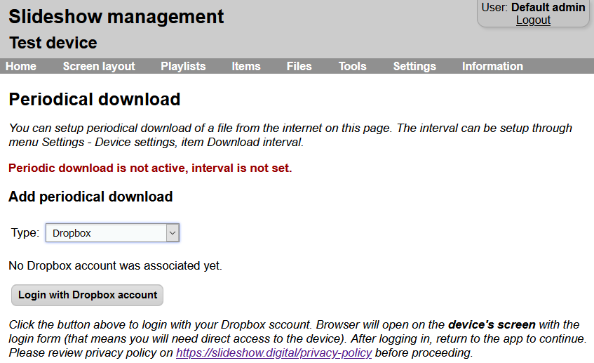
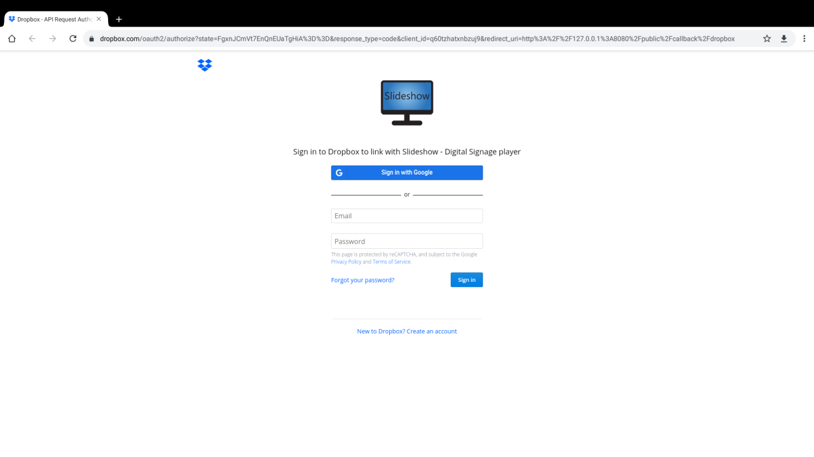
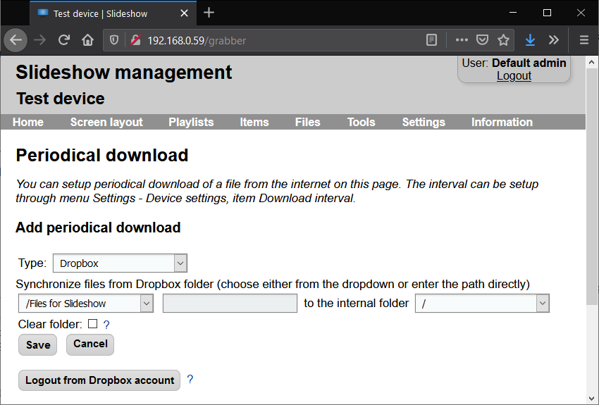

# File synchronization from Dropbox

Slideshow offers you the possibility to automatically synchronize files from your Dropbox account to Slideshow's internal storage, similarly to synchronization with [Google Drive](file_synchronization_google_drive.md). Thanks to this feature, you can manage the files remotely, without a need for HTTP or FTP server. As both Dropbox and Slideshow software are free, this offers you an inexpensive and effective solution for Digital Signage.

Slideshow supports synchronizing up to 2000 files from a single Dropbox folder. If you would like to synchronize more files, split the files into subfolders, each containing at most 2000 files.

In order to lower the network bandwidth, Slideshow downloads only files which have a newer last modification date on Dropbox than in the internal storage. It is important to set the date and time on a device correctly, so the modification date is saved correctly.

## Setting up file synchronization from Dropbox

1. Open Slideshow's web interface and navigate to menu `Tools` → `File synchronization`.
2. In `Add new synchronization` section, select type `Dropbox` and click on `Login with Dropbox account`.

3. Dropbox login form will open on the device's screen -- not on the screen you have web interface, but on the screen of the device where Slideshow is installed! This is due to the security policy of Dropbox, so this step cannot be done remotely. If the device's screen stays blank or the login form is not loaded properly, check if your device has internet access and has up-to-date browser installed.

4. Login into your Dropbox account and allow Slideshow to access your Dropbox. We are asking just for read-only access, Slideshow won't (and can't) modify files on your Dropbox.
5. After successful login, you will get a simple screen with a message to switch back to Slideshow app on the device. Web interface in your browser should refresh and display a success message.

    If you have changed the port for Slideshow's web interface to a different one than the predefined one (80 or 8080), the login might not work correctly. We suggest switching to the predefined ports during the initial Dropbox setup.

6. Pick a source folder on your Dropbox (you have to create if first through [https://www.dropbox.com](https://www.dropbox.com)) and target folder on your device. You can also choose whether you would like to clear (delete) old files after each download - this is useful if you are adding and removing files over the time.

    Due to the limitations of Dropbox API, some subfolders from your Dropbox may be missing in the dropdown. If you would like to synchronize from a Dropbox folder not in the list, select an empty entry (the first one) and fill out the path to the subfolder in the next field.

7. Click on `Save` and test the newly added entry by clicking on `Synchronize now`.
8. If you want Slideshow to synchronize the files periodically, remember to set "Synchronization interval" in menu `Settings` -- `Device settings`. It specifies how often (in seconds) should Slideshow download files from Dropbox (and other sources). Remember to reload Slideshow app after setting it.

    

9. Slideshow has to stay logged in into your Dropbox account if you want the file synchronization to work. If you log out from your Dropbox account (either via Slideshow web interface, or Dropbox console), you won't be able to synchronize any files from Dropbox until you log back in.
10. If you want to add more folders for synchronization or edit the existing one, just start from step 6. Entering your Dropbox username and password is necessary only during the first setup or if you log out from the account.

## More features

You can combine synchronization from Dropbox with other Slideshow's features:

- [**setup.csv**](https://slideshow.digital/documentation/setup-csv-file/) - just add a file named `setup.csv` to the folder which you are synchronizing on Dropbox, and it will be automatically recognized by Slideshow.
- **[Scheduled deletion](../../configuration/playback_configuration/scheduled_file_deletion.md)** - setup scheduled deletion of a file based on its name.
- **Unpacking ZIP files** - if your Dropbox's folder contains a ZIP file, it will be automatically unpacked during the download.

## Video tutorial

<iframe style="width: 100%; aspect-ratio: 16 / 9;" src="https://www.youtube.com/embed/yoSzr0ZCY4M?feature=oembed&start&end&wmode=opaque&loop=0&controls=1&mute=0&rel=0&modestbranding=0" frameborder="0" allowfullscreen></iframe>
