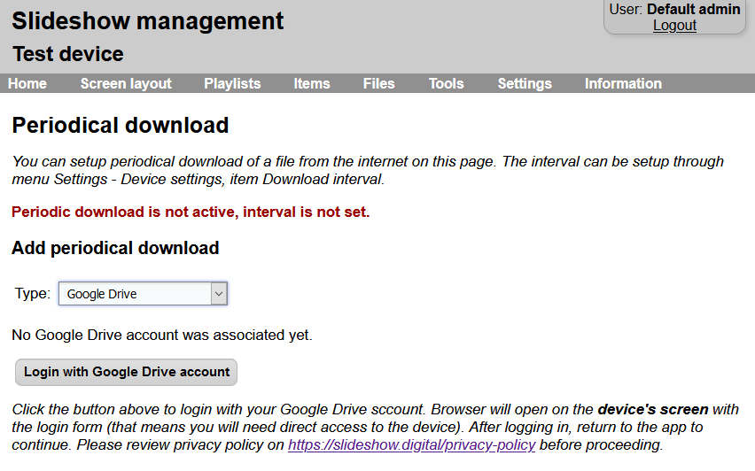
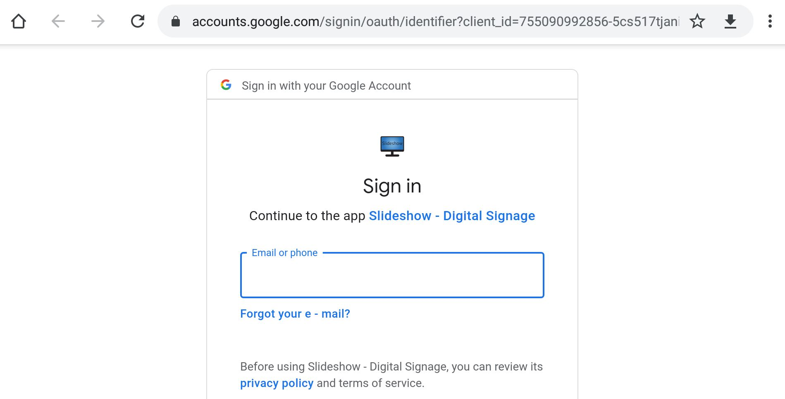
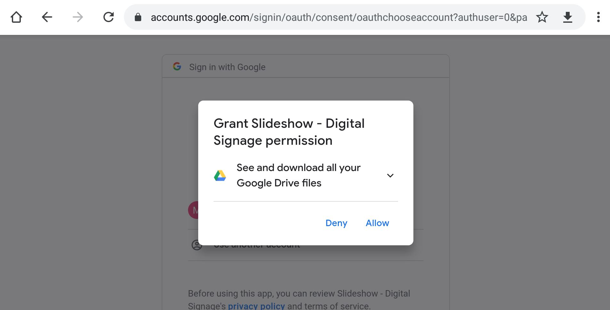
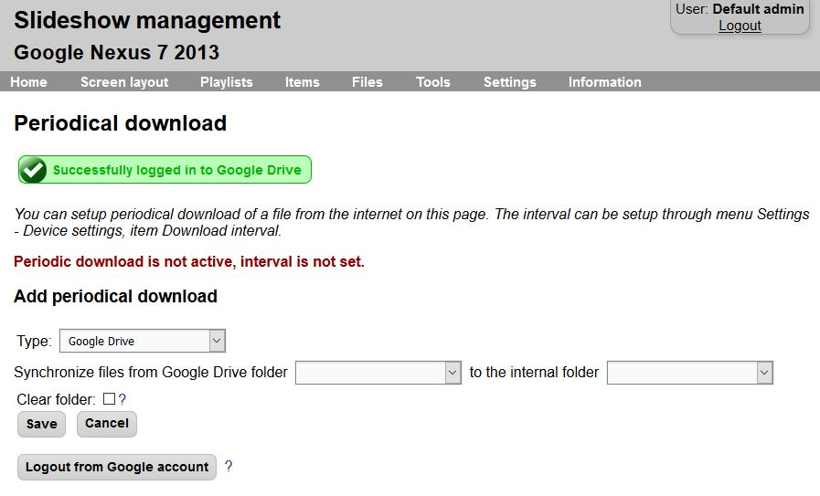
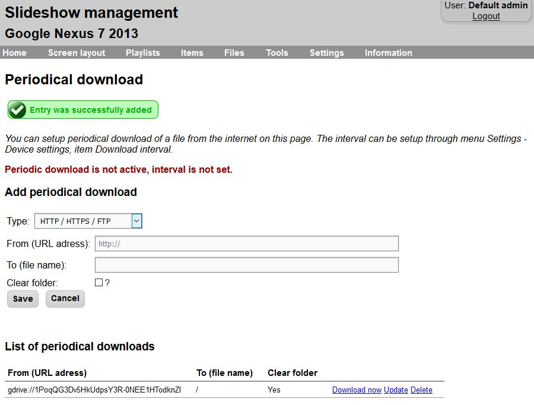
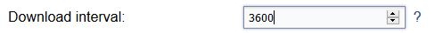

# File synchronization from Google Drive

Slideshow offers you the possibility to automatically synchronize files from your Google Drive account to Slideshow's internal storage, similarly to synchronization with [Dropbox](file_synchronization_dropbox.md). Thanks to this feature, you can manage the files remotely, without a need for HTTP or FTP server. As both Google Drive and Slideshow software are free, this offers you an inexpensive and effective solution for Digital Signage.

In order to lower the network bandwidth, Slideshow downloads only files which have a newer last modification date on Google Drive than in the internal storage. It is important to set the date and time on the device correctly, so the modification date is saved correctly.

It is not necessary to have Google Drive app installed on the Android device; Slideshow is using direct connection to Google Drive servers for the synchronization.

## Setting up file synchronization from Google Drive

1. Open Slideshow's web interface and navigate to menu `Tools` → `File synchronizatrion`.
2. In `Add new synchronization` section, select type `Google Drive` and click on `Login with Google account`.

3. Google login form will open on the device's screen - not on the screen you have the web interface, but on the screen of the device where Slideshow is installed! This is due to Google's security policy, so this step cannot be done remotely.

    If the device's screen stays blank or the login form is not loaded properly, check if your device has internet access and has an up-to-date browser installed (or even has a web browser installed - some devices are shipped with no preinstalled browser).

    If you get an error message saying "Error 403: disallowed_useragent", try installing or updating Chrome (from [Google Play Store](https://play.google.com/store/apps/details?id=com.android.chrome) or [APKMirror](https://www.apkmirror.com/apk/google-inc/chrome/)) or Firefox browser (from [Google Play Store](https://play.google.com/store/apps/details?id=org.mozilla.firefox) or [APKMirror](https://www.apkmirror.com/apk/mozilla/firefox/)) on the Android device and setting it as your default browser. Google doesn't support older browsers for login to their services.

4. Login into your Google account and allow Slideshow to access your Google Drive. We are asking just for read-only access, Slideshow won't (and can't) modify files on your Google Drive.

5. After successful login, you will get a simple screen with a message to switch back to Slideshow app on the device. Web interface in your browser should refresh and display a success message.
If you have changed the port for Slideshow's web interface to a different one than the predefined one (80 or 8080), the login might not work correctly. We suggest switching to the predefined ports during the initial Google Drive setup.

6. Pick a source folder on your Google Drive (you have to create if first through [https://drive.google.com](https://drive.google.com)) and target folder on your device. You can also choose whether you would like to clear (delete) old files after each download. This is useful if you are adding and removing files over time.
7. Click on `Save` and test the newly added entry by clicking on `Synchronize now`. If there are many files in the folder, or there are large files, it might take some time until the downloading is finished. If the folder contains more than 1000 files, only the first 1000 will be downloaded.

8. If you want Slideshow to synchronize the files periodically, remember to set "Synchronization interval" in menu `Settings` → `Device settings`. It specifies how often (in seconds) should Slideshow download files from Google Drive (and other sources). Remember to reload Slideshow app after setting it.

9. Slideshow has to stay logged in into your Google account if you want the file synchronization to work. If you log out from your Google account (either via Slideshow web interface or Google console), you won't be able to synchronize any files from Google Drive until you log in back.

    Google might automatically log out Slideshow if you change your Google account password or if there are too many devices connected to a single Google account (usually 20+).

10. If you want to add more folders for synchronization or edit the existing one, just start from step 6. Entering your Google Account username and password is necessary only during the first setup or if you log out from the account.

## More features

You can combine synchronization from Google Drive with other Slideshow's features:

- [**setup.csv**](https://slideshow.digital/documentation/setup-csv-file/) - just add a file named `setup.csv` to the folder which you are synchronizing on Google Drive, and it will be automatically recognized by Slideshow.
- **[Scheduled deletion](../../configuration/playback_configuration/scheduled_file_deletion.md)** - setup scheduled deletion of a file based on its name.
- **Unpacking ZIP files** - if your Google Drive's folder contains a ZIP file, it will be automatically unpacked during the download.
- **Google Docs Files** - Slideshow can automatically convert Google Docs, Google Sheets and Google Slides files to PDFs while synchronizing from Google Drive and then display these PDFs on screen.

## Video tutorial

<iframe style="width: 100%; aspect-ratio: 16 / 9;" src="https://www.youtube.com/embed/QvROD3we564?feature=oembed&start&end&wmode=opaque&loop=0&controls=1&mute=0&rel=0&modestbranding=0" frameborder="0" allowfullscreen></iframe>
