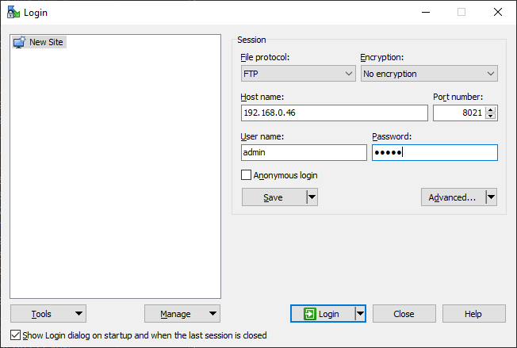
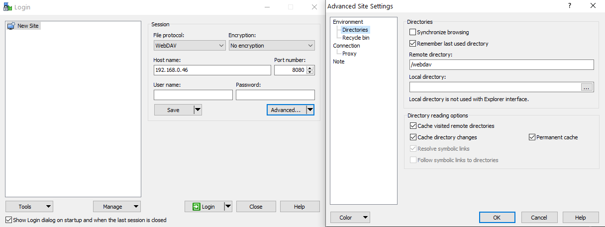

# File upload thorugh FTP and WebDAV

!!! Warning "Only local access"
    Direct file upload is accessible only within the same local network. It is not accessible remotely through the internet.

## FTP interface

You can access all files uploaded to Slideshow using an FTP client (for example, [WinSCP](https://winscp.net/) or [Total Commander](https://www.ghisler.com/)). Use the following connection settings:

- **IP address:** LAN IP address of the device
- **Port:** default is 21 on rooted devices, 8021 on non-rooted devices
- **Username / password:** same as for the web interface, default is admin / admin.

You can find the current FTP port via on-screen menu → `Help`. It can be changed via web interface → menu `Settings` → `Device settings` → `FTP port number`.

FTP protocol is not encrypted (Slideshow doesn’t support SFTP or FTP over SSL). If you are connecting to the device via public or not-secured Wi-Fi (Wi-Fi without a password), your connection might be easily intercepted.


/// caption
WinSCP with prepared connection to Slideshow via FTP
///

## WebDAV interface

You can access all files uploaded to Slideshow using a WebDAV client (for example, [WinSCP](https://winscp.net/)). WebDav interface is running on the same port as [HTTP and HTTPS interface](web_interface.md), on path `/webdav`. Use the following connection settings:

- **IP address:** LAN IP address of the device
- **Port:** same port as HTTP or HTTPS interface
- **Username / password:** same as for the web interface, default is admin / admin.
- **Remote directory:** /webdav


/// caption
WinSCP with prepared connection to Slideshow via WebDav
///

### WebDAV on Windows

!!! warning "Native Windows WebDAV client is not compatible"
    WebDav client integrated in Windows operating system is not fully compatible with Slideshow, because it doesn’t support HTTP Basic Auth for WebDAV by default.

If you want to use WebDAV client integrated in Windows OS, you have to enable it through registry editor, set entry `HKEY_LOCAL_MACHINE\SYSTEM\CurrentControlSet\Services\WebClient\Parameters\BasicAuthLevel` to value `2`

If you are not comfortable changing registry settings in Windows (we fully understand if you aren’t), we suggest using alternative client, for example, [WinSCP](https://winscp.net).

### WebDAV on Linux

On Linux, you can mount Slideshow’s data using davfs2 package (replace the IP address and port with the one you are using for Slideshow):

```
mount -t davfs http://192.168.1.100:8080/webdav /mnt/slideshow-webdav/
```
or
```
mount -t davfs https://192.168.1.100:8443/webdav /mnt/slideshow-webdav/
```