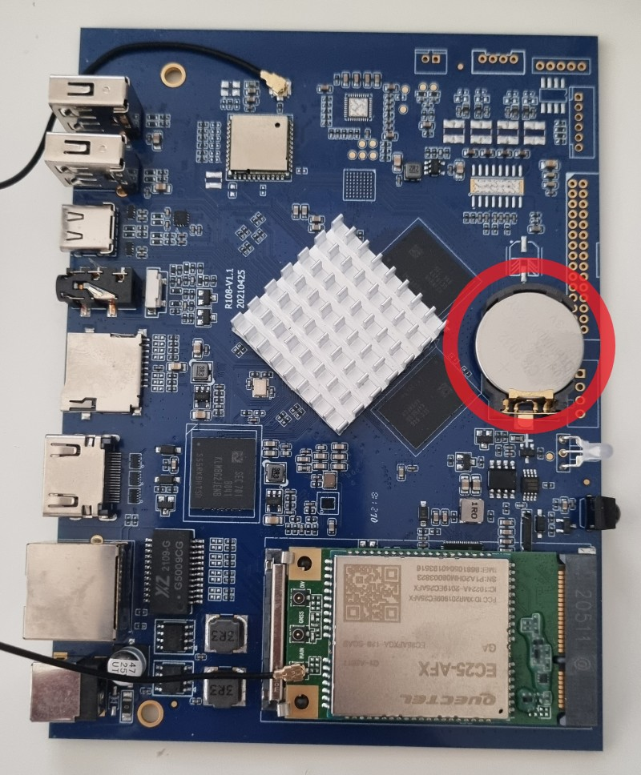
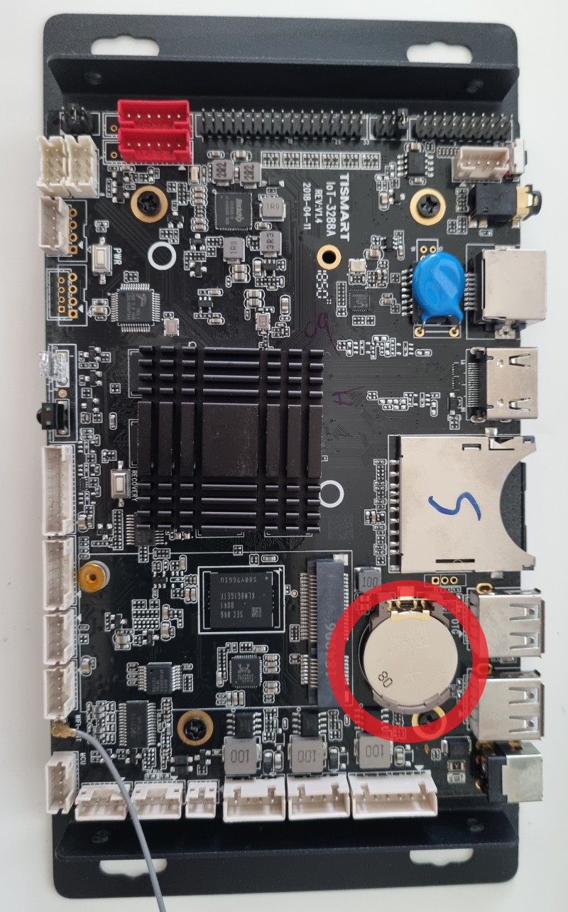
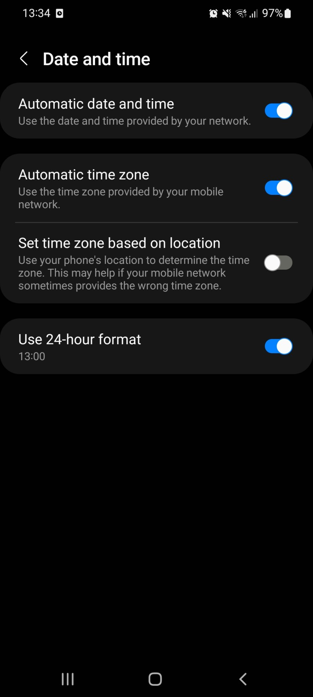

# Date and time

Slideshow can display current date and/or time on the screen using content type `Date/Time`. The date and time of the Android device will be used as the source.

## Real time clock (RTC)

Keeping the information about current time requires electricity. Same as your wristwatch won’t work without a battery, a clock in an electronic device requires power. When a device is turned off, unplugged from a power source and has no battery, there is no electricity to keep the internal clock of the device running, and it powers off as well. When you power on such a device, it either starts with some date set by the manufacturer or the same date and time as when it was last powered off.

This effect is not limited to Android devices. You might have seen a similar effect in the past on an old computer with a dead CMOS/BIOS battery. After powering on, you can see entirely wrong time in Windows, and the only solution is to replace the dead battery.

To keep the date and time correct even in case the device is completely without power, the manufacturer of the device has to add a hardware module called [real-time clock (RTC)](https://en.wikipedia.org/wiki/Real-time_clock). It is a very low power chip with an oscillator and a small battery or a capacitor, which keeps the device clock always correct, no matter if the device is on or off, with power or without.

### RTC in Android boxes

If an Android box doesn’t have an RTC module, the only way for the box to get the correct date and time is to get it from the internet using [Network Time Protocol (NTP)](https://en.wikipedia.org/wiki/Network_Time_Protocol). There are many NTP servers available all over the world, and Android is automatically configured to contact them, ask them for the correct current time and set this time internally. As long as the device is running, it will keep the time correct even if you disconnect it from the internet (although the clock might drift a couple of seconds if you keep the device running for a very long time).

In the past, the majority of Android boxes and sticks didn’t have the RTC module, so internet connection was a must if you wanted to have the correct time. Luckily, the situation is getting better, and you can now easily find an Android box that has an RTC module and keeps the time correct across power offs even without an internet connection. Usually you can find mention of "RTC" in the specifications of the device.

From the devices we have tested in the past, Rikomagic DS03 and Ugoos X2 Pro have RTC modules working out of the box. Zidoo Z9X has an RTC module, but there is no battery installed in it from the factory, so it resets the clock to 1 January 2018 after each reboot.

{ width="340" style="display: inline" }
{ width="340" style="display: inline"  }
/// caption
Android box boards with RTC battery circled in red
///

{ width=340 }
/// caption
Time synchronization settings in Android
///
