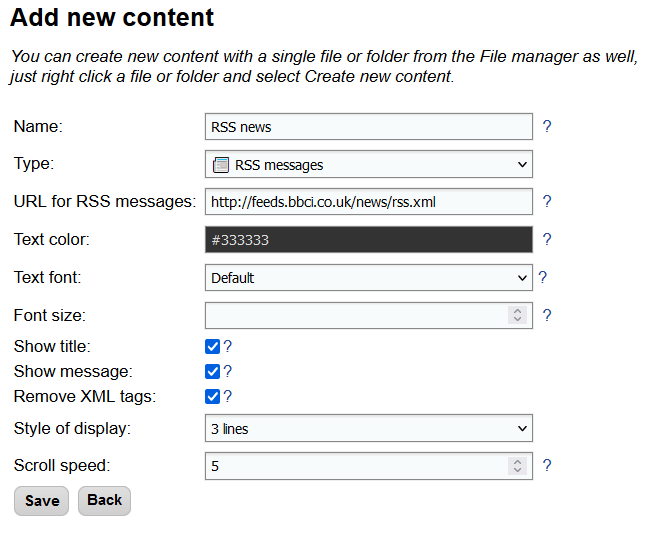

# RSS feeds

You can set up up displaying RSS feeds on screen by creating a new content with type `RSS messages` and adding it to your playlist. Alternatively, you can use sample screen layout `With side panels` as a starting point.

/// caption
Dialog for adding new content
///

## Source of RSS file

The source of displayed RSS messages can be setup through the field URL for RSS messages in RSS content setup. There are several possible types of sources:

- **From the internet** – enter the URL of the RSS file, for example [http://feeds.bbci.co.uk/news/rss.xml](http://feeds.bbci.co.uk/news/rss.xml).
- **Local file** – enter name of the file uploaded or copied to Slideshow. We suggest using a file with .rss extension.
- **Local messages** – enter `local` as URL. Messages added through web interface → menu `Tools` → `RSS messages` will be displayed.

You can enter multiple sources for one content, delimit them with comma (`,`). Messages from all sources will be displayed in cycle, starting with the first message of the first source and ending with the last message of the last source.

In case the RSS feed contains HTML/XML tags you don’t want to display on the screen (string such as `&nbsp;` or ``), enable `Remove XML tags` options on the `Edit content page`.

File [sample.rss](sample.rss) is available for testing; it contains a minimal example needed for Slideshow with two messages. If you would like to host your RSS files in cloud, you can use [www.rss-hosting.com](https://www.rss-hosting.com).

## Description of RSS file

RSS format is plain-text XML format, so it can be easily edited manually using a text editor. You can find descriptions of the format on [Wikipedia](https://en.wikipedia.org/wiki/RSS) or [W3schools](https://www.w3schools.com/xml/xml_rss.asp). Slideshow displays only tags `title` and `description` (alternatively `summary` or `content`) from each message of the RSS file on screen. Title is displayed with bold font, description with regular font.

If you want to create an RSS file by yourself and want a more advanced tool than a simple text editor, you can try, for example, [RSS Builder](https://sourceforge.net/projects/rss-builder/).

## Video tutorial

<iframe style="width: 100%; aspect-ratio: 16 / 9;" src="https://www.youtube.com/embed/cRxAuWNwGwg?feature=oembed&start&end&wmode=opaque&loop=0&controls=1&mute=0&rel=0&modestbranding=0" frameborder="0" allowfullscreen></iframe>
