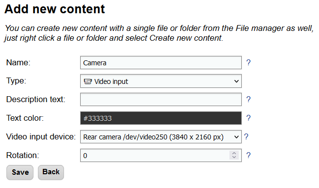
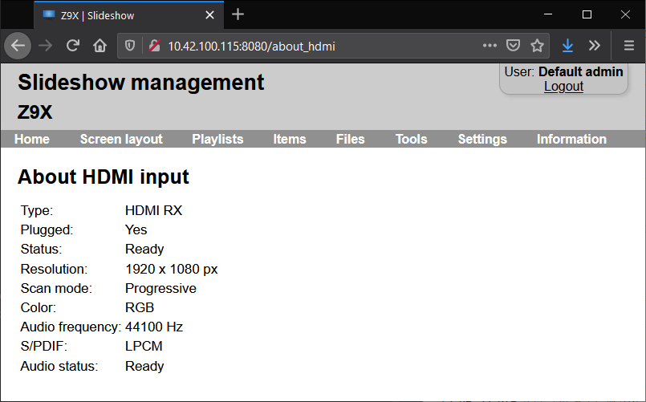

# Video input

Slideshow can display current feed from a camera connected to the Android device or from an HDMI input on the screen using content with type `Video input`.

In order to display the content of video input on the screen,  Slideshow requires permission to access the camera. You can grant this permission from the on-screen menu → `Basic settings` → `Request camera permission`. If this option is missing from the Basic settings, the permission has been already granted, and it is not necessary to grant it again.

List of currently connected video input devices as well as their maximum resolution can be viewed via the web interface → menu `Information` → `About device` → entry `Video input device`. Slideshow always picks the most suitable resolution based on the dimensions and aspect ratio of the zone where the picture is displayed.

Video input can’t be used at the same time as face detection from the same camera, as two services can’t use the same camera at the same time (Android operating system doesn’t allow it).

/// caption
Web interface for editing content with type Video input
///

## HDMI input

Displaying content from the HDMI input port is currently supported only on devices based on Realtek RTD1619DR chip (tested only on Zidoo Z9X box). It can be activated by creating content with `Video input device` set to `Realtek HDMI IN`. If you don’t see this Video input device in the list on the Edit content page, your device is not supported. Video as well as audio from the HDMI input is supported.

The current status of the HDMI input can be verified through the web interface → menu `Information` → `About device` → entry `Video input device` → link `Realtek HDMI IN`.

/// caption
Details about HDMI input in Slideshow's web interface
///
