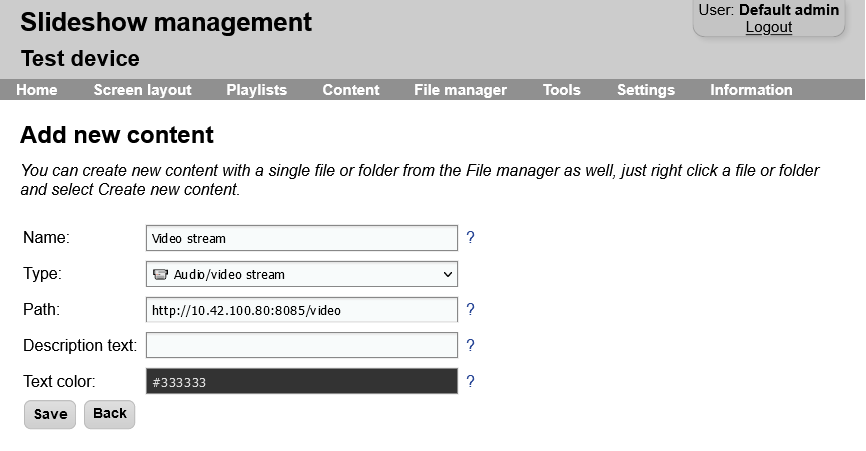
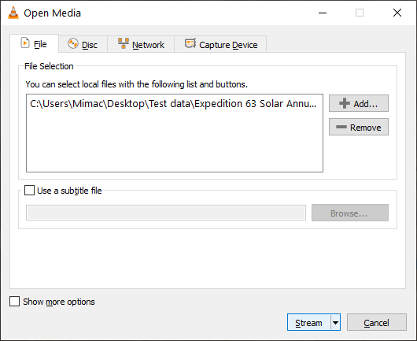
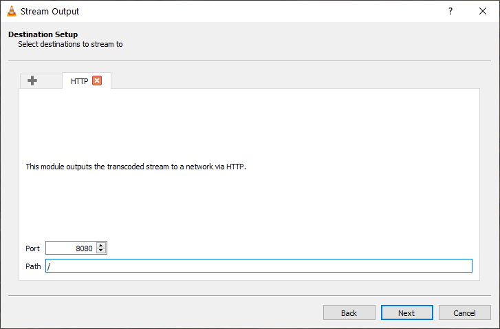
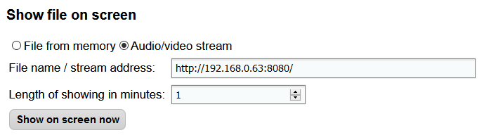
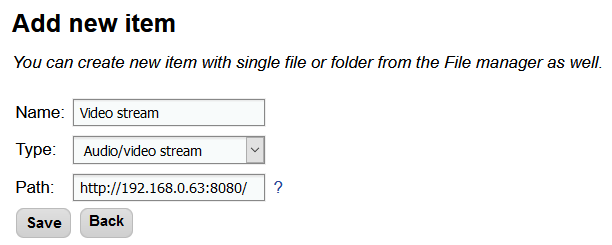

# Video streams

Slideshow supports playing HTTP and RTSP video streams on the screen using content with type `Audio/video stream`.

HTTP or RTSP video stream can be produced for example using VLC media player on Windows or Linux, from a IP security camera or other sources.

If you would like to display YouTube video or YouTube live stream, use content type `YouTube video` instead of `Audio/video stream`.

If you would like to display live image from a different device with HDMI output, you can use content type `Video input` on supported devices.

We recommend setting video player type to ExoPlayer for displaying video streams, as it has much better support for live streams than the native Android video player. However, support of stream containers and codecs is still highly dependent on the device, in reality not every device has good support for live streams. On some devices, there are even differences between the native video player and ExoPlayer. We recommend thorough testing before you start using video streams for your customers.

/// caption
Creating new content with type Audio/video stream
///

## Streaming from VLC

If you want to stream video in your local network, we suggest trying one of the two great applications: [VLC media player](https://www.videolan.org/) and [FFmpeg](https://ffmpeg.org/). Both are free and open source.

**VLC media player** is a player you can use for regular playback of videos and movies. Among many other advanced features, it can also stream files, webcam or even your desktop through the network. You can set up streaming from menu `Media` → `Stream...`, pick a source, click on `Stream` and configure HTTP streaming destination, which is supported by Slideshow. The resulting stream URL address will be `http://{IP address of your computer:8080/` (provided you didn’t change the port or path while setting it up).

{ width="320" style="display: inline" }
{ width="320" style="display: inline" }
/// caption
Choosing the stream source (notice various sources in tabs on the top) and setting up HTTP streaming destination in VLC.
///

**FFmpeg** is powerful command line software for processing audio and video files. Using ffserver (one of its tools), you can stream video files and other video sources as HTTP stream. The setup of streaming is harder than with VLC, but as it is command-line-based, you can create a startup script and automatize the streaming.

Once you have the streaming source ready, you can connect multiple devices with Slideshow to the same stream and have the same content on multiple screens at almost the same time.

### Displaying the stream in Slideshow

After you setup video streaming source, you can quickly test it on Slideshow. Just open the web interface → menu `Tools` → `Show message`, in the section `Show file on screen` pick `Audio/video stream`, enter the stream address on click on `Show on screen now`. Video should be displayed on the screen (in the main panel) within a few seconds.

{ width="450" }
/// caption
Testing video stream from Slideshow
///

It will always take a few seconds until the video is displayed on the screen, as Slideshow has to cache the video for smooth playback. If there is a black screen for longer than 10 seconds, you can check Slideshow’s [logs](../../troubleshooting.md#logs). Common problem are:

- Slideshow can’t access the video stream because the firewall on the source computer is blocking the connection. In that case, allow the particular port in the firewall, or turn it off completely for the duration of the test.
- Format or codec of the source file is not supported by Android. Try transcoding the stream, H.264 + MP3 encapsulated in MP4 format is one of the safest way.

If the test is successful, you can add new item with type Stream and assign in to the playlist of your choosing.

{ width="450" }
/// caption
New item with type Stream
///

## Video tutorial

<iframe style="width: 100%; aspect-ratio: 16 / 9;" src="https://www.youtube.com/embed/Zg0awHOr7Dg?feature=oembed&start&end&wmode=opaque&loop=0&controls=1&mute=0&rel=0&modestbranding=0" frameborder="0" allowfullscreen></iframe>
