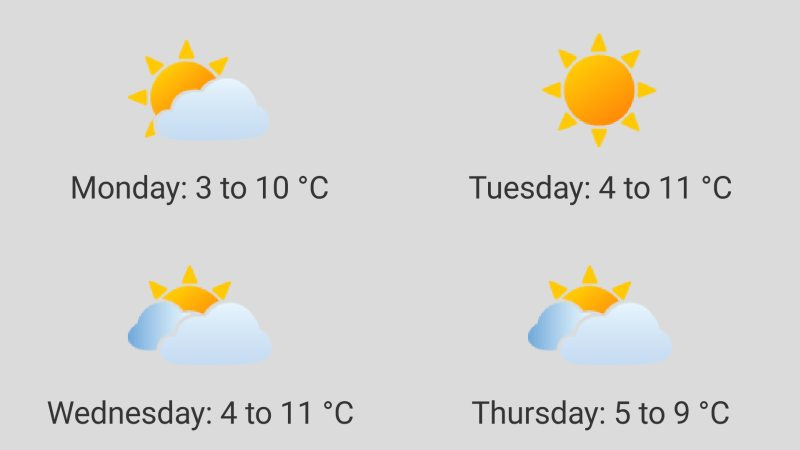
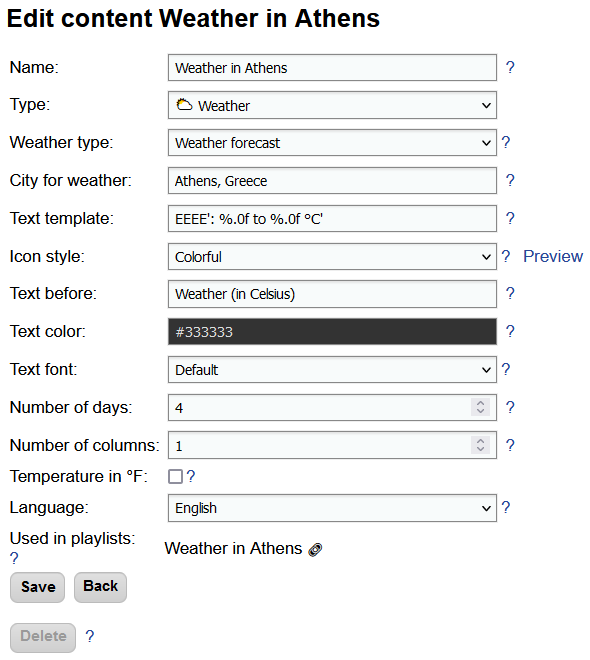
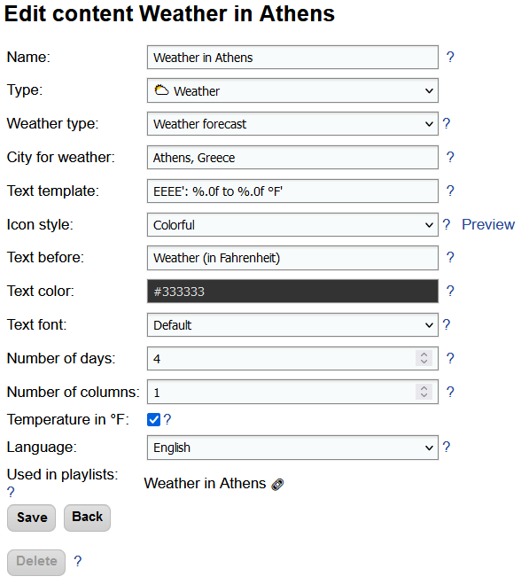
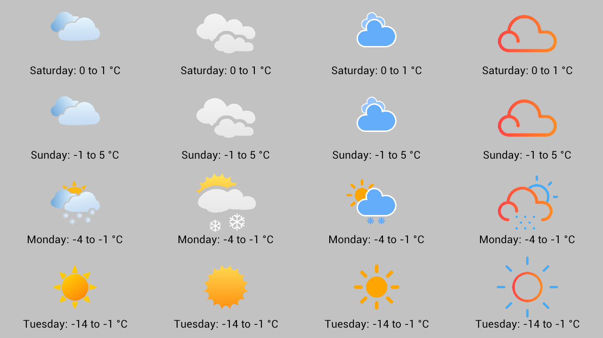
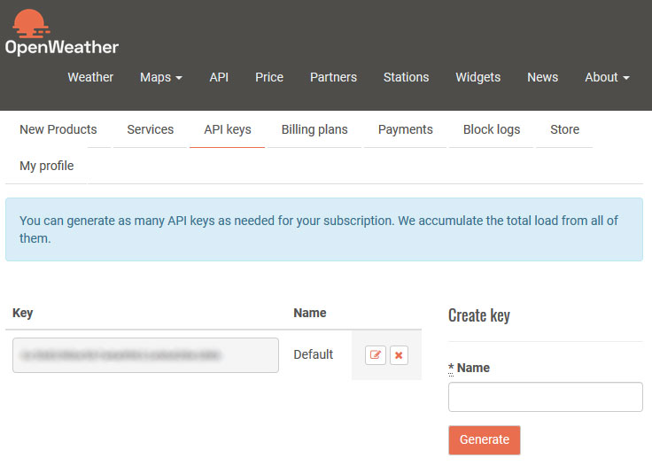
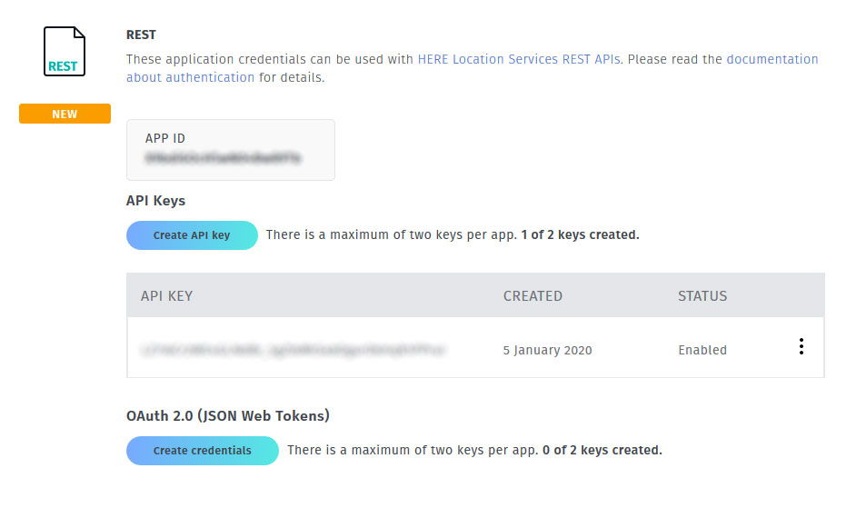

# Weather forecast

Among other things, Slideshow can also display weather forecast from the internet on the screen. The displayed weather forecast consists of an icon, date and temperature range for a day. Optionally, you can enter custom text that will be displayed above the forecast.

{ width="400" }
/// caption
Forecast for 4 days on entire screen
///

## Setting up weather content

You can set up displaying weather forecast by creating a new content with type `Weather` and adding it to your playlist. Alternatively, you can use sample screen layout `With side panels` as a starting point.

Slideshow can display weather for a maximum of 4 days, vertically (with number of columns set to 1) or horizontally (with number of columns set to 4).


/// caption
Dialog for editing content on the web interface. Example for degrees Celsius.
///

/// caption
Dialog for editing content on the web interface. Example for degrees Fahrenheit.
///

The temperature is displayed in degrees Celsius by default. Switching to degrees Fahrenheit is possible by enabling option `Temperature in °F` and changing the `Text template` to `EEEE': %.0f to %.0f °F'` (or similar one) in the content.

By selecting icon style on the Edit content page, you can change the style of the weather icon displayed on the screen. Samples from the available styles are in the image below.


/// caption
Available weather icon styles: Default, Colorful, Simple, Outlines and Metno
///

## Weather sources

Different online sources of weather forecast can be used in Slideshow. In order to use some of these sources, you might have to first create an account on the respective site (usually for free). You can find comparison of the sources in the table below.

Setup of the weather source is through the web interface → menu `Settings` → `Device settings`.

| Name of the forecast source | Open-Meteo | OpenWeatherMap | HERE Maps                                                                                                                                                                    | Norwegian Meteorological Institute (MET Norway) |
| - | - | - |------------------------------------------------------------------------------------------------------------------------------------------------------------------------------| - |
| **Website** | [https://open-meteo.com](https://open-meteo.com) | [https://openweathermap.org](https://openweathermap.org) | [https://developer.here.com](https://developer.here.com)                                                                                                                     | [https://www.met.no/en](https://www.met.no/en) |
| **Registration** | Not required | [https://home.openweathermap.org/users/sign_up](https://home.openweathermap.org/users/sign_up) | [https://developer.here.com/sign-up?create=Freemium-Basic&keepState=true&step=account](https://developer.here.com/sign-up?create=Freemium-Basic&keepState=true&step=account) | Not required
| **Limit for free account** | 10 000 requests per day | 60 requests per minute | Credit card required                                                                                                                                                         | Fair usage |
| **Where to get the API key** | Not required | [https://home.openweathermap.org/api_keys](https://home.openweathermap.org/api_keys) → Generate new key | [https://developer.here.com/projects](https://developer.here.com/projects) → create new project and generate key in the REST section                                         | Not required |
| **What to enter in the Slideshow’s Device settings** | Weather source: `Open-Meteo` | Weather source: `OpenWeatherMap (hourly)`<br>API key for weather: `{API key}` (change for your actual value) | Weather source: `HERE Destination weather`<br>API key for weather: `{API KEY}` (change for your actual value)                                                                | Weather source: `MET Norway (yr.no)` |


/// caption
API Key on OpenWeatherMap website
///


/// caption
API Key on HERE Destination weather website
///

Slideshow caches weather forecast for a particular location for 1 hour, so a single free account on both services is good enough for displaying weather information on several devices. However, if you are looking for guaranteed SLA or have over 50 devices, we recommend looking into the paid accounts on either of the services.

Also, remember to read through the license terms of the weather source and add credit to the provider if required. Some services might restrict the usage to non-commercial only if you are not paying a subscription.

## Troubleshooting

Each time the weather is refreshed from the server, there is an entry in the Slideshow’s logs (web interface → menu `Information` → `Log`):

```
2020-10-25 17:47:20 INFO sk.mimac.slideshow.weather.WeatherReader 
- Weather refreshed (location=Punta Arenas)
```

In case something goes wrong while downloading new weather data, there is a warning entry in the logs. For example, if an API key is missing, there will be the following entry in logs:

```
2020-10-25 21:46:16 WARN sk.mimac.slideshow.weather.WeatherReader 
- Can't refresh weather: OpenWeatherMap API key not found, please obtain it on https://home.openweathermap.org/users/sign_up and enter it in the Device settings
```

## Video tutorial

<iframe style="width: 100%; aspect-ratio: 16 / 9;" src="https://www.youtube.com/embed/_00houLSGDM?feature=oembed&start&end&wmode=opaque&loop=0&controls=1&mute=0&rel=0&modestbranding=0" frameborder="0" allowfullscreen></iframe>
