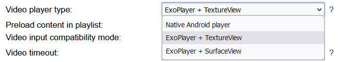
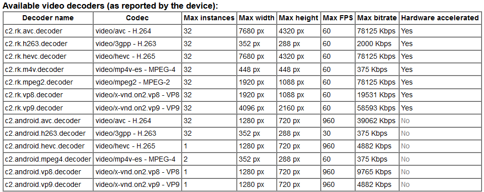

# Video playback

Slideshow contains several different video players, each using a different method to render videos on the screen. As there is a great variety between hardware video decoders of various manufacturers, each device model might work best with a different video player.

By default, ExoPlayer + TextureView is used. If you want to change the video player, you can do so via web interface → menu `Settings` → `Device settings` → setting `Video player type`. Reload the app or refresh your screen layout to apply the change.

/// caption
Choice of video players in Device settings
///

## Native Android player

Most conservative option, which uses Android’s native video player. You can find a list of supported codecs and containers on https://developer.android.com/guide/topics/media/media-formats#video-codecs. The exact codec and bitrate support is highly dependent on the hardware. Use this option if ExoPlayer doesn’t work correctly on your device.

## ExoPlayer

Slideshow also contains a video player based on ExoPlayer project. It supports the same codecs as a standard video player, but the support of video containers varies, for example, AVI and WMV are supported only by the native Android player.

It supports the following features on top of the native video player:

- **Shorter lag between videos:** if there are two videos one after another to be displayed on the screen, ExoPlayer supports pre-buffering the next video in the playlist. Thanks to this pre-buffering, the time between end of the first video and start of the second is down to approximately 40 milliseconds (highly depends on the actual device), which is barely visible to the users. In order for the pre-buffering to work, setting Preload content in playlist has to be enabled in the Device settings.
- **Scaling videos:** the videos within the zone are scaled with the same options as images: Fit center, Center crop, Fit to screen and Center (no scaling). You can change the scaling type either through the Device settings in the web interface (Image scale type), or through the Basic setting in the on-screen menu.
- **Rotating videos:** together with rotating the screen layout, it also rotates the video in the correct way
- **Better support for video streams:** ExoPlayer has better support for streaming through network protocols (e.g. HTTP / RTSP / UDP / RTMP).

You can choose whether you would like to use ExoPlayer in combination with TextureView (supports overlaying two videos on top of each other) or SurfaceView (supports 4K output on devices without 4K framebuffer, support HDR on devices with HDR support).

## Recommended video format

If you would like to encode your video in the best way, we recommend the following settings. They are based on our testing and should be compatible with all usages on all devices running Slideshow.

* Container: MP4 (MPEG-4 Part 14)
* Video codec: H.264 (MPEG-4 AVC)
* Audio codec: AAC (stereo)
* Resolution: the same as the resolution of the device

The actual list of video decoders detected on your Android device can be viewed through the web interface – menu `Information` – `About device` – see the list at the bottom. Please note that this list is reporter by the device, there is no guarantee that the video playback will work flawlessly with these decoders.

/// caption
List of supported codecs on a sample device
///
