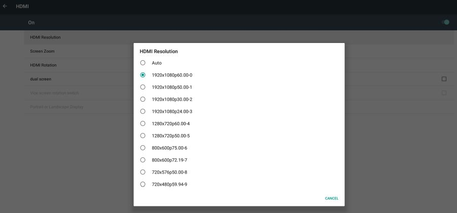

# 4K playback

There are currently many Android boxes on the market advertising 4K display support. But how good is this support in reality?

## Quick recap about resolutions

In this article, I am using several abbreviation for various screen resolutions:

- **4K** - usually resolution 3840 × 2160 pixels is used, also known as 2160p. Used on the most of new TVs. Requires at least HDMI 1.3 for 30 Hz or HDMI 2.0 for 60 Hz, meaning output device (Android box), cable and input device (TV) must support this version of HDMI.
- **Full HD** - 1920 × 1080 pixels, also known as 1080p. Practically commercial minimum today.
- **HD** - 1280 × 720 pixels, also known as 720p. Older standard, currently almost out-of-use.

/// caption
Comparison of sizes of various resolutions: 4k, Full HD and HD
///

## Introduction -- what is a framebuffer?

Framebuffer or screen buffer is a portion of internal memory containing all pixels that should be displayed on the screen, in form of a bitmap.

Operating system or application writes all the graphic on the user interface to the framebuffer. Afterwards it calls framebuffer flush, which causes the graphic card to actually display the content of the framebuffer on your screen. Operating system or application then continues preparing next frame in the framebuffer.

## Framebuffer size on Android boxes

So back to the original question -- how does the 4K support look like on an average 2019-2020's Android box?

-   HDMI 2.0 support for 4K 60 Hz output -- **mostly yes**
-   Support for hardware accelerated decoding of 4K videos -- **yes**
-   4K internal framebuffer -- **mostly no, size is fixed to Full HD**

The problem with 4K support of Android boxes is that most of them support it only for playing videos, the rest of the content is displayed in Full HD. This is because no matter what the actual resolution of the screen is, the internal framebuffer is fixed to Full HD resolution. Your monitor or TV can report that the picture resolution is 4K and while technically correct, it is only a resolution of the HDMI signal.

The reason for keeping the framebuffer at Full HD resolution is performance. As 4K has four times as many pixels as Full HD, most of the graphic cards used in the current Android boxes would have hard time keeping up and the user interface would be too laggy. So the manufacturers decided to keep the framebuffer resolution at Full HD and take advantage only of the graphic card's 4K video decoding capability.

Because of the fixed framebuffer size, Slideshow app will always report the screen resolution as 1920 × 1080 px (on About device page or while editing a screen layout) and will render **all images, text, HTML pages, etc. with this resolution**. Only videos which are going through hardware accelerated decoding are displayed in 4K (if the box supports it), because the hardware acceleration on graphic card usually goes around the internal framebuffer.

There is an equivalent situation with some old devices (for example, Geniatech ATV510B), which supports Full HD with video decoding and on HDMI output, but its internal framebuffer has a fixed resolution of 1280 × 720 px.

/// caption
On RK3288 box, you can choose between various HDMI output resolutions, but no matter what you choose, framebuffer resolution stays at 1920 × 1080 px
///

## Conclusion

The main point of this article is to warn potential buyers of various Android boxes, that choosing any Android box claiming to have 4K support may not be the best idea for digital signage. Always do research before choosing the right hardware.

If you know any good Android box with 4K framebuffer, [let us know](https://slideshow.digital/contact-us/). We will be happy to add it here.
