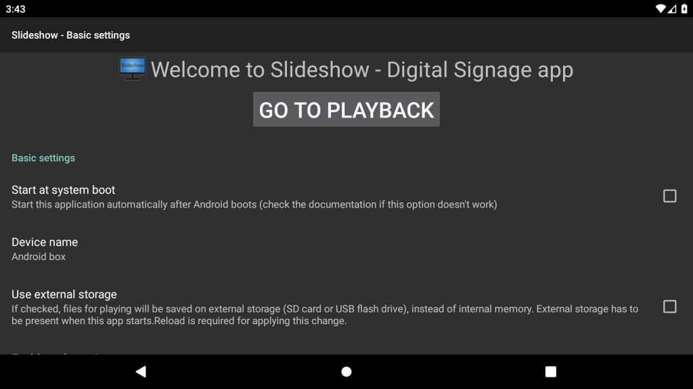
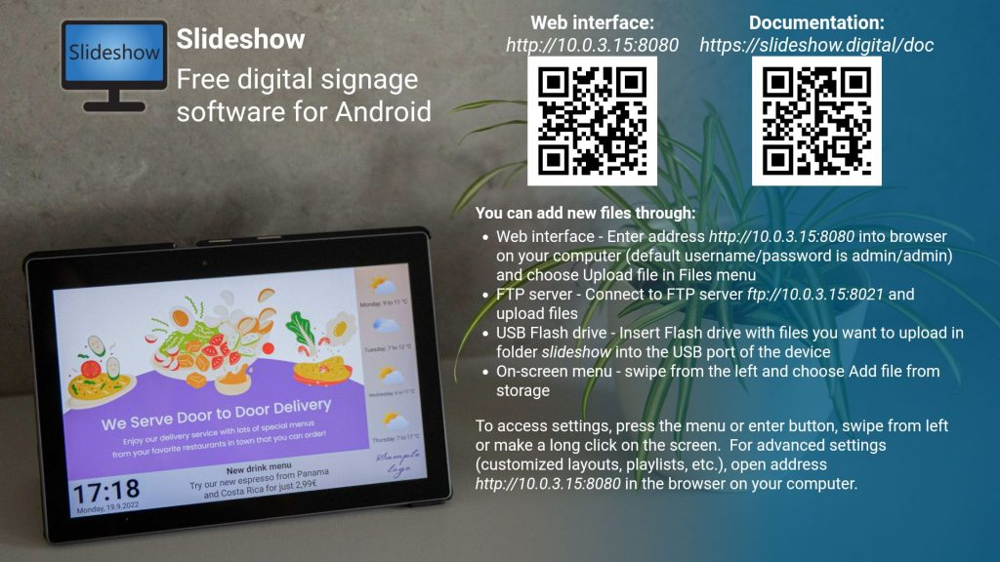
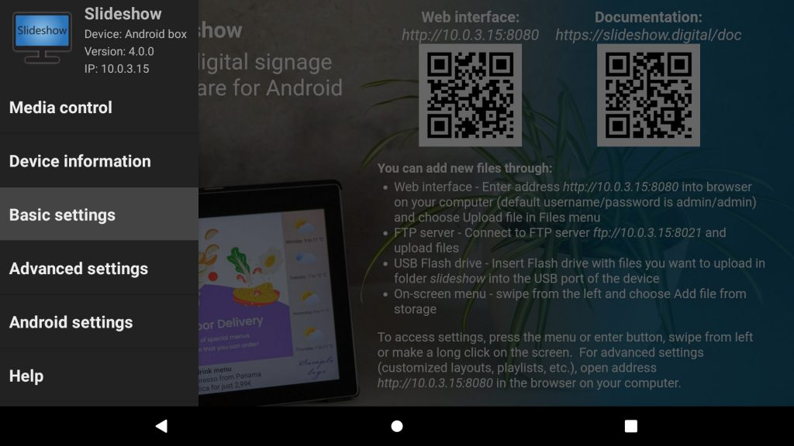
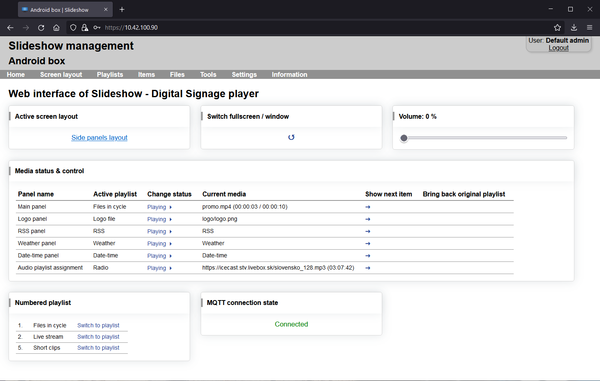
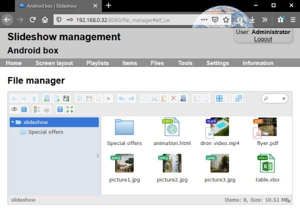

# Tutorial 

**1.** Prepare a compatible Android device - almost any device with Android version 5.0 or newer will work. You can use Android TV, Android box or stick connected to your TV or screen, Android tablet or even Android emulator on your computer.

**2\.** Download Slideshow application for free, install it on your device and start the application.

[Get Slideshow](https://slideshow.digital/how-to-get-it/){ .md-button .md-button--primary }

**3\.** After granting the necessary permissions you will get the following screen with basic settings. Review them, adjust if needed and press the `Go to playback` button.

**4\.** Following screen will be displayed. Slideshow is now ready to be used, you can upload first files using any of the methods mentioned on the screen.

**5\.** If you want to access settings again, press the menu button on your device or remote control and select Basic settings. You can open the menu also by swiping from the left side of the screen or pressing Enter key on a connected USB keyboard.

**6.** If your Android device is connected to the local network (through Wi-Fi or Ethernet cable), you can access Slideshow's web interface through browser on your computer. Just enter the URL address of the web interface displayed on the screen (above the first QR code) to the browser on your computer. If Slideshow is already displaying some other files, you can reopen the screen with URL address through the on-screen menu → `Help`, or using keyboard shortcut `h` or `Space`.

The default username / password for the web interface is `admin` / `admin`. You can manage advanced configuration and settings there, review statistics and check logs.

**7.** You can upload new files through the web interface → menu `File Manager`. Add files which you would like to play through Slideshow using drag and drop them from your computer to the File manager.

[Documentation](index.md){ .md-button .md-button--primary }
[Video tutorials](https://www.youtube.com/playlist?list=PLyqW3uREXFEgl4V1CWAqyQo1pGXf2-Lki){ .md-button .md-button--primary }
