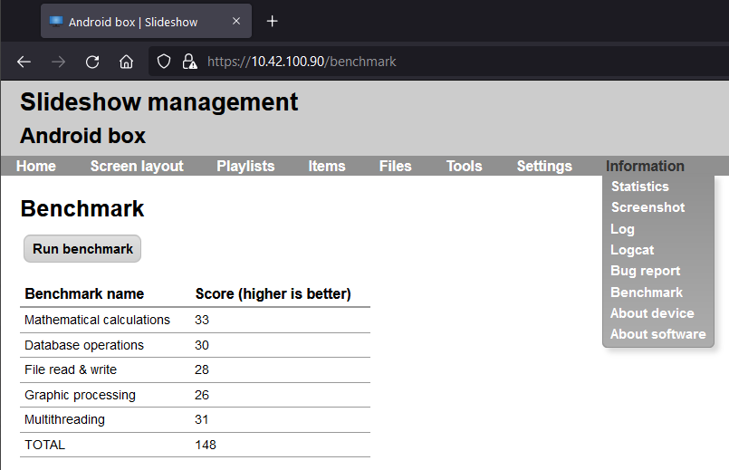
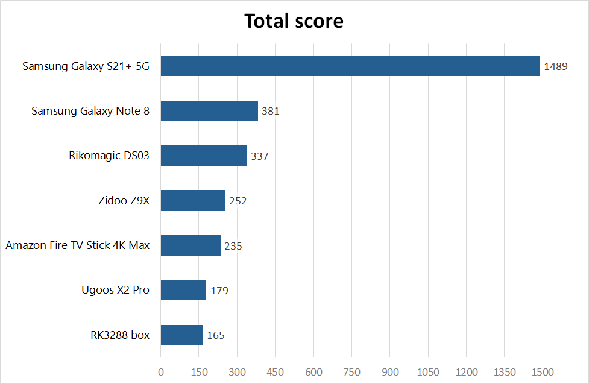

# Benchmarks

Slideshow contains a simple hardware benchmarking feature. You can find it via web interface → menu `Information` → `Benchmark`. The usage is pretty straightforward, just click on the Run benchmark button, wait for a few tenths of seconds (depending on your device performance), and you will get a score which represents the hardware performance of the device currently running Slideshow app. The entire benchmark runs in the background, you won’t see anything on the screen, just the results in your browser afterward.

The tests are designed to cover different kinds of workloads used in Slideshow app, to give you estimates of how well the device should perform in real life. Included are mathematical calculations, database operations, reading and writing files in storage, graphic processing and multi-threading tests. You can compare the results across various device to find out which one has the best performance.

/// caption
Benchmark page with results
///

If you want to compare the results from your device with some baseline, you can find results from the devices we are using for testing below. All tests were run while Slideshow was displaying just a single picture on the screen, to rule out any other background load that could skew the results.

| Model	| RK3288 box                     | Ugoos X2 Pro | Amazon Fire TV Stick 4K Max | Zidoo Z9X | Rikomagic DS03 | Samsung Galaxy Note 8 | Samsung Galaxy S21+ 5G |
| - |--------------------------------| - | - | - | - | - | - |
| **SoC** | Rockchip RK3288 | Amlogic S905X2 | MediaTek MT8696 | Realtek RTD1619DR  | Rockchip RK3399 | Exynos 8895 | Exynos 2100 |
| **CPU** | 4x ARM Cortex-A17 | 4x ARM Cortex-A53 | 4x ARM Cortex-A53 | 6x ARM Cortex-A55 | 2x ARM Cortex-A72 + 4x ARM Cortex-A53 | 4x Mongoose M2 + 4x ARM Cortex-A53 | 1x ARM Cortex-X1 + 3x ARM Cortex-A78 + 4x ARM Cortex-A55 |
| **RAM** | 2 GB | 4 GB | 2 GB | 2 GB | 4 GB | 6 GB | 8 GB |
| **Android version** | 7.1.2 | 9 | 9 | 9 | 9 | 9 | 12 |
| **Mathematical calculations** | 30 | 49 | 45 | 42 | 83 | 99 | 440 |
| **Database operations** | 34 | 45 | 43 | 29 | 64 | 76 | 245 |
| **File read & write** | 33 | 22 | 28 | 19 | 45 | 48 | 50 |
| **Graphic processing** | 30 | 20 | 23 | 18 | 42 | 48 | 171 |
| **Multithreading** | 38 | 43 | 96 | 144 | 103 | 110 | 583 |
| **TOTAL** | 165 | 179 | 235 | 252 | 337 | 381 | 1489 |

