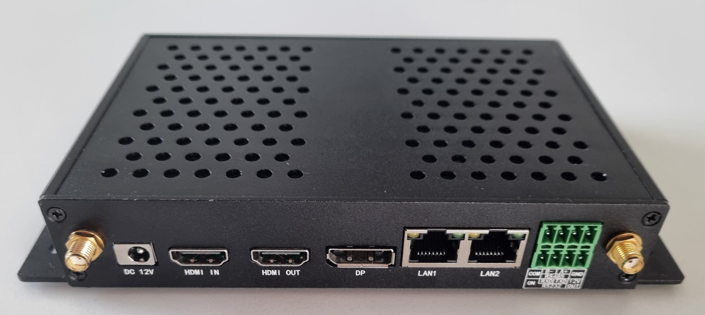
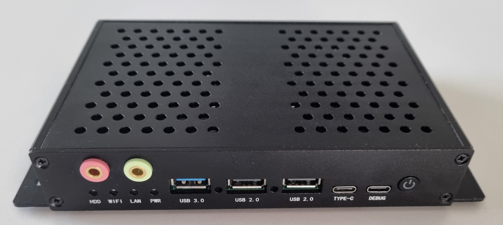
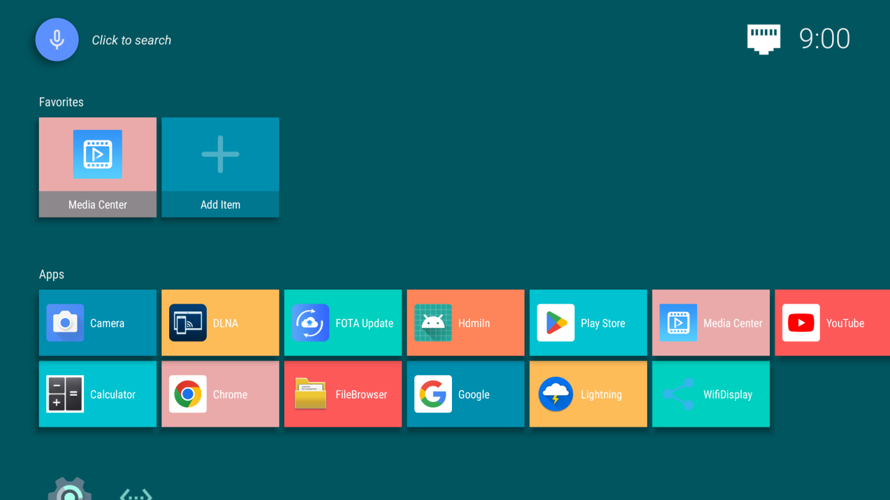
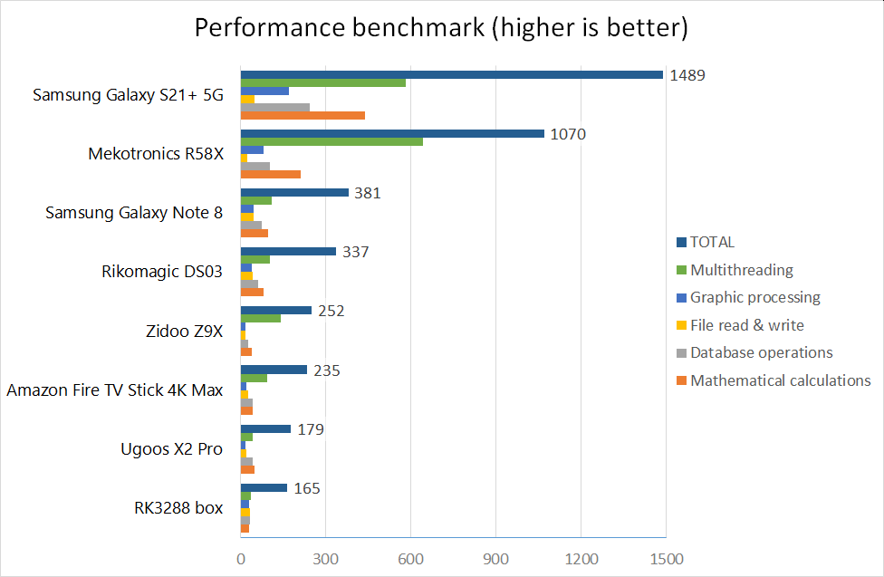

# Mekotronics R58X box

We received a very interesting Android box for testing Slideshow app – [Mekotronics R58X](https://www.mekotronics.com/h-pd-54.html). At the first moment we noticed a number of ports, which are not very usual on Android boxes, mainly DisplayPort, HDMI input, USB-C, analog audio in/out and RS232. I decided to test this device a little bit more and to share my findings with you.

## Specification

- **CPU:** Rockchip RK3588, 4x ARM Cortex-A76 + 4x ARM Cortex-A55, 64-bit, up to 2.5 GHz
- **GPU:** ARM Mali G610 MP4
- **RAM:** 4 GB
- **Internal storage:** 32 GB (about 23 GB is accessible for data)
- **Video output:** 1x HDMI, 1x DisplayPort
- **Network connectivity:** 2x Gigabit LAN, WiFi 6 (2.4 GHz + 5 GHz, 802.11b/g/n/ac/ax)
- **USB:** 1x USB A 3.0, 2x USB A 2.0, 1x USB C
- **Audio:** 3.5 mm jack input, 3.5 mm jack output (audio output also possible through HDMI)
- **Other connectors:** HDMI input, RS232 + RS245 pins
- **Power supply:** 12V DC adapter
- **Operating system:** Android 12 (rooted)
- **Dimensions:** 18.6 x 10.4 x 2.9 mm

## Hardware

The box feels really sturdy, with aluminum housing, ready for light industrial usage as well. It has perforated top side for better cooling (passive only, fortunately no fan). The edges of the housing can get scratched quite quickly (as you can see on the pictures below), overall the exterior of the box fits more for commercial / industrial usage than as a media box in the living room.

Front side of the box has a power button, with a short press you put the device to sleep, with a long press you will get a dialog for power off / restart, similar to how the power button on Android phones work.

Additionally to the ports you can see on the pictures below there are two SATA 3 ports and a M.2 PCI-Express slot inside the box, but they are impossible to reach without completely disassembling the box.

{ width="370" }
{ width="370" }

## Software

The box is running rooted Android 12 (released in October 2021), which is quite positive news compared to the fact that many other Android boxes in stores are running on older versions of Android. The actual firmware at the time of testing (November 2022) was from 26 August 2022.

There are just a few basic apps preinstalled, like Chrome browser, File browser, Calculator and Media Center. The Media Center app is just an extremely simple video player. The lack of other apps can be viewed as good if you don’t like any bloatware, but if you would like to use the box as a media center, you will have to install some more apps. Google Play Store is pre-installed, so you can just log in and download apps you like.

Some issues were found during testing Android 12 on this box with Slideshow app and although responses from Mekotronics support were fast, they weren’t able to offer satisfactory solutions to the software issues (more details).

The manufacturer is offering [firmware](https://www.mekotronics.com/h-nd-21.html) with Ubuntu and Debian Linux distributions as well, so it is possible to replace Android OS, but I haven’t tested it so far, as I focus on Android.

/// caption
Home screen of Mekotronics R58X with pre-installed apps
///

## Performance

There were no performance problems while using the user interface or any app, the octa-core CPU has a lot of raw power. I benchmarked it using the integrated benchmark in Slideshow app, just to get a sense of the overall CPU performance. It scored several times more than any previous Android box and just below Samsung Galaxy S21+ phone, although it even beat it in multi-threading score.

/// caption
Benchmark of Mekotronics R58X against other Android devices
///

## Video playback

Manufacturer claims hardware accelerated video decoding support for many formats, including H.264, H.265 (up to 8K) and AV1 (up to 4K). I tested several formats, bitrates and resolution, the box played every video smoothly, including H.265 video with 400 Mbps bitrate and 8K video.

## Network connectivity

The box has two Gigabit RJ45 LAN ports, both of them light up when you attach a cable, but only LAN1 port is visible in the Android settings. LAN2 port is not directly visible in Android settings and it doesn’t receive any IP address from the DHCP server. I managed to enable the second port manually via commands entered to the shell console and it actually worked for a while, but as soon as I unplugged the cable from LAN1 port, LAN2 port stopped working as well (although its cable was still connected). File transfer speed using LAN1 port was around 848 Mbps (106 MB/s), so it was working correctly in Gigabit mode.

When I tried connecting the box to a WiFi network, I was getting messages “Could not find SSID” at first, although I just picked the network from a list of scanned networks. Only after I unplugged the cable from LAN port, it connected successfully. The signal across a single wall was quite weak (even with two larger antennas), the real file transfer speed was around 20 Mbps (2.5 MB/s). At first I thought the antennas were not connected correctly, but when I removed them the speed dropped even more, so I guess they were connected correctly and the WiFi is just that bad.

To sum up, there are three network interfaces, only two of them work, only one at the time and WiFi speed is unusable for video streaming. While it is not a deal breaker for some setups, it’s a pity that it is not possible to have two simultaneous connections, for a failover scenario.

## Audio and video output

Mekotronics R58X has two video outputs: HDMI and DisplayPort. They can be used also at the same time, but only for image mirroring, not for separate content for each output. Still, it can be useful for sending the same content to two screens, at least you don’t have to buy a separate HDMI splitter.

One of the best features of this box is that it has native 4K framebuffer (resolution 3840 x 2160 px), meaning it renders all content directly in 4K (not just videos, as it is common with other boxes). No additional setup is needed, the box will always report the framebuffer resolution as 4K and only the video output (HDMI or DisplayPort) will be scaled up/down according to the output resolution.

There is 3.5 mm jack analog audio output for speakers, the quality is a little bit sub-par (audibly worse than analog audio output of a mid-range laptop), I suggest sticking with audio through HDMI output. Audio is always played on both 3.5 mm jack and HDMI, there is no need for special setup or configuration.

## HDMI input

I was really looking forward to testing HDMI input after my experience with Zidoo Z9X. There is HdmiIn app preinstalled, but with really limited options, it just shows the image from the HDMI input. The stability of the app is really bad, I got it working (with a picture on the screen) maybe in 1 out of 3 tries, the other times there was just a black screen. In contrast to Zidoo Z9X, Mekotronics R58X doesn’t show the HDMI input as a virtual camera, so any third party app that would want to use HDMI input on this box would have to use their private API.

## Conclusion

The hardware characteristics of Mekotronics R58X looks excellent – it has plenty of performance and many I/O ports for extensions. However many of the I/O ports are simply unusable in real life due to lack of proper software support.

The box is targeted for commercial usage, it’s definitely not for non-technical users. If you need just a regular Android box with wired LAN connection, it will work perfectly, there were no stability issues during multi-day testing. However if you would like to use any of the extra features, be prepared to get in touch with their support.

:material-plus-circle: Rooted Android 12 operating system 
:material-plus-circle: Very good CPU performance 
:material-plus-circle: Native 4K support with 4K framebuffer 
:material-plus-circle: No problem with hardware accelerated video decoding

:material-minus-circle: HDMI input doesn't work reliably 
:material-minus-circle: Only one network interface works at any time 
:material-minus-circle: Poor WiFi performance 

